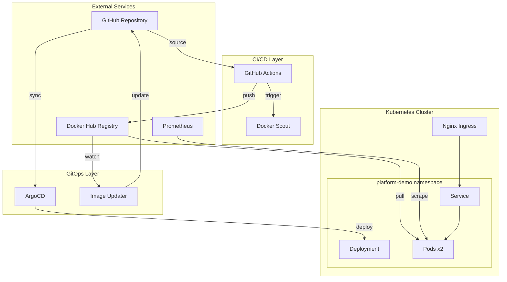
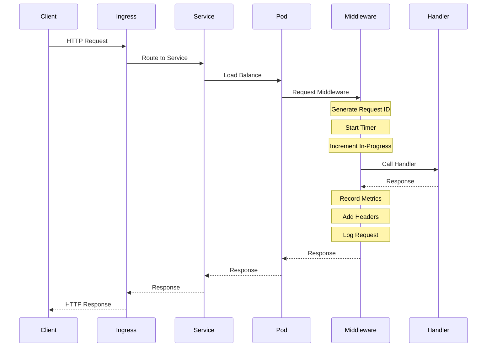
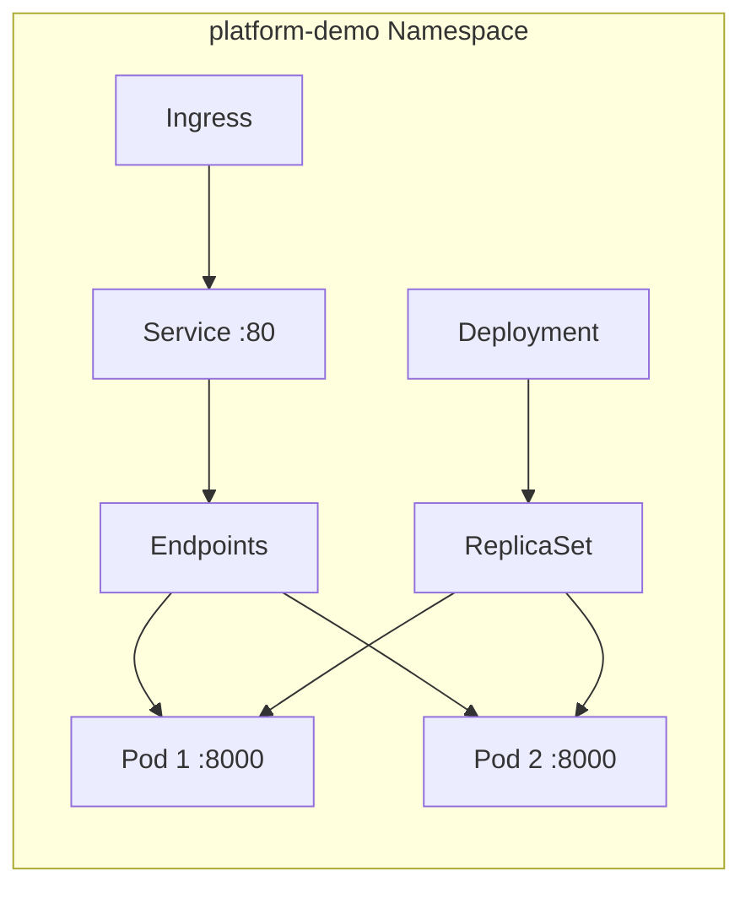
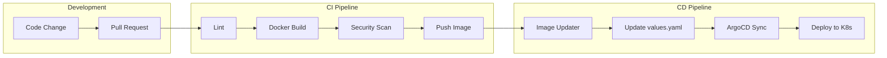

# Architecture

System design and architectural decisions for the FastAPI Platform Demo.

## High-Level Architecture



## Application Architecture

### Request Flow



### Component Structure

```
main.py
├── Lifespan Context Manager
│   └── Startup/Shutdown Logging
├── Request Middleware
│   ├── Request ID Generation
│   ├── Metrics Collection
│   └── Response Headers
├── Health Endpoints
│   ├── /api/v1/healthz (Liveness)
│   ├── /api/v1/ready (Readiness)
│   └── /api/v1/ready/toggle
├── Diagnostic Endpoints
│   ├── /api/v1/details
│   └── /api/v1/stats
├── Business Endpoints
│   ├── /api/v1/hello
│   └── /api/v1/getdate
└── Observability
    └── /metrics (Prometheus)
```

## Design Decisions

### Why FastAPI?

| Requirement | FastAPI Solution |
|-------------|------------------|
| High Performance | Built on Starlette/Uvicorn with async support |
| Type Safety | Pydantic validation with automatic OpenAPI docs |
| Developer Experience | Auto-generated Swagger UI and ReDoc |
| Python Ecosystem | Full access to Python libraries (psutil, prometheus-client) |

### Middleware Pattern

The application uses a single middleware for all cross-cutting concerns:

```python
@app.middleware('http')
async def request_middleware(request: Request, call_next):
    # 1. Generate/propagate request ID
    request_id = request.headers.get('X-Request-ID', str(uuid.uuid4()))
    
    # 2. Track in-progress requests
    REQUESTS_IN_PROGRESS.labels(method=method, endpoint=path).inc()
    
    # 3. Time the request
    start_time = time.time()
    response = await call_next(request)
    duration = time.time() - start_time
    
    # 4. Record metrics
    REQUEST_COUNT.labels(...).inc()
    REQUEST_LATENCY.labels(...).observe(duration)
    
    # 5. Add tracing headers
    response.headers['X-Request-ID'] = request_id
    response.headers['X-Response-Time'] = f'{duration:.4f}s'
    
    return response
```

**Benefits:**

- Single point of control for observability
- Consistent behavior across all endpoints
- Easy to extend with additional concerns

### Health Check Design

**Liveness vs Readiness:**

| Probe | Purpose | Failure Action |
|-------|---------|----------------|
| Liveness (`/healthz`) | Is the process alive? | Restart container |
| Readiness (`/ready`) | Can it serve traffic? | Remove from service |

**Toggleable Readiness:**

The readiness state can be toggled via API, enabling:

- Graceful shutdown demonstrations
- Rolling update testing
- Chaos engineering scenarios

### Metrics Strategy

**RED Method Implementation:**

- **R**ate: `http_requests_total` counter
- **E**rrors: Status code labels on counter
- **D**uration: `http_request_duration_seconds` histogram

**Histogram Buckets:**

Selected to capture typical API latencies:

```python
buckets=[0.005, 0.01, 0.025, 0.05, 0.1, 0.25, 0.5, 1.0, 2.5, 5.0]
```

- Fast responses: 5ms, 10ms, 25ms, 50ms
- Normal responses: 100ms, 250ms, 500ms
- Slow responses: 1s, 2.5s, 5s

### Logging Strategy

**Structured JSON Logging:**

```python
logging.basicConfig(
    format='{"time":"%(asctime)s","level":"%(levelname)s","message":"%(message)s","logger":"%(name)s"}',
)
```

**Benefits:**

- Machine-parseable for log aggregation
- Consistent format across all logs
- Easy to query with tools like jq

## Deployment Architecture

### Container Design

**Multi-Stage Build:**

```dockerfile
# Stage 1: Builder
FROM python:3.13-slim AS builder
# Install uv, sync dependencies

# Stage 2: Runtime
FROM python:3.13-slim
# Copy only runtime artifacts
```

**Security Hardening:**

- Non-root user (UID 1000)
- Read-only root filesystem
- Dropped capabilities
- No privilege escalation

### Kubernetes Resources



### GitOps Flow



## Security Considerations

### Container Security

| Control | Implementation |
|---------|----------------|
| Non-root execution | `runAsUser: 1000` |
| Read-only filesystem | `readOnlyRootFilesystem: true` |
| No privilege escalation | `allowPrivilegeEscalation: false` |
| Minimal capabilities | `drop: [ALL]` |

### Supply Chain Security

| Control | Implementation |
|---------|----------------|
| SBOM Generation | Docker BuildKit SBOM |
| Build Provenance | GitHub attestations |
| CVE Scanning | Docker Scout |
| Signed Images | Build provenance attestation |

### Network Security

| Control | Implementation |
|---------|----------------|
| Internal service | ClusterIP service type |
| TLS termination | Nginx Ingress |
| CORS configured | FastAPI CORS middleware |

## Scalability

### Horizontal Scaling

The application is stateless and horizontally scalable:

- No local state stored
- No sticky sessions required
- Load balancing via Kubernetes Service

### Resource Management

Default resource allocation:

```yaml
resources:
  requests:
    cpu: 100m
    memory: 128Mi
  limits:
    cpu: 500m
    memory: 256Mi
```

### Performance Characteristics

- Startup time: < 5 seconds
- Memory footprint: ~45MB RSS
- Request latency: < 10ms (p95 for simple endpoints)
