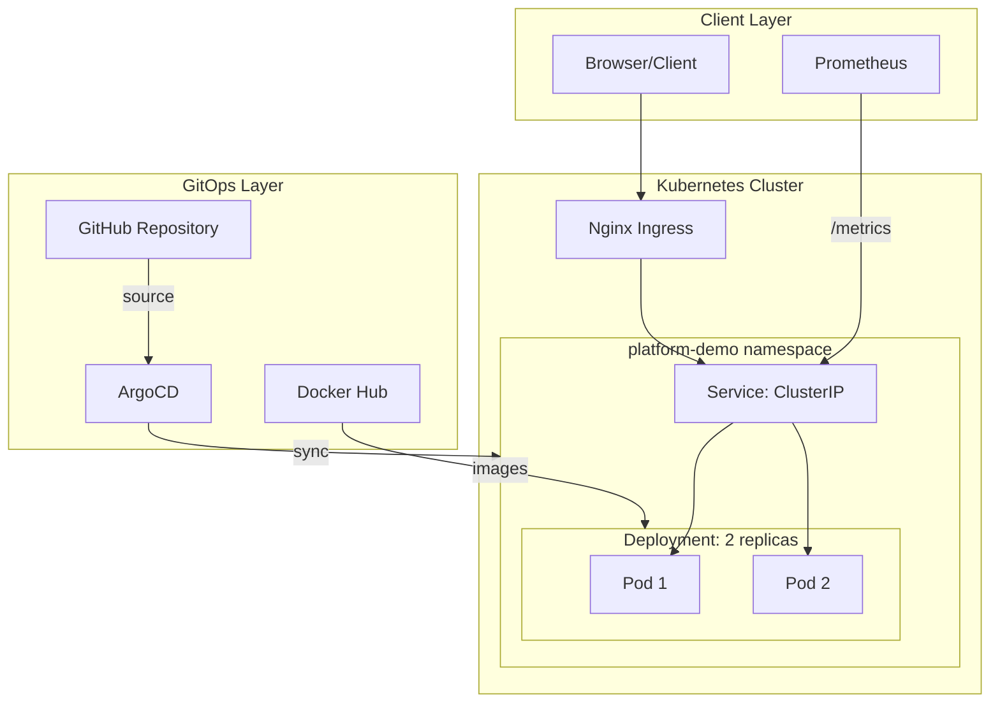

# FastAPI Platform Demo

A production-ready FastAPI application demonstrating platform engineering best practices with comprehensive observability, GitOps deployment, and CI/CD automation.

## Overview

The FastAPI Platform Demo is a reference implementation showcasing how to build and deploy cloud-native Python applications. It serves as both a learning resource and a template for production deployments.

### Key Features

| Feature                   | Description                                                              |
| ------------------------- | ------------------------------------------------------------------------ |
| **Health Probes**         | Kubernetes-native liveness and readiness endpoints with toggleable state |
| **Prometheus Metrics**    | HTTP request counters, latency histograms, and in-progress gauges        |
| **Structured Logging**    | JSON-formatted logs with request IDs for traceability                    |
| **Multi-arch Images**     | Docker images built for both amd64 and arm64 platforms                   |
| **GitOps Deployment**     | Automated deployments via ArgoCD with image auto-updates                 |
| **Supply Chain Security** | SBOM generation and build provenance attestations                        |

## Quick Start

### Local Development

```bash
# Clone the repository
git clone https://github.com/polyglotdev/from-devops-to-platform-engineering-master-backstage-and-idps.git
cd from-devops-to-platform-engineering-master-backstage-and-idps

# Install dependencies with uv
uv sync

# Run the application
uv run uvicorn main:app --reload
```

The API will be available at `http://localhost:8000`.

### Docker

```bash
# Pull the latest image
docker pull domniniquehallan/python-fastapi-app:latest

# Run the container
docker run -p 8000:8000 domniniquehallan/python-fastapi-app:latest
```

### Kubernetes (via Helm)

```bash
# Add to your cluster
helm install fastapi-app ./helm/fastapi-app -n platform-demo --create-namespace

# Or let ArgoCD manage it
kubectl apply -f argocd/applications/fastapi-app.yaml
```

## Architecture



## API Endpoints

| Endpoint               | Method | Description                |
| ---------------------- | ------ | -------------------------- |
| `/api/v1/hello`        | GET    | Simple greeting message    |
| `/api/v1/healthz`      | GET    | Liveness probe             |
| `/api/v1/ready`        | GET    | Readiness probe            |
| `/api/v1/ready/toggle` | POST   | Toggle readiness state     |
| `/api/v1/details`      | GET    | System and request details |
| `/api/v1/stats`        | GET    | System statistics          |
| `/api/v1/getdate`      | GET    | Current date               |
| `/metrics`             | GET    | Prometheus metrics         |

## Technology Stack

- **Runtime**: Python 3.13
- **Framework**: FastAPI with Uvicorn
- **Metrics**: prometheus-client
- **System Info**: psutil
- **User Agent Parsing**: user-agents
- **Package Management**: uv (Astral)
- **Container**: Multi-stage Docker build with Python 3.13-slim
- **Orchestration**: Kubernetes with Helm
- **GitOps**: ArgoCD with Image Updater
- **CI/CD**: GitHub Actions

## Project Structure

```
.
├── main.py                 # FastAPI application
├── pyproject.toml          # Python project configuration
├── Dockerfile              # Multi-stage container build
├── helm/
│   └── fastapi-app/        # Helm chart
├── k8s/                    # Raw Kubernetes manifests
├── argocd/
│   └── applications/       # ArgoCD Application specs
├── .github/
│   └── workflows/          # CI/CD pipelines
└── docs/
    └── fastapi-app/        # TechDocs documentation
```

## Related Documentation

- [API Reference](api-reference.md) - Detailed endpoint documentation
- [Deployment Guide](deployment.md) - Kubernetes and ArgoCD setup
- [Observability](observability.md) - Metrics, logging, and monitoring
- [Architecture](architecture.md) - System design and decisions
