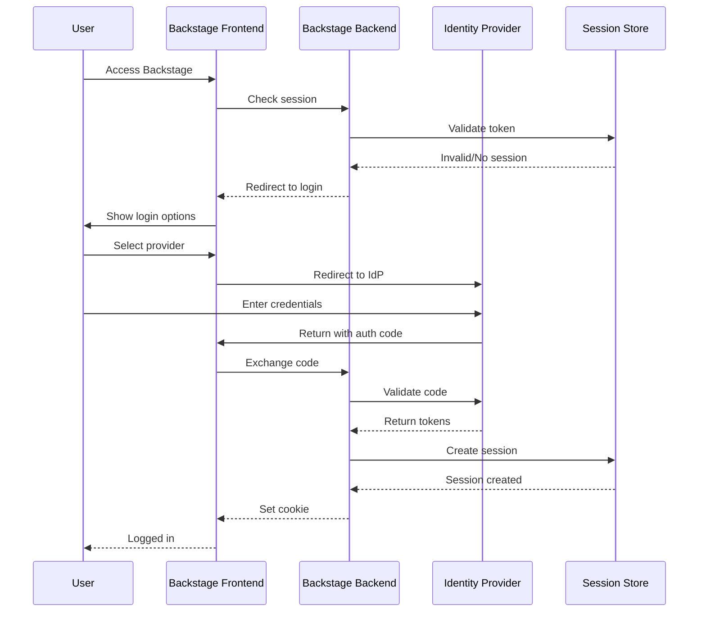
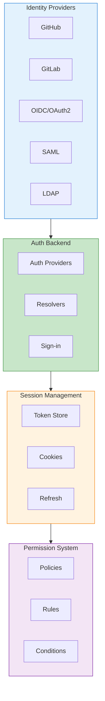
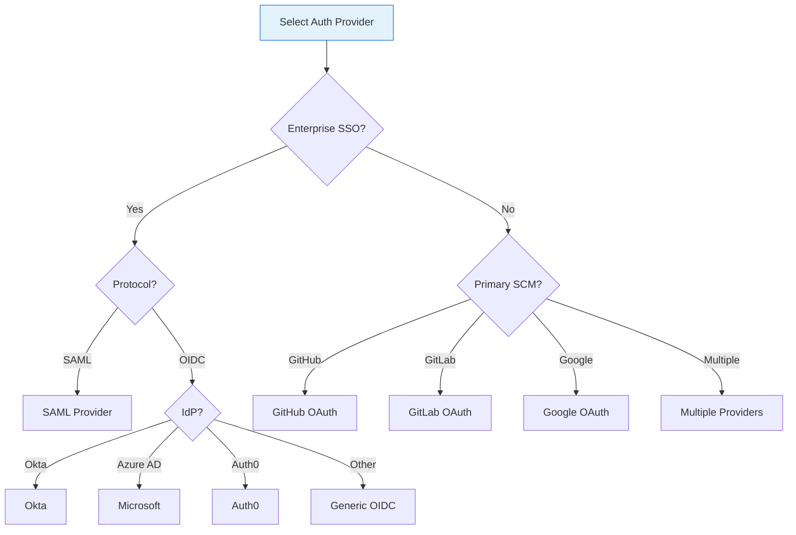
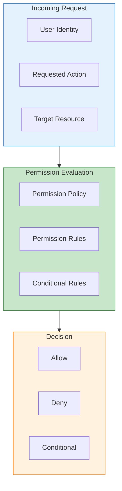
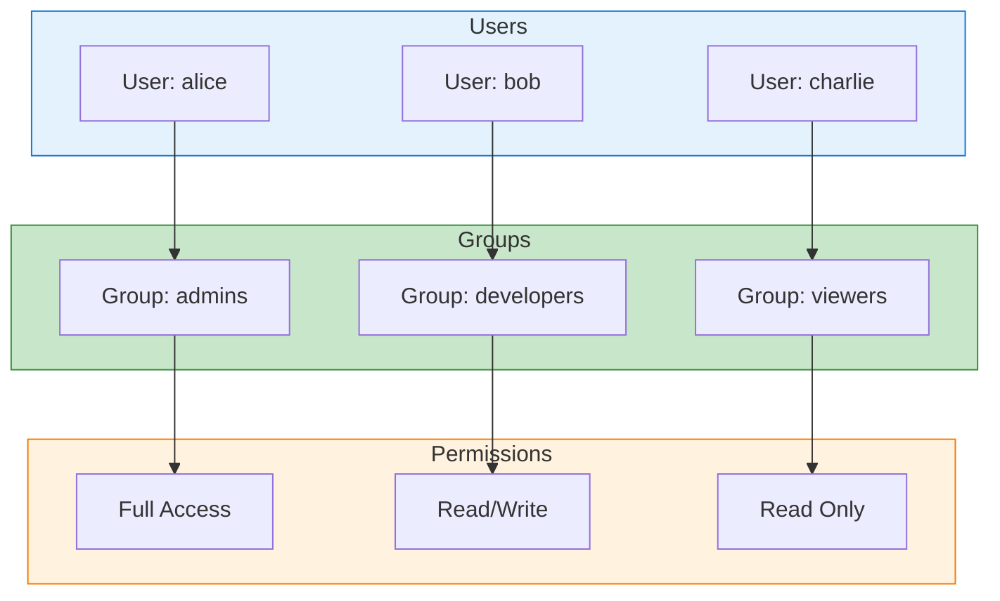
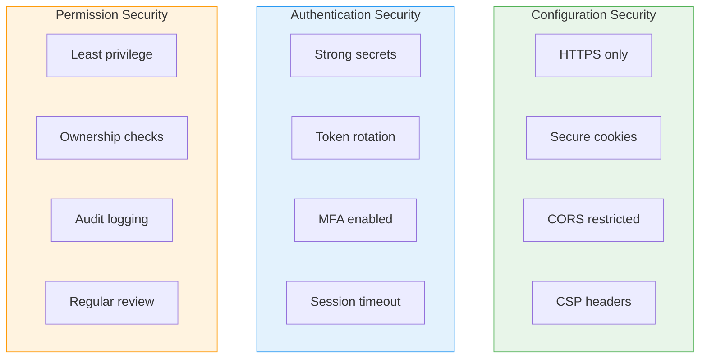

# Backstage Authentication and Authorization Guide

Comprehensive guide to implementing authentication, authorization, and
permissions in Backstage.

## Table of Contents

- [Backstage Authentication and Authorization Guide](#backstage-authentication-and-authorization-guide)
  - [Table of Contents](#table-of-contents)
  - [Understanding Auth in Backstage](#understanding-auth-in-backstage)
    - [Authentication Flow](#authentication-flow)
    - [Auth Architecture](#auth-architecture)
  - [Authentication Providers](#authentication-providers)
    - [Supported Providers](#supported-providers)
    - [Provider Selection Guide](#provider-selection-guide)
  - [Configuring Auth Providers](#configuring-auth-providers)
    - [GitHub OAuth](#github-oauth)
    - [Google OAuth](#google-oauth)
    - [Microsoft / Azure AD](#microsoft--azure-ad)
    - [Okta OIDC](#okta-oidc)
    - [Generic OIDC](#generic-oidc)
    - [SAML](#saml)
    - [Multiple Providers](#multiple-providers)
  - [Session Management](#session-management)
    - [Cookie Configuration](#cookie-configuration)
    - [Session Expiration](#session-expiration)
    - [Sign-in Resolvers](#sign-in-resolvers)
    - [Built-in Resolvers](#built-in-resolvers)
  - [Permission System](#permission-system)
    - [Permission Architecture](#permission-architecture)
    - [Enable Permission System](#enable-permission-system)
    - [Backend Permission Setup](#backend-permission-setup)
    - [Permission Policy](#permission-policy)
    - [Register Permission Policy](#register-permission-policy)
    - [Catalog Permissions](#catalog-permissions)
    - [Custom Permissions](#custom-permissions)
    - [Using Permissions in Backend](#using-permissions-in-backend)
    - [Using Permissions in Frontend](#using-permissions-in-frontend)
  - [Role-Based Access Control](#role-based-access-control)
    - [RBAC with Groups](#rbac-with-groups)
    - [Group-Based Policy](#group-based-policy)
    - [Entity Ownership Rules](#entity-ownership-rules)
  - [Service-to-Service Auth](#service-to-service-auth)
    - [Backend Service Authentication](#backend-service-authentication)
    - [External Service Auth](#external-service-auth)
  - [Security Best Practices](#security-best-practices)
    - [1. Secure Configuration](#1-secure-configuration)
    - [2. Token Security](#2-token-security)
    - [3. Audit Logging](#3-audit-logging)
    - [4. Regular Security Reviews](#4-regular-security-reviews)
    - [Security Checklist](#security-checklist)
  - [Next Steps](#next-steps)
  - [References](#references)

## Understanding Auth in Backstage

Backstage uses a flexible authentication system that supports multiple identity
providers and a powerful permission framework for authorization.

### Authentication Flow



### Auth Architecture



## Authentication Providers

### Supported Providers

| Provider  | Type             | Use Case                 |
| --------- | ---------------- | ------------------------ |
| GitHub    | OAuth 2.0        | GitHub organizations     |
| GitLab    | OAuth 2.0        | GitLab instances         |
| Google    | OAuth 2.0        | Google Workspace         |
| Microsoft | OAuth 2.0 / OIDC | Azure AD / Microsoft 365 |
| Okta      | OIDC             | Enterprise SSO           |
| Auth0     | OIDC             | Auth0 tenants            |
| OneLogin  | OIDC             | Enterprise SSO           |
| SAML      | SAML 2.0         | Enterprise IdPs          |
| LDAP      | LDAP             | On-premises directories  |
| Guest     | None             | Development/demos        |

### Provider Selection Guide



## Configuring Auth Providers

### GitHub OAuth

**1. Create GitHub OAuth App:**

- Go to GitHub Settings > Developer settings > OAuth Apps
- New OAuth App
- Authorization callback URL: `https://backstage.example.com/api/auth/github/handler/frame`

**2. Configure Backstage:**

```yaml
# app-config.yaml
auth:
  environment: production
  providers:
    github:
      production:
        clientId: ${AUTH_GITHUB_CLIENT_ID}
        clientSecret: ${AUTH_GITHUB_CLIENT_SECRET}
        # Enterprise GitHub
        # enterpriseInstanceUrl: https://github.mycompany.com
        signIn:
          resolvers:
            - resolver: usernameMatchingUserEntityName
```

**3. Backend Setup:**

```typescript
// packages/backend/src/index.ts
import { createBackend } from '@backstage/backend-defaults'

const backend = createBackend()

backend.add(import('@backstage/plugin-auth-backend'))
backend.add(import('@backstage/plugin-auth-backend-module-github-provider'))

backend.start()
```

**4. Frontend Setup:**

```typescript
// packages/app/src/App.tsx
import { githubAuthApiRef } from '@backstage/core-plugin-api'
import { SignInPage } from '@backstage/core-components'

const app = createApp({
  components: {
    SignInPage: (props) => (
      <SignInPage
        {...props}
        auto
        providers={[
          {
            id: 'github-auth-provider',
            title: 'GitHub',
            message: 'Sign in using GitHub',
            apiRef: githubAuthApiRef,
          },
        ]}
      />
    ),
  },
})
```

### Google OAuth

**1. Create Google OAuth Credentials:**

- Go to Google Cloud Console > APIs & Services > Credentials
- Create OAuth 2.0 Client ID
- Authorized redirect URI: `https://backstage.example.com/api/auth/google/handler/frame`

**2. Configure Backstage:**

```yaml
auth:
  providers:
    google:
      production:
        clientId: ${AUTH_GOOGLE_CLIENT_ID}
        clientSecret: ${AUTH_GOOGLE_CLIENT_SECRET}
        signIn:
          resolvers:
            - resolver: emailMatchingUserEntityProfileEmail
```

```typescript
// Backend
backend.add(import('@backstage/plugin-auth-backend-module-google-provider'))
```

### Microsoft / Azure AD

**1. Register Azure AD Application:**

- Azure Portal > Azure Active Directory > App registrations
- Redirect URI: `https://backstage.example.com/api/auth/microsoft/handler/frame`

**2. Configure Backstage:**

```yaml
auth:
  providers:
    microsoft:
      production:
        clientId: ${AUTH_MICROSOFT_CLIENT_ID}
        clientSecret: ${AUTH_MICROSOFT_CLIENT_SECRET}
        tenantId: ${AUTH_MICROSOFT_TENANT_ID}
        # Optional: domain hint
        # domainHint: mycompany.com
        signIn:
          resolvers:
            - resolver: emailMatchingUserEntityProfileEmail
```

### Okta OIDC

```yaml
auth:
  providers:
    okta:
      production:
        clientId: ${AUTH_OKTA_CLIENT_ID}
        clientSecret: ${AUTH_OKTA_CLIENT_SECRET}
        audience: ${AUTH_OKTA_AUDIENCE}
        # authServerId: default
        # idp: 0oaxxxxx (for specific IdP)
        signIn:
          resolvers:
            - resolver: emailMatchingUserEntityProfileEmail
```

### Generic OIDC

```yaml
auth:
  providers:
    oidc:
      production:
        clientId: ${AUTH_OIDC_CLIENT_ID}
        clientSecret: ${AUTH_OIDC_CLIENT_SECRET}
        metadataUrl: https://idp.example.com/.well-known/openid-configuration
        # Or specify endpoints manually
        # authorizationUrl: https://idp.example.com/authorize
        # tokenUrl: https://idp.example.com/token
        # tokenSignedResponseAlg: RS256
        scope: 'openid profile email'
        prompt: 'auto' # auto, none, consent, login
        signIn:
          resolvers:
            - resolver: emailMatchingUserEntityProfileEmail
```

### SAML

```yaml
auth:
  providers:
    saml:
      production:
        entryPoint: https://idp.example.com/sso/saml
        issuer: backstage
        cert: ${SAML_IDP_CERT}
        # Optional
        # privateKey: ${SAML_PRIVATE_KEY}
        # decryptionPvk: ${SAML_DECRYPTION_KEY}
        # audience: https://backstage.example.com
        signIn:
          resolvers:
            - resolver: emailMatchingUserEntityProfileEmail
```

### Multiple Providers

```yaml
auth:
  environment: production
  providers:
    github:
      production:
        clientId: ${AUTH_GITHUB_CLIENT_ID}
        clientSecret: ${AUTH_GITHUB_CLIENT_SECRET}
    google:
      production:
        clientId: ${AUTH_GOOGLE_CLIENT_ID}
        clientSecret: ${AUTH_GOOGLE_CLIENT_SECRET}
    microsoft:
      production:
        clientId: ${AUTH_MICROSOFT_CLIENT_ID}
        clientSecret: ${AUTH_MICROSOFT_CLIENT_SECRET}
        tenantId: ${AUTH_MICROSOFT_TENANT_ID}
```

```typescript
// Frontend with multiple providers
<SignInPage
  {...props}
  providers={[
    {
      id: 'github-auth-provider',
      title: 'GitHub',
      message: 'Sign in using GitHub',
      apiRef: githubAuthApiRef,
    },
    {
      id: 'google-auth-provider',
      title: 'Google',
      message: 'Sign in using Google',
      apiRef: googleAuthApiRef,
    },
    {
      id: 'microsoft-auth-provider',
      title: 'Microsoft',
      message: 'Sign in using Microsoft',
      apiRef: microsoftAuthApiRef,
    },
  ]}
/>
```

## Session Management

### Cookie Configuration

```yaml
# app-config.yaml
backend:
  auth:
    keys:
      - secret: ${AUTH_SESSION_SECRET} # min 32 characters

    # Cookie settings
    cookies:
      secure: true # Require HTTPS
      sameSite: lax # lax, strict, none
      domain: .example.com # Optional: share across subdomains
```

### Session Expiration

```yaml
auth:
  session:
    # Session lifetime (default: 1 day)
    maxAge: 86400000 # milliseconds

    # Sliding expiration
    rolling: true
```

### Sign-in Resolvers

Resolvers map external identity to Backstage entities:

```typescript
// Custom resolver
import { createSignInResolverFactory } from '@backstage/plugin-auth-backend'

export const customSignInResolver = createSignInResolverFactory({
  create() {
    return async (info, ctx) => {
      const { profile } = info

      // Custom logic to find user entity
      const userEntity = await ctx.findCatalogUser({
        filter: {
          'spec.profile.email': profile.email,
        },
      })

      if (!userEntity) {
        throw new Error(`User not found: ${profile.email}`)
      }

      return ctx.signInWithCatalogUser({
        entityRef: userEntity.entity.metadata.name,
      })
    }
  },
})
```

### Built-in Resolvers

| Resolver                               | Description        |
| -------------------------------------- | ------------------ |
| `usernameMatchingUserEntityName`       | Match by username  |
| `emailMatchingUserEntityProfileEmail`  | Match by email     |
| `emailLocalPartMatchingUserEntityName` | Match email prefix |

## Permission System

### Permission Architecture



### Enable Permission System

```yaml
# app-config.yaml
permission:
  enabled: true
```

### Backend Permission Setup

```typescript
// packages/backend/src/index.ts
import { createBackend } from '@backstage/backend-defaults'

const backend = createBackend()

// Permission backend
backend.add(import('@backstage/plugin-permission-backend/alpha'))
backend.add(
  import('@backstage/plugin-permission-backend-module-allow-all-policy')
)
// Or custom policy
// backend.add(import('./plugins/permission-policy'));

backend.start()
```

### Permission Policy

```typescript
// packages/backend/src/plugins/permission-policy.ts
import {
  PolicyDecision,
  AuthorizeResult,
} from '@backstage/plugin-permission-common'
import {
  PermissionPolicy,
  PolicyQuery,
} from '@backstage/plugin-permission-node'
import { BackstageIdentityResponse } from '@backstage/plugin-auth-node'

export class CustomPermissionPolicy implements PermissionPolicy {
  async handle(
    request: PolicyQuery,
    user?: BackstageIdentityResponse
  ): Promise<PolicyDecision> {
    // Get user's ownership claims
    const ownership = user?.identity.ownershipEntityRefs ?? []

    // Admin check
    if (ownership.includes('group:default/admins')) {
      return { result: AuthorizeResult.ALLOW }
    }

    // Permission-specific logic
    if (request.permission.name === 'catalog.entity.delete') {
      // Only allow owners to delete
      if (request.permission.resourceType === 'catalog-entity') {
        return {
          result: AuthorizeResult.CONDITIONAL,
          pluginId: 'catalog',
          resourceType: 'catalog-entity',
          conditions: {
            rule: 'IS_ENTITY_OWNER',
            params: { claims: ownership },
          },
        }
      }
    }

    // Default deny
    return { result: AuthorizeResult.DENY }
  }
}
```

### Register Permission Policy

```typescript
// packages/backend/src/plugins/permission-policy.ts
import { createBackendModule } from '@backstage/backend-plugin-api'
import { policyExtensionPoint } from '@backstage/plugin-permission-node/alpha'
import { CustomPermissionPolicy } from './CustomPermissionPolicy'

export default createBackendModule({
  pluginId: 'permission',
  moduleId: 'custom-policy',
  register(reg) {
    reg.registerInit({
      deps: {
        policy: policyExtensionPoint,
      },
      async init({ policy }) {
        policy.setPolicy(new CustomPermissionPolicy())
      },
    })
  },
})
```

### Catalog Permissions

```typescript
// Built-in catalog permissions
import {
  catalogEntityCreatePermission,
  catalogEntityDeletePermission,
  catalogEntityRefreshPermission,
  catalogLocationCreatePermission,
  catalogLocationDeletePermission,
} from '@backstage/plugin-catalog-common/alpha'

// In permission policy
if (request.permission.name === catalogEntityDeletePermission.name) {
  // Handle delete permission
}
```

### Custom Permissions

```typescript
// plugins/my-plugin-common/src/permissions.ts
import { createPermission } from '@backstage/plugin-permission-common'

export const myPluginReadPermission = createPermission({
  name: 'my-plugin.read',
  attributes: { action: 'read' },
})

export const myPluginWritePermission = createPermission({
  name: 'my-plugin.write',
  attributes: { action: 'update' },
})

export const myPluginPermissions = [
  myPluginReadPermission,
  myPluginWritePermission,
]
```

### Using Permissions in Backend

```typescript
// plugins/my-plugin-backend/src/router.ts
import { PermissionsService } from '@backstage/backend-plugin-api'
import { AuthorizeResult } from '@backstage/plugin-permission-common'
import { myPluginWritePermission } from '@internal/plugin-my-plugin-common'

export async function createRouter(options: {
  permissions: PermissionsService
  httpAuth: HttpAuthService
}) {
  const { permissions, httpAuth } = options

  router.post('/items', async (req, res) => {
    const credentials = await httpAuth.credentials(req)

    // Check permission
    const decision = await permissions.authorize(
      [{ permission: myPluginWritePermission }],
      { credentials }
    )

    if (decision[0].result !== AuthorizeResult.ALLOW) {
      res.status(403).json({ error: 'Forbidden' })
      return
    }

    // Proceed with creating item
    const item = await service.createItem(req.body)
    res.status(201).json(item)
  })

  return router
}
```

### Using Permissions in Frontend

```typescript
// plugins/my-plugin/src/components/CreateButton.tsx
import React from 'react'
import { usePermission } from '@backstage/plugin-permission-react'
import { myPluginWritePermission } from '@internal/plugin-my-plugin-common'
import { Button } from '@material-ui/core'

export const CreateButton = () => {
  const { allowed, loading } = usePermission({
    permission: myPluginWritePermission,
  })

  if (loading) {
    return null
  }

  return (
    <Button disabled={!allowed} onClick={handleCreate}>
      Create Item
    </Button>
  )
}
```

## Role-Based Access Control

### RBAC with Groups



### Group-Based Policy

```typescript
// packages/backend/src/plugins/permission-policy.ts
import { BackstageIdentityResponse } from '@backstage/plugin-auth-node'

type Role = 'admin' | 'developer' | 'viewer'

function getUserRole(user?: BackstageIdentityResponse): Role {
  const ownership = user?.identity.ownershipEntityRefs ?? []

  if (ownership.includes('group:default/admins')) {
    return 'admin'
  }
  if (ownership.includes('group:default/developers')) {
    return 'developer'
  }
  return 'viewer'
}

export class RBACPermissionPolicy implements PermissionPolicy {
  async handle(
    request: PolicyQuery,
    user?: BackstageIdentityResponse
  ): Promise<PolicyDecision> {
    const role = getUserRole(user)

    // Admin: full access
    if (role === 'admin') {
      return { result: AuthorizeResult.ALLOW }
    }

    // Define role permissions
    const rolePermissions: Record<Role, string[]> = {
      admin: ['*'],
      developer: [
        'catalog.entity.read',
        'catalog.entity.create',
        'catalog.entity.refresh',
        'scaffolder.task.create',
        'scaffolder.task.read',
      ],
      viewer: ['catalog.entity.read', 'scaffolder.task.read'],
    }

    const allowedPermissions = rolePermissions[role] || []

    if (
      allowedPermissions.includes('*') ||
      allowedPermissions.includes(request.permission.name)
    ) {
      return { result: AuthorizeResult.ALLOW }
    }

    return { result: AuthorizeResult.DENY }
  }
}
```

### Entity Ownership Rules

```typescript
// Conditional permission based on ownership
import { createConditionFactory } from '@backstage/plugin-permission-node'
import { catalogConditions } from '@backstage/plugin-catalog-backend/alpha'

// Use built-in ownership condition
const isOwner = catalogConditions.isEntityOwner

export class OwnershipPolicy implements PermissionPolicy {
  async handle(
    request: PolicyQuery,
    user?: BackstageIdentityResponse
  ): Promise<PolicyDecision> {
    const ownership = user?.identity.ownershipEntityRefs ?? []

    // For entity modifications, require ownership
    if (request.permission.name === 'catalog.entity.delete') {
      return {
        result: AuthorizeResult.CONDITIONAL,
        pluginId: 'catalog',
        resourceType: 'catalog-entity',
        conditions: catalogConditions.isEntityOwner({
          claims: ownership,
        }),
      }
    }

    return { result: AuthorizeResult.ALLOW }
  }
}
```

## Service-to-Service Auth

### Backend Service Authentication

```typescript
// Service calling another service
import { AuthService } from '@backstage/backend-plugin-api'

export class MyService {
  constructor(private readonly auth: AuthService) {}

  async callOtherService(): Promise<Data> {
    // Get service token
    const { token } = await this.auth.getPluginRequestToken({
      onBehalfOf: await this.auth.getOwnServiceCredentials(),
      targetPluginId: 'catalog',
    })

    const response = await fetch('http://localhost:7007/api/catalog/entities', {
      headers: {
        Authorization: `Bearer ${token}`,
      },
    })

    return response.json()
  }
}
```

### External Service Auth

```yaml
# app-config.yaml
backend:
  auth:
    externalAccess:
      - type: static
        options:
          token: ${EXTERNAL_ACCESS_TOKEN}
          subject: external-service
```

```typescript
// External service calling Backstage API
const response = await fetch(
  'https://backstage.example.com/api/catalog/entities',
  {
    headers: {
      Authorization: `Bearer ${process.env.BACKSTAGE_TOKEN}`,
    },
  }
)
```

## Security Best Practices

### 1. Secure Configuration

```yaml
# Production security settings
backend:
  # Use secure cookies
  auth:
    keys:
      - secret: ${AUTH_SESSION_SECRET} # 32+ character secret
    cookies:
      secure: true
      sameSite: strict

  # CORS configuration
  cors:
    origin: https://backstage.example.com
    methods: [GET, HEAD, PATCH, POST, PUT, DELETE]
    credentials: true

  # CSP headers
  csp:
    connect-src: ["'self'", 'https:']
    default-src: ["'self'"]
    img-src: ["'self'", 'data:', 'https:']
    script-src: ["'self'", "'unsafe-eval'"]
```

### 2. Token Security

```yaml
# Rotate secrets regularly
auth:
  providers:
    github:
      production:
        clientId: ${AUTH_GITHUB_CLIENT_ID}
        clientSecret: ${AUTH_GITHUB_CLIENT_SECRET}
        # Use environment-specific secrets
```

### 3. Audit Logging

```typescript
// Add audit logging to permission policy
export class AuditingPermissionPolicy implements PermissionPolicy {
  constructor(private readonly logger: LoggerService) {}

  async handle(
    request: PolicyQuery,
    user?: BackstageIdentityResponse
  ): Promise<PolicyDecision> {
    const decision = await this.evaluatePolicy(request, user)

    // Log permission decisions
    this.logger.info('Permission decision', {
      user: user?.identity.userEntityRef,
      permission: request.permission.name,
      resource: request.permission.resourceType,
      decision: decision.result,
      timestamp: new Date().toISOString(),
    })

    return decision
  }
}
```

### 4. Regular Security Reviews

| Area         | Review Frequency | Checklist                    |
| ------------ | ---------------- | ---------------------------- |
| Auth tokens  | Monthly          | Rotate secrets, check scopes |
| Permissions  | Quarterly        | Audit role assignments       |
| Dependencies | Weekly           | Security updates             |
| Access logs  | Weekly           | Review anomalies             |

### Security Checklist



## Next Steps

- [Integrations Guide](./backstage-integrations.md) - Secure external
  connections
- [Plugin Development](./backstage-plugins.md) - Add permissions to plugins
- [Best Practices](./backstage-best-practices.md) - Security patterns

## References

- [Authentication Documentation](https://backstage.io/docs/auth/)
- [Permission System](https://backstage.io/docs/permissions/)
- [Auth Providers](https://backstage.io/docs/auth/identity-resolver)
- [Security Advisories](https://github.com/backstage/backstage/security/advisories)
