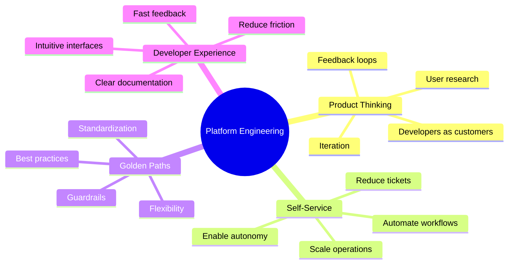
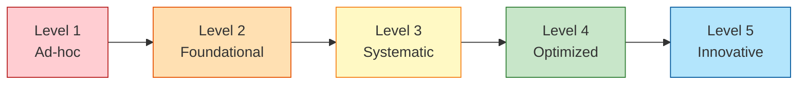
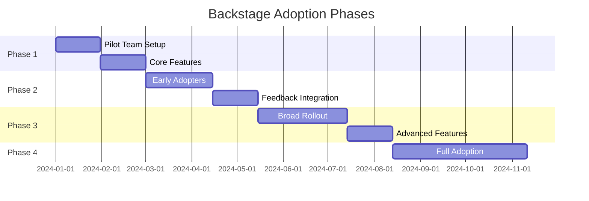
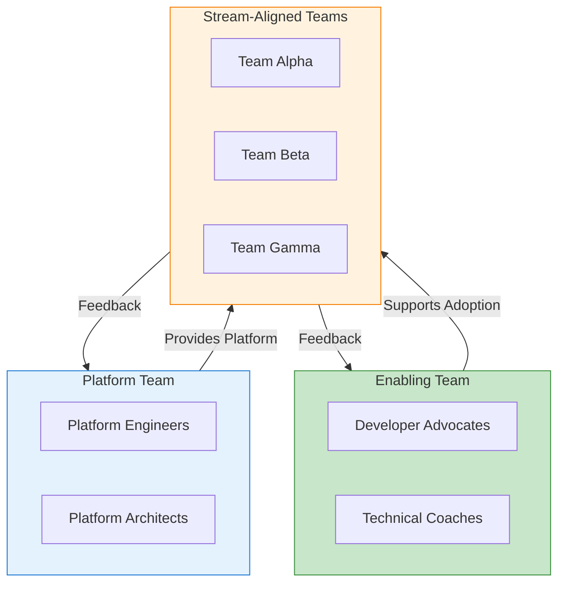
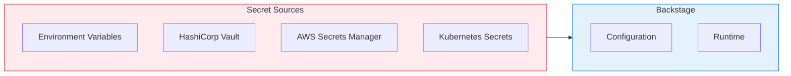
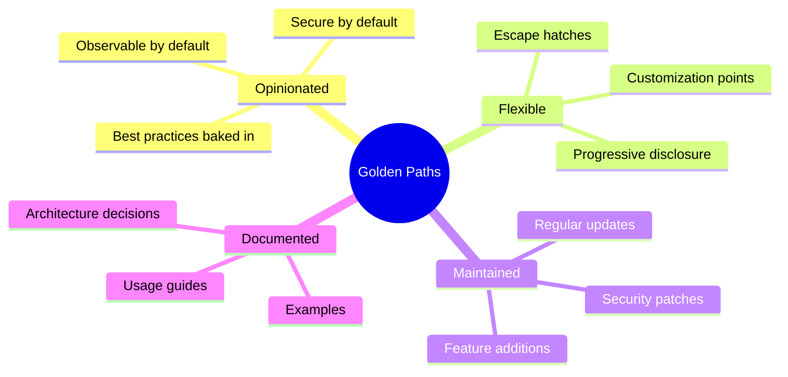
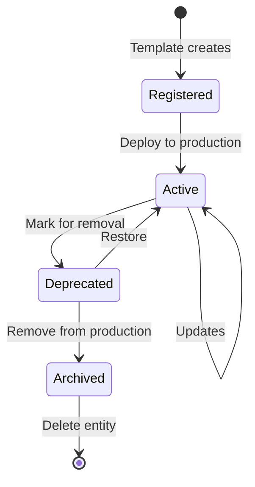
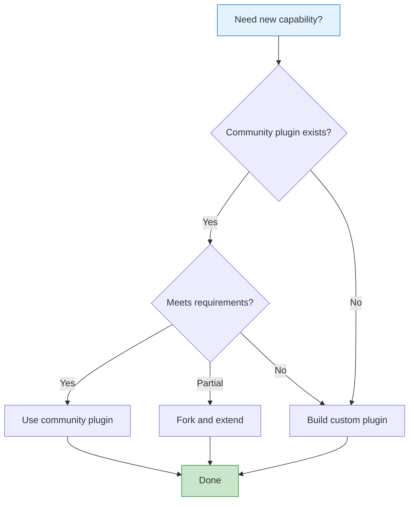
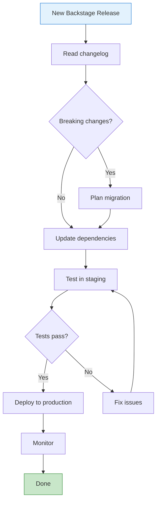
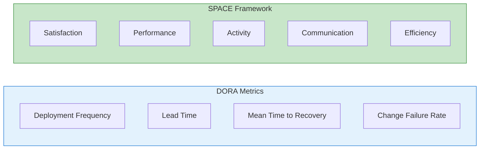

# Backstage Best Practices for Platform Engineering

This guide covers best practices, patterns, and strategies for successfully
implementing Backstage as part of your Internal Developer Platform.

## Table of Contents

- [Backstage Best Practices for Platform Engineering](#backstage-best-practices-for-platform-engineering)
  - [Table of Contents](#table-of-contents)
  - [Platform Engineering Fundamentals](#platform-engineering-fundamentals)
    - [The Platform Engineering Mindset](#the-platform-engineering-mindset)
    - [Platform Team Structure](#platform-team-structure)
    - [Platform Maturity Model](#platform-maturity-model)
  - [Adoption Strategy](#adoption-strategy)
    - [Phased Rollout](#phased-rollout)
    - [Phase 1: Foundation (1-2 months)](#phase-1-foundation-1-2-months)
    - [Phase 2: Expansion (2-3 months)](#phase-2-expansion-2-3-months)
    - [Phase 3: Scale (3-6 months)](#phase-3-scale-3-6-months)
    - [Phase 4: Optimization (Ongoing)](#phase-4-optimization-ongoing)
    - [Adoption Checklist](#adoption-checklist)
  - [Organizational Patterns](#organizational-patterns)
    - [Team Topologies for Platform](#team-topologies-for-platform)
    - [InnerSource Model](#innersource-model)
    - [Governance Model](#governance-model)
  - [Technical Best Practices](#technical-best-practices)
    - [Configuration Management](#configuration-management)
    - [Secret Management](#secret-management)
    - [Performance Optimization](#performance-optimization)
    - [Caching Strategy](#caching-strategy)
  - [Golden Paths](#golden-paths)
    - [Golden Path Principles](#golden-path-principles)
    - [Template Design Pattern](#template-design-pattern)
    - [Service Template Example](#service-template-example)
  - [Catalog Management](#catalog-management)
    - [Entity Lifecycle](#entity-lifecycle)
    - [Catalog Quality](#catalog-quality)
    - [Automated Validation](#automated-validation)
    - [Catalog Hygiene](#catalog-hygiene)
  - [Plugin Strategy](#plugin-strategy)
    - [Plugin Decision Matrix](#plugin-decision-matrix)
    - [Plugin Prioritization](#plugin-prioritization)
    - [Plugin Maintenance](#plugin-maintenance)
  - [Operations and Maintenance](#operations-and-maintenance)
    - [Monitoring Setup](#monitoring-setup)
    - [Health Checks](#health-checks)
    - [Backup Strategy](#backup-strategy)
    - [Upgrade Process](#upgrade-process)
  - [Measuring Success](#measuring-success)
    - [Key Performance Indicators](#key-performance-indicators)
    - [Developer Experience Metrics](#developer-experience-metrics)
    - [Satisfaction Survey](#satisfaction-survey)
    - [Reporting Dashboard](#reporting-dashboard)
  - [Common Pitfalls](#common-pitfalls)
    - [Pitfall 1: Big Bang Approach](#pitfall-1-big-bang-approach)
    - [Pitfall 2: Ignoring User Research](#pitfall-2-ignoring-user-research)
    - [Pitfall 3: Over-Engineering Templates](#pitfall-3-over-engineering-templates)
    - [Pitfall 4: Neglecting Maintenance](#pitfall-4-neglecting-maintenance)
    - [Pitfall 5: Poor Catalog Quality](#pitfall-5-poor-catalog-quality)
    - [Anti-Patterns to Avoid](#anti-patterns-to-avoid)
  - [Next Steps](#next-steps)
  - [References](#references)

## Platform Engineering Fundamentals

### The Platform Engineering Mindset



### Platform Team Structure

| Role                         | Responsibilities                   |
| ---------------------------- | ---------------------------------- |
| **Platform Product Manager** | Roadmap, user research, priorities |
| **Platform Engineers**       | Build and maintain platform        |
| **Developer Advocates**      | Adoption, training, feedback       |
| **SRE/Operations**           | Reliability, monitoring, support   |

### Platform Maturity Model



| Level               | Characteristics                    |
| ------------------- | ---------------------------------- |
| **1. Ad-hoc**       | No platform, manual processes      |
| **2. Foundational** | Basic Backstage, catalog only      |
| **3. Systematic**   | Templates, TechDocs, integrations  |
| **4. Optimized**    | Self-service, automation, metrics  |
| **5. Innovative**   | AI-assisted, predictive, proactive |

## Adoption Strategy

### Phased Rollout



### Phase 1: Foundation (1-2 months)

| Activity              | Deliverable                 |
| --------------------- | --------------------------- |
| Deploy Backstage      | Running instance            |
| Software Catalog      | Initial entities registered |
| Authentication        | SSO integration             |
| Pilot team onboarding | 1-2 teams using Backstage   |

### Phase 2: Expansion (2-3 months)

| Activity            | Deliverable                      |
| ------------------- | -------------------------------- |
| Software Templates  | 2-3 golden path templates        |
| TechDocs            | Documentation for pilot services |
| Key integrations    | CI/CD, Kubernetes visibility     |
| Feedback collection | User interviews, surveys         |

### Phase 3: Scale (3-6 months)

| Activity         | Deliverable                       |
| ---------------- | --------------------------------- |
| Broad rollout    | 50%+ teams onboarded              |
| Custom plugins   | Organization-specific features    |
| Automation       | Catalog sync, template automation |
| Training program | Documentation, workshops          |

### Phase 4: Optimization (Ongoing)

| Activity               | Deliverable                      |
| ---------------------- | -------------------------------- |
| Full adoption          | All teams onboarded              |
| Advanced features      | Permissions, search optimization |
| Metrics and KPIs       | Developer productivity metrics   |
| Continuous improvement | Regular feedback cycles          |

### Adoption Checklist

```markdown
## Pre-Launch

- [ ] Executive sponsorship secured
- [ ] Platform team formed
- [ ] Success metrics defined
- [ ] Pilot teams identified

## Foundation

- [ ] Backstage deployed (staging/prod)
- [ ] Authentication configured
- [ ] Core integrations working
- [ ] Initial catalog populated

## Templates

- [ ] Service template created
- [ ] Frontend template created
- [ ] Documentation template created
- [ ] Template testing complete

## Documentation

- [ ] Backstage user guide written
- [ ] Template usage docs created
- [ ] Onboarding guide ready
- [ ] FAQ compiled

## Launch

- [ ] Pilot feedback incorporated
- [ ] Training sessions scheduled
- [ ] Support channels established
- [ ] Communication plan executed
```

## Organizational Patterns

### Team Topologies for Platform



### InnerSource Model

Encourage contributions from across the organization:

```yaml
# CONTRIBUTING.md structure
Contributing to Backstage:
  - Report bugs via issues
  - Suggest features via RFCs
  - Submit pull requests
  - Review others' contributions

Contribution Areas:
  - Catalog entities
  - Software templates
  - Documentation
  - Plugins
  - Bug fixes
```

### Governance Model

| Area          | Governance                              |
| ------------- | --------------------------------------- |
| **Templates** | Platform team owns, PRs welcome         |
| **Plugins**   | Platform team reviews, teams contribute |
| **Catalog**   | Teams own their entities                |
| **Standards** | Architecture review board               |

## Technical Best Practices

### Configuration Management

```yaml
# Use environment-specific configs
# app-config.yaml (base)
app:
  title: Developer Portal

# app-config.local.yaml (development)
app:
  title: Developer Portal (Dev)
backend:
  database:
    client: better-sqlite3
    connection: ':memory:'

# app-config.production.yaml (production)
app:
  title: Developer Portal
backend:
  database:
    client: pg
    connection:
      host: ${POSTGRES_HOST}
```

### Secret Management



**Best Practices:**

1. Never commit secrets to git
2. Use secret management tools
3. Rotate secrets regularly
4. Audit secret access

### Performance Optimization

```yaml
# Catalog performance
catalog:
  processingInterval:
    minutes: 5 # Don't process too frequently
  rules:
    - allow: [Component, API, Resource, System, Domain, Group, User]
  providers:
    github:
      schedule:
        frequency: { hours: 1 } # Reasonable discovery interval

# Search performance
search:
  collators:
    catalog:
      batchSize: 500
      defaultRefreshIntervalSeconds: 600
```

### Caching Strategy

```typescript
// Use caching for external APIs
import { cacheService } from '@backstage/backend-plugin-api'

const cachedData = await cache.get('my-key')
if (cachedData) {
  return cachedData
}

const freshData = await fetchFromApi()
await cache.set('my-key', freshData, { ttl: 3600 })
return freshData
```

## Golden Paths

### Golden Path Principles



### Template Design Pattern

```yaml
# Template structure for golden paths
parameters:
  # Required basics
  - title: Required Information
    required: [name, owner]
    properties:
      name: ...
      owner: ...

  # Optional customization
  - title: Optional Configuration
    properties:
      enableFeatureX:
        default: true
      customSetting:
        default: 'standard'

  # Advanced (hidden by default)
  - title: Advanced Options
    properties:
      advancedMode:
        default: false

    dependencies:
      advancedMode:
        oneOf:
          - properties:
              advancedMode:
                const: false
          - properties:
              advancedMode:
                const: true
              expertSetting: ...
```

### Service Template Example

```yaml
# templates/service-golden-path/template.yaml
apiVersion: scaffolder.backstage.io/v1beta3
kind: Template
metadata:
  name: service-golden-path
  title: Production-Ready Service
  description: |
    Create a new service with all best practices:
    - CI/CD pipeline
    - Kubernetes deployment
    - Monitoring and alerting
    - Documentation
    - Security scanning
spec:
  owner: group:platform-team
  type: service

  parameters:
    - title: Service Information
      required: [name, description, owner]
      properties:
        name:
          title: Name
          type: string
          pattern: '^[a-z][a-z0-9-]*$'
        description:
          title: Description
          type: string
        owner:
          title: Owner
          type: string
          ui:field: OwnerPicker

    - title: Technology Stack
      required: [language]
      properties:
        language:
          title: Language
          type: string
          enum: [python, typescript, go]
          enumNames: [Python, TypeScript, Go]

    - title: Infrastructure
      properties:
        needsDatabase:
          title: Needs Database
          type: boolean
          default: false
        needsCache:
          title: Needs Cache
          type: boolean
          default: false
        tier:
          title: Service Tier
          type: string
          enum: [standard, critical]
          default: standard

  steps:
    # Fetch template based on language
    - id: fetch
      action: fetch:template
      input:
        url: ./skeleton/${{ parameters.language }}
        values:
          name: ${{ parameters.name }}
          description: ${{ parameters.description }}
          owner: ${{ parameters.owner }}

    # Add database config if needed
    - id: add-database
      if: ${{ parameters.needsDatabase }}
      action: fetch:template
      input:
        url: ./addons/database
        targetPath: ./

    # Publish to GitHub
    - id: publish
      action: publish:github
      input:
        repoUrl: ${{ parameters.repoUrl }}
        description: ${{ parameters.description }}

    # Register in catalog
    - id: register
      action: catalog:register
      input:
        repoContentsUrl: ${{ steps.publish.output.repoContentsUrl }}
        catalogInfoPath: /catalog-info.yaml

  output:
    links:
      - title: Repository
        url: ${{ steps.publish.output.remoteUrl }}
      - title: Open in Catalog
        entityRef: ${{ steps.register.output.entityRef }}
```

## Catalog Management

### Entity Lifecycle



### Catalog Quality

| Metric               | Target | Check                          |
| -------------------- | ------ | ------------------------------ |
| Description coverage | 100%   | All entities have descriptions |
| Owner coverage       | 100%   | All entities have owners       |
| Documentation        | 80%+   | Most entities have TechDocs    |
| Tags                 | 90%+   | Entities are properly tagged   |
| Relationships        | 70%+   | Systems/dependencies defined   |

### Automated Validation

```yaml
# .github/workflows/catalog-validation.yml
name: Validate Catalog

on:
  pull_request:
    paths:
      - '**/catalog-info.yaml'

jobs:
  validate:
    runs-on: ubuntu-latest
    steps:
      - uses: actions/checkout@v4

      - name: Validate catalog-info.yaml
        run: |
          # Check required fields
          for file in $(find . -name 'catalog-info.yaml'); do
            echo "Validating $file"

            # Check description exists
            if ! yq e '.metadata.description' "$file" | grep -v null; then
              echo "ERROR: Missing description in $file"
              exit 1
            fi

            # Check owner exists
            if ! yq e '.spec.owner' "$file" | grep -v null; then
              echo "ERROR: Missing owner in $file"
              exit 1
            fi
          done
```

### Catalog Hygiene

```typescript
// Scheduled job to check catalog quality
import { SchedulerService } from '@backstage/backend-plugin-api'

scheduler.scheduleTask({
  id: 'catalog-hygiene-check',
  frequency: { days: 1 },
  timeout: { minutes: 30 },
  fn: async () => {
    const entities = await catalogApi.getEntities()

    const issues = []

    for (const entity of entities.items) {
      // Check for missing description
      if (!entity.metadata.description) {
        issues.push({
          entity: entity.metadata.name,
          issue: 'Missing description',
        })
      }

      // Check for missing owner
      if (!entity.spec?.owner) {
        issues.push({
          entity: entity.metadata.name,
          issue: 'Missing owner',
        })
      }

      // Check for stale entities (no updates in 90 days)
      const lastUpdated =
        entity.metadata.annotations?.['backstage.io/managed-by-location']
      // ... stale check logic
    }

    // Send report
    await sendHygieneReport(issues)
  },
})
```

## Plugin Strategy

### Plugin Decision Matrix



### Plugin Prioritization

| Priority | Criteria                | Examples                  |
| -------- | ----------------------- | ------------------------- |
| **P0**   | Core functionality      | Catalog, Auth, TechDocs   |
| **P1**   | High-value integrations | Kubernetes, CI/CD         |
| **P2**   | Nice-to-have            | Cost insights, Lighthouse |
| **P3**   | Future consideration    | Experimental features     |

### Plugin Maintenance

```markdown
## Plugin Maintenance Checklist

### Monthly

- [ ] Check for plugin updates
- [ ] Review security advisories
- [ ] Test in staging environment

### Quarterly

- [ ] Evaluate plugin usage
- [ ] Review and prune unused plugins
- [ ] Update plugin configuration

### Annually

- [ ] Plugin strategy review
- [ ] Evaluate new community plugins
- [ ] Plan custom plugin development
```

## Operations and Maintenance

### Monitoring Setup

```yaml
# Prometheus metrics configuration
backend:
  metrics:
    serviceName: backstage
    serviceVersion: 1.0.0
# Key metrics to monitor
# - backstage_catalog_entities_total
# - backstage_catalog_refresh_duration_seconds
# - backstage_scaffolder_task_duration_seconds
# - backstage_http_request_duration_seconds
```

### Health Checks

```typescript
// Custom health check endpoint
router.get('/health/detailed', async (req, res) => {
  const checks = {
    database: await checkDatabase(),
    catalog: await checkCatalog(),
    search: await checkSearch(),
    integrations: {
      github: await checkGitHub(),
      kubernetes: await checkKubernetes(),
    },
  }

  const healthy = Object.values(checks).every((c) =>
    typeof c === 'object' ? Object.values(c).every((v) => v) : c
  )

  res.status(healthy ? 200 : 503).json({
    status: healthy ? 'healthy' : 'degraded',
    checks,
    timestamp: new Date().toISOString(),
  })
})
```

### Backup Strategy

| Component     | Backup Method       | Frequency  |
| ------------- | ------------------- | ---------- |
| Database      | pg_dump / snapshots | Daily      |
| Configuration | Git repository      | Per change |
| TechDocs      | S3 versioning       | Per build  |
| Secrets       | Vault backup        | Daily      |

### Upgrade Process



## Measuring Success

### Key Performance Indicators

| Category          | KPI                           | Target  |
| ----------------- | ----------------------------- | ------- |
| **Adoption**      | % teams using Backstage       | 90%+    |
| **Catalog**       | % services registered         | 95%+    |
| **Templates**     | % new services from templates | 80%+    |
| **Self-Service**  | % reduction in tickets        | 50%+    |
| **Time to Value** | Time to first deployment      | < 1 day |

### Developer Experience Metrics



### Satisfaction Survey

```markdown
## Developer Portal Feedback Survey

1. How often do you use Backstage? (Daily/Weekly/Monthly/Rarely)

2. Rate your satisfaction with: (1-5)

   - Software Catalog
   - Software Templates
   - TechDocs
   - Search functionality

3. How has Backstage affected your productivity?

   - Significantly improved
   - Somewhat improved
   - No change
   - Decreased

4. What features would you like to see added?

5. What challenges do you face using Backstage?
```

### Reporting Dashboard

```typescript
// Track key metrics
const metrics = {
  // Adoption
  totalTeams: await countTeams(),
  teamsUsingBackstage: await countTeamsWithEntities(),

  // Catalog health
  totalEntities: await countEntities(),
  entitiesWithDocs: await countEntitiesWithTechDocs(),
  entitiesWithOwners: await countEntitiesWithOwners(),

  // Template usage
  totalTemplateRuns: await countTemplateExecutions(),
  successfulRuns: await countSuccessfulTemplateExecutions(),

  // Search effectiveness
  searchQueries: await countSearchQueries(),
  searchSuccessRate: await calculateSearchSuccessRate(),
}
```

## Common Pitfalls

### Pitfall 1: Big Bang Approach

**Problem:** Trying to implement everything at once

**Solution:**

- Start with core features (Catalog, Auth)
- Add features incrementally
- Get feedback early and often

### Pitfall 2: Ignoring User Research

**Problem:** Building what platform team wants, not what developers need

**Solution:**

- Conduct user interviews
- Shadow developers
- Analyze support tickets
- Regular feedback sessions

### Pitfall 3: Over-Engineering Templates

**Problem:** Templates too complex or too rigid

**Solution:**

- Start simple, add complexity as needed
- Provide escape hatches
- Document customization points
- Listen to template users

### Pitfall 4: Neglecting Maintenance

**Problem:** Backstage becomes outdated and unreliable

**Solution:**

- Schedule regular updates
- Monitor for issues
- Maintain documentation
- Plan for sustainability

### Pitfall 5: Poor Catalog Quality

**Problem:** Catalog has stale, incomplete, or duplicate entries

**Solution:**

- Automate catalog validation
- Regular hygiene reviews
- Clear ownership requirements
- Quality metrics and dashboards

### Anti-Patterns to Avoid

| Anti-Pattern           | Why It's Bad              | Better Approach          |
| ---------------------- | ------------------------- | ------------------------ |
| Mandatory everything   | Resistance to adoption    | Optional with incentives |
| No customization       | Doesn't fit all use cases | Flexible templates       |
| Platform as gatekeeper | Slows teams down          | Platform as enabler      |
| No feedback loop       | Miss important needs      | Regular check-ins        |
| Siloed development     | Limited perspective       | InnerSource model        |

## Next Steps

Continue building your platform engineering skills:

- [Backstage Overview](./backstage-overview.md) - Start here if you haven't
- [Installation Guide](./backstage-installation.md) - Get Backstage running
- [Software Catalog](./backstage-software-catalog.md) - Populate your catalog
- [Software Templates](./backstage-software-templates.md) - Create golden paths
- [TechDocs](./backstage-techdocs.md) - Documentation as code
- [Plugins](./backstage-plugins.md) - Extend Backstage
- [Integrations](./backstage-integrations.md) - Connect your tools
- [Authentication](./backstage-authentication.md) - Secure your portal

## References

- [Platform Engineering Guide](https://platformengineering.org/)
- [Team Topologies](https://teamtopologies.com/)
- [DORA Metrics](https://dora.dev/)
- [SPACE Framework](https://queue.acm.org/detail.cfm?id=3454124)
- [Backstage Adopters](https://backstage.io/docs/overview/adopting)
- [Backstage Community](https://backstage.io/community)
