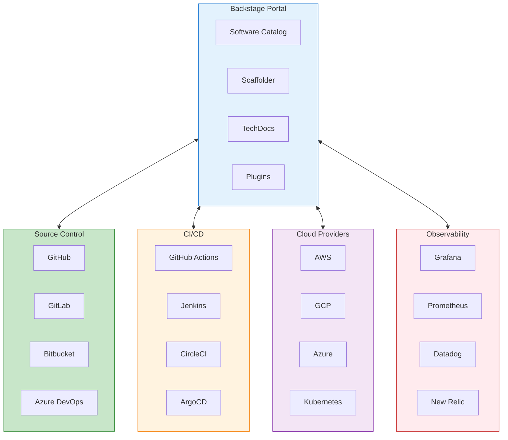
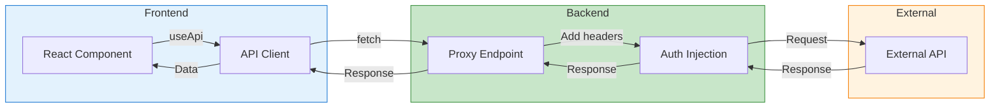

# Backstage Integrations Guide

Comprehensive guide to integrating Backstage with external services, source
control management, CI/CD pipelines, cloud providers, and observability tools.

## Table of Contents

- [Backstage Integrations Guide](#backstage-integrations-guide)
  - [Table of Contents](#table-of-contents)
  - [Understanding Integrations](#understanding-integrations)
    - [Integration Architecture](#integration-architecture)
    - [Integration Types](#integration-types)
  - [Source Control Management](#source-control-management)
    - [GitHub Integration](#github-integration)
    - [GitLab Integration](#gitlab-integration)
    - [Bitbucket Integration](#bitbucket-integration)
    - [Azure DevOps Integration](#azure-devops-integration)
    - [Multi-SCM Configuration](#multi-scm-configuration)
  - [CI/CD Integrations](#cicd-integrations)
    - [GitHub Actions](#github-actions)
    - [Jenkins](#jenkins)
    - [CircleCI](#circleci)
    - [ArgoCD](#argocd)
    - [Tekton](#tekton)
  - [Cloud Provider Integrations](#cloud-provider-integrations)
    - [Kubernetes](#kubernetes)
    - [AWS Integration](#aws-integration)
    - [Google Cloud Platform](#google-cloud-platform)
    - [Azure](#azure)
  - [Observability Integrations](#observability-integrations)
    - [Grafana](#grafana)
    - [Prometheus](#prometheus)
    - [Datadog](#datadog)
    - [New Relic](#new-relic)
  - [Incident Management](#incident-management)
    - [PagerDuty](#pagerduty)
    - [OpsGenie](#opsgenie)
    - [Rootly](#rootly)
  - [Infrastructure as Code](#infrastructure-as-code)
    - [Terraform Cloud](#terraform-cloud)
    - [Pulumi](#pulumi)
    - [Crossplane](#crossplane)
  - [Custom Integrations](#custom-integrations)
    - [Building a Custom Integration](#building-a-custom-integration)
    - [Integration Processor](#integration-processor)
  - [Proxy Configuration](#proxy-configuration)
    - [Secure API Proxying](#secure-api-proxying)
    - [Using Proxied APIs in Frontend](#using-proxied-apis-in-frontend)
    - [Integration Workflow](#integration-workflow)
  - [Integration Testing](#integration-testing)
    - [Testing Integrations](#testing-integrations)
    - [Health Checks](#health-checks)
  - [Next Steps](#next-steps)
  - [References](#references)

## Understanding Integrations

Backstage integrations connect your developer portal to external tools and
services, providing a unified view of your entire development ecosystem.

### Integration Architecture



### Integration Types

| Type         | Description                  | Examples              |
| ------------ | ---------------------------- | --------------------- |
| **Built-in** | Core Backstage functionality | GitHub, GitLab        |
| **Plugin**   | Installable extensions       | Kubernetes, PagerDuty |
| **Proxy**    | API passthrough              | Custom APIs           |
| **Custom**   | Self-developed               | Internal tools        |

## Source Control Management

### GitHub Integration

```yaml
# app-config.yaml
integrations:
  github:
    - host: github.com
      token: ${GITHUB_TOKEN}

    # GitHub Enterprise
    - host: github.mycompany.com
      token: ${GITHUB_ENTERPRISE_TOKEN}
      apiBaseUrl: https://github.mycompany.com/api/v3
      rawBaseUrl: https://github.mycompany.com/raw

    # GitHub App (recommended for organizations)
    - host: github.com
      apps:
        - appId: ${GITHUB_APP_ID}
          privateKey: ${GITHUB_APP_PRIVATE_KEY}
          webhookSecret: ${GITHUB_APP_WEBHOOK_SECRET}
          clientId: ${GITHUB_APP_CLIENT_ID}
          clientSecret: ${GITHUB_APP_CLIENT_SECRET}
```

**Required GitHub Token Scopes:**

| Scope       | Purpose                        |
| ----------- | ------------------------------ |
| `repo`      | Access private repositories    |
| `read:org`  | Read organization membership   |
| `read:user` | Read user profile              |
| `workflow`  | Trigger workflows (Scaffolder) |

**GitHub App Permissions:**

| Permission          | Access     | Purpose           |
| ------------------- | ---------- | ----------------- |
| Repository contents | Read/Write | Catalog discovery |
| Repository metadata | Read       | Basic info        |
| Pull requests       | Read/Write | Scaffolder PRs    |
| Workflows           | Read/Write | GitHub Actions    |
| Members             | Read       | Organization data |

### GitLab Integration

```yaml
integrations:
  gitlab:
    - host: gitlab.com
      token: ${GITLAB_TOKEN}

    # Self-hosted GitLab
    - host: gitlab.mycompany.com
      token: ${GITLAB_ENTERPRISE_TOKEN}
      apiBaseUrl: https://gitlab.mycompany.com/api/v4
      baseUrl: https://gitlab.mycompany.com
```

**GitLab Token Scopes:**

- `api` - Full API access
- `read_repository` - Read repository content
- `read_user` - Read user info

### Bitbucket Integration

```yaml
integrations:
  bitbucketCloud:
    - username: ${BITBUCKET_USERNAME}
      appPassword: ${BITBUCKET_APP_PASSWORD}

  bitbucketServer:
    - host: bitbucket.mycompany.com
      token: ${BITBUCKET_SERVER_TOKEN}
      apiBaseUrl: https://bitbucket.mycompany.com/rest/api/1.0
```

### Azure DevOps Integration

```yaml
integrations:
  azure:
    - host: dev.azure.com
      credentials:
        - organizations:
            - my-org
          personalAccessToken: ${AZURE_DEVOPS_TOKEN}

    # Azure DevOps Server (on-premises)
    - host: azuredevops.mycompany.com
      credentials:
        - personalAccessToken: ${AZURE_DEVOPS_SERVER_TOKEN}
```

### Multi-SCM Configuration

```yaml
# app-config.yaml
integrations:
  github:
    - host: github.com
      token: ${GITHUB_TOKEN}
  gitlab:
    - host: gitlab.com
      token: ${GITLAB_TOKEN}
  azure:
    - host: dev.azure.com
      credentials:
        - organizations: ['*']
          personalAccessToken: ${AZURE_TOKEN}

catalog:
  providers:
    github:
      providerId:
        organization: 'my-org'
        catalogPath: '/catalog-info.yaml'
        schedule:
          frequency: { hours: 1 }
          timeout: { minutes: 3 }

    gitlab:
      providerId:
        host: gitlab.com
        group: 'my-group'
        entityFilename: catalog-info.yaml
        schedule:
          frequency: { hours: 1 }
          timeout: { minutes: 3 }
```

## CI/CD Integrations

### GitHub Actions

```yaml
# Install plugin
# packages/app/package.json
# "@backstage/plugin-github-actions": "^0.6.0"
```

```typescript
// packages/app/src/components/catalog/EntityPage.tsx
import { EntityGithubActionsContent } from '@backstage/plugin-github-actions'

// Add to entity page
;<EntityLayout.Route path="/github-actions" title="GitHub Actions">
  <EntityGithubActionsContent />
</EntityLayout.Route>
```

```yaml
# catalog-info.yaml annotation
metadata:
  annotations:
    github.com/project-slug: my-org/my-repo
```

### Jenkins

```yaml
# app-config.yaml
jenkins:
  baseUrl: https://jenkins.mycompany.com
  username: ${JENKINS_USERNAME}
  apiKey: ${JENKINS_API_KEY}

  # Multiple instances
  instances:
    - name: default
      baseUrl: https://jenkins.mycompany.com
      username: ${JENKINS_USERNAME}
      apiKey: ${JENKINS_API_KEY}
    - name: production
      baseUrl: https://jenkins-prod.mycompany.com
      username: ${JENKINS_PROD_USERNAME}
      apiKey: ${JENKINS_PROD_API_KEY}
```

```typescript
// Entity page integration
import { EntityJenkinsContent } from '@backstage/plugin-jenkins'
;<EntityLayout.Route path="/jenkins" title="Jenkins">
  <EntityJenkinsContent />
</EntityLayout.Route>
```

```yaml
# catalog-info.yaml annotation
metadata:
  annotations:
    jenkins.io/job-full-name: folder/job-name
    # For multiple instances
    jenkins.io/job-full-name: production:folder/job-name
```

### CircleCI

```yaml
# app-config.yaml
circleci:
  baseUrl: https://circleci.com/api
```

```yaml
# catalog-info.yaml annotation
metadata:
  annotations:
    circleci.com/project-slug: github/my-org/my-repo
```

### ArgoCD

```yaml
# app-config.yaml
argocd:
  baseUrl: https://argocd.mycompany.com
  appLocatorMethods:
    - type: 'config'
      instances:
        - name: main
          url: https://argocd.mycompany.com
          username: ${ARGOCD_USERNAME}
          password: ${ARGOCD_PASSWORD}
```

```typescript
// Entity page
import { EntityArgoCDOverviewCard } from '@roadiehq/backstage-plugin-argo-cd'
;<EntityLayout.Route path="/argocd" title="ArgoCD">
  <EntityArgoCDOverviewCard />
</EntityLayout.Route>
```

```yaml
# catalog-info.yaml annotation
metadata:
  annotations:
    argocd/app-name: my-app
    # Multiple apps
    argocd/app-selector: app.kubernetes.io/instance=my-app
```

### Tekton

```yaml
# app-config.yaml
tekton:
  - name: default
    dashboardBaseUrl: https://tekton-dashboard.mycompany.com
```

## Cloud Provider Integrations

### Kubernetes

```yaml
# app-config.yaml
kubernetes:
  serviceLocatorMethod:
    type: 'multiTenant'
  clusterLocatorMethods:
    - type: 'config'
      clusters:
        - url: https://kubernetes.mycompany.com
          name: production
          authProvider: 'serviceAccount'
          skipTLSVerify: false
          skipMetricsLookup: false
          serviceAccountToken: ${K8S_SA_TOKEN}
          caData: ${K8S_CA_DATA}

        - url: https://kubernetes-staging.mycompany.com
          name: staging
          authProvider: 'google'
          skipTLSVerify: false

    # AWS EKS
    - type: 'config'
      clusters:
        - url: https://xxx.eks.amazonaws.com
          name: eks-production
          authProvider: 'aws'
          caData: ${EKS_CA_DATA}

    # GKE
    - type: 'config'
      clusters:
        - url: https://xxx.gke.io
          name: gke-production
          authProvider: 'google'
          caData: ${GKE_CA_DATA}
```

```yaml
# catalog-info.yaml annotations
metadata:
  annotations:
    backstage.io/kubernetes-id: my-service
    backstage.io/kubernetes-namespace: production
    backstage.io/kubernetes-label-selector: app=my-service
    # Cluster specific
    backstage.io/kubernetes-cluster: production
```

```typescript
// Entity page
import { EntityKubernetesContent } from '@backstage/plugin-kubernetes'
;<EntityLayout.Route path="/kubernetes" title="Kubernetes">
  <EntityKubernetesContent />
</EntityLayout.Route>
```

### AWS Integration

```yaml
# app-config.yaml
aws:
  accounts:
    - accountId: '123456789012'
      roleName: BackstageRole
      region: us-east-1
      # Or use access keys
      # accessKeyId: ${AWS_ACCESS_KEY_ID}
      # secretAccessKey: ${AWS_SECRET_ACCESS_KEY}

  # S3 for TechDocs
  techdocs:
    publisher:
      type: 'awsS3'
      awsS3:
        bucketName: ${TECHDOCS_S3_BUCKET}
        region: ${AWS_REGION}

  # Cost insights
  costInsights:
    aws:
      accountId: '123456789012'
```

### Google Cloud Platform

```yaml
# app-config.yaml
gcp:
  project: my-gcp-project
  # Service account key
  credentials:
    $file: ${GOOGLE_APPLICATION_CREDENTIALS}

  # TechDocs storage
  techdocs:
    publisher:
      type: 'googleGcs'
      googleGcs:
        bucketName: ${TECHDOCS_GCS_BUCKET}
        projectId: ${GCP_PROJECT_ID}
```

### Azure

```yaml
# app-config.yaml
azure:
  tenantId: ${AZURE_TENANT_ID}
  clientId: ${AZURE_CLIENT_ID}
  clientSecret: ${AZURE_CLIENT_SECRET}
  subscriptionId: ${AZURE_SUBSCRIPTION_ID}

  # TechDocs storage
  techdocs:
    publisher:
      type: 'azureBlobStorage'
      azureBlobStorage:
        containerName: ${TECHDOCS_CONTAINER}
        credentials:
          accountName: ${AZURE_ACCOUNT_NAME}
          accountKey: ${AZURE_ACCOUNT_KEY}
```

## Observability Integrations

### Grafana

```yaml
# app-config.yaml
grafana:
  domain: https://grafana.mycompany.com
  # Unified alerting
  unifiedAlerting: true
```

```yaml
# catalog-info.yaml annotation
metadata:
  annotations:
    grafana/dashboard-selector: my-service-dashboard
    grafana/alert-label-selector: service=my-service
```

```typescript
// Entity page
import {
  EntityGrafanaDashboardsCard,
  EntityGrafanaAlertsCard,
} from '@k-phoen/backstage-plugin-grafana'
;<Grid container>
  <Grid item md={6}>
    <EntityGrafanaDashboardsCard />
  </Grid>
  <Grid item md={6}>
    <EntityGrafanaAlertsCard />
  </Grid>
</Grid>
```

### Prometheus

```yaml
# app-config.yaml
prometheus:
  proxyPath: /prometheus/api
```

```yaml
# catalog-info.yaml annotation
metadata:
  annotations:
    prometheus.io/rule: my-service-alerts
    prometheus.io/alert: my-service
```

### Datadog

```yaml
# app-config.yaml
datadog:
  region: us1 # us1, us3, us5, eu1, ap1
  apiKey: ${DATADOG_API_KEY}
  applicationKey: ${DATADOG_APP_KEY}
```

```yaml
# catalog-info.yaml annotation
metadata:
  annotations:
    datadog/dashboard-url: https://app.datadoghq.com/dashboard/abc123
    datadog/service-name: my-service
```

### New Relic

```yaml
# app-config.yaml
newRelic:
  rest:
    baseUrl: https://api.newrelic.com
    apiKey: ${NEW_RELIC_REST_API_KEY}
  nerdGraph:
    baseUrl: https://api.newrelic.com/graphql
    apiKey: ${NEW_RELIC_USER_KEY}
```

```yaml
# catalog-info.yaml annotation
metadata:
  annotations:
    newrelic.com/dashboard-guid: ABC123XYZ
```

## Incident Management

### PagerDuty

```yaml
# app-config.yaml
pagerduty:
  apiToken: ${PAGERDUTY_TOKEN}
```

```yaml
# catalog-info.yaml annotation
metadata:
  annotations:
    pagerduty.com/integration-key: abc123xyz
    # Or service ID
    pagerduty.com/service-id: PXXXXXX
```

```typescript
// Entity page
import {
  EntityPagerDutyCard,
  isPluginApplicableToEntity,
} from '@pagerduty/backstage-plugin'
;<EntitySwitch>
  <EntitySwitch.Case if={isPluginApplicableToEntity}>
    <EntityPagerDutyCard />
  </EntitySwitch.Case>
</EntitySwitch>
```

### OpsGenie

```yaml
# app-config.yaml
opsgenie:
  baseUrl: https://api.opsgenie.com
  apiKey: ${OPSGENIE_API_KEY}
```

```yaml
# catalog-info.yaml annotation
metadata:
  annotations:
    opsgenie.com/component-selector: 'tag:component:my-service'
    opsgenie.com/team: platform-team
```

### Rootly

```yaml
# app-config.yaml
rootly:
  apiKey: ${ROOTLY_API_KEY}
```

## Infrastructure as Code

### Terraform Cloud

```yaml
# app-config.yaml
terraformCloud:
  baseUrl: https://app.terraform.io
  token: ${TFC_TOKEN}
```

### Pulumi

```yaml
# app-config.yaml
pulumi:
  baseUrl: https://api.pulumi.com
  token: ${PULUMI_TOKEN}
```

### Crossplane

```yaml
# Use Kubernetes plugin with Crossplane resources
kubernetes:
  customResources:
    - group: 'database.aws.crossplane.io'
      apiVersion: 'v1alpha1'
      plural: 'rdsinstances'
```

## Custom Integrations

### Building a Custom Integration

```typescript
// plugins/my-integration-backend/src/service.ts
import { Config } from '@backstage/config'
import { LoggerService } from '@backstage/backend-plugin-api'

interface MyServiceConfig {
  baseUrl: string
  apiKey: string
}

export class MyIntegrationService {
  private readonly config: MyServiceConfig
  private readonly logger: LoggerService

  constructor(options: { config: Config; logger: LoggerService }) {
    this.logger = options.logger
    this.config = {
      baseUrl: options.config.getString('myIntegration.baseUrl'),
      apiKey: options.config.getString('myIntegration.apiKey'),
    }
  }

  async getResource(id: string): Promise<Resource> {
    const response = await fetch(`${this.config.baseUrl}/resources/${id}`, {
      headers: {
        Authorization: `Bearer ${this.config.apiKey}`,
        'Content-Type': 'application/json',
      },
    })

    if (!response.ok) {
      throw new Error(`Failed to fetch resource: ${response.statusText}`)
    }

    return response.json()
  }

  async listResources(): Promise<Resource[]> {
    const response = await fetch(`${this.config.baseUrl}/resources`, {
      headers: {
        Authorization: `Bearer ${this.config.apiKey}`,
      },
    })

    if (!response.ok) {
      throw new Error(`Failed to list resources: ${response.statusText}`)
    }

    return response.json()
  }
}
```

### Integration Processor

```typescript
// Create a catalog processor for your integration
import {
  CatalogProcessor,
  processingResult,
} from '@backstage/plugin-catalog-node'

export class MyIntegrationProcessor implements CatalogProcessor {
  constructor(private readonly service: MyIntegrationService) {}

  getProcessorName(): string {
    return 'MyIntegrationProcessor'
  }

  async postProcessEntity(entity: Entity): Promise<Entity> {
    const annotation = entity.metadata.annotations?.['my-integration/id']
    if (!annotation) {
      return entity
    }

    // Enrich entity with data from integration
    const resource = await this.service.getResource(annotation)

    entity.metadata.annotations = {
      ...entity.metadata.annotations,
      'my-integration/status': resource.status,
      'my-integration/last-sync': new Date().toISOString(),
    }

    return entity
  }
}
```

## Proxy Configuration

### Secure API Proxying

```yaml
# app-config.yaml
proxy:
  endpoints:
    # Simple proxy
    '/my-api':
      target: https://api.example.com
      changeOrigin: true

    # With authentication
    '/secure-api':
      target: https://secure-api.example.com
      changeOrigin: true
      headers:
        Authorization: Bearer ${API_TOKEN}

    # With path rewrite
    '/external':
      target: https://external.example.com/api/v1
      changeOrigin: true
      pathRewrite:
        '^/api/proxy/external': ''

    # Multiple methods
    '/crud-api':
      target: https://crud.example.com
      changeOrigin: true
      allowedMethods:
        - GET
        - POST
        - PUT
        - DELETE
      allowedHeaders:
        - Content-Type
        - Authorization
```

### Using Proxied APIs in Frontend

```typescript
// plugins/my-plugin/src/api/client.ts
import { DiscoveryApi, FetchApi } from '@backstage/core-plugin-api'

export class MyApiClient {
  constructor(
    private readonly discoveryApi: DiscoveryApi,
    private readonly fetchApi: FetchApi
  ) {}

  async getData(): Promise<Data> {
    const proxyUrl = await this.discoveryApi.getBaseUrl('proxy')
    const response = await this.fetchApi.fetch(`${proxyUrl}/my-api/data`)

    if (!response.ok) {
      throw new Error('Failed to fetch data')
    }

    return response.json()
  }
}
```

### Integration Workflow



## Integration Testing

### Testing Integrations

```typescript
// Test integration configuration
import { ConfigReader } from '@backstage/config'

describe('GitHub Integration', () => {
  it('should configure properly', () => {
    const config = new ConfigReader({
      integrations: {
        github: [
          {
            host: 'github.com',
            token: 'test-token',
          },
        ],
      },
    })

    const githubConfig = config.getOptionalConfigArray('integrations.github')
    expect(githubConfig).toHaveLength(1)
    expect(githubConfig?.[0].getString('host')).toBe('github.com')
  })
})
```

### Health Checks

```typescript
// Backend health check for integrations
router.get('/health/integrations', async (req, res) => {
  const results = {
    github: await checkGitHub(),
    kubernetes: await checkKubernetes(),
    grafana: await checkGrafana(),
  }

  const allHealthy = Object.values(results).every((r) => r.healthy)

  res.status(allHealthy ? 200 : 503).json({
    status: allHealthy ? 'healthy' : 'degraded',
    integrations: results,
  })
})
```

## Next Steps

- [Authentication Guide](./backstage-authentication.md) - Secure integrations
- [Plugin Development](./backstage-plugins.md) - Build custom integrations
- [Best Practices](./backstage-best-practices.md) - Integration patterns

## References

- [Integrations Documentation](https://backstage.io/docs/integrations/)
- [GitHub Integration](https://backstage.io/docs/integrations/github/locations)
- [Kubernetes Plugin](https://backstage.io/docs/features/kubernetes/)
- [Proxy Configuration](https://backstage.io/docs/plugins/proxying)
