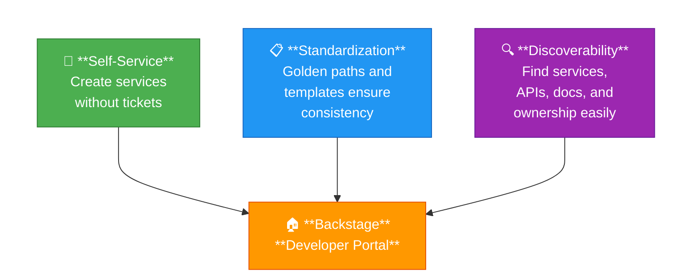
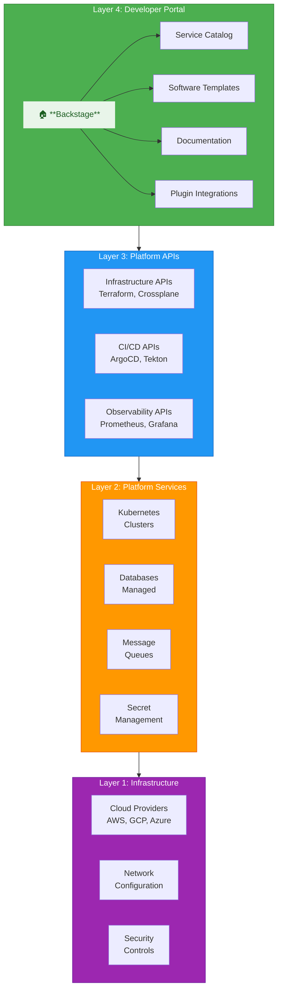
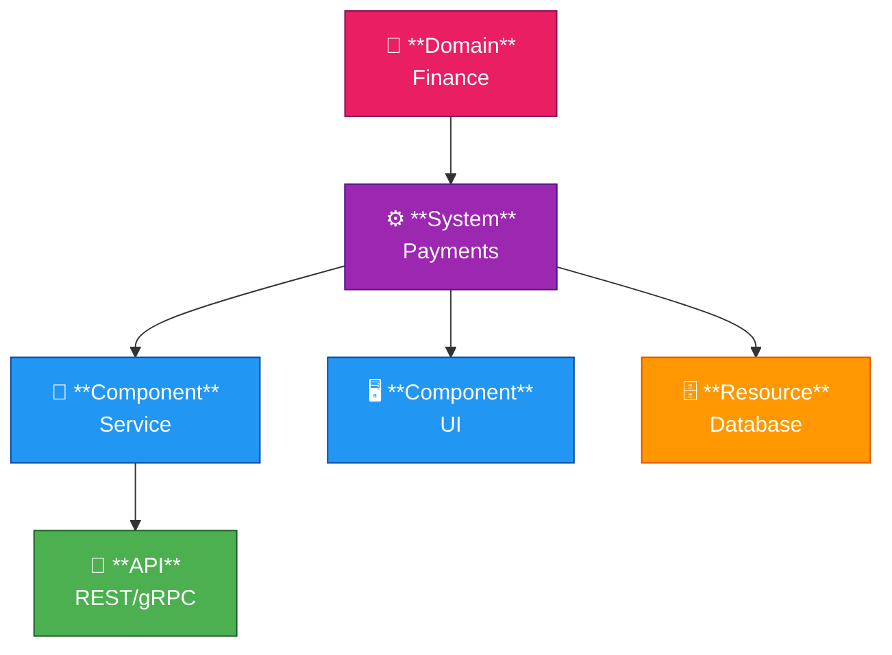
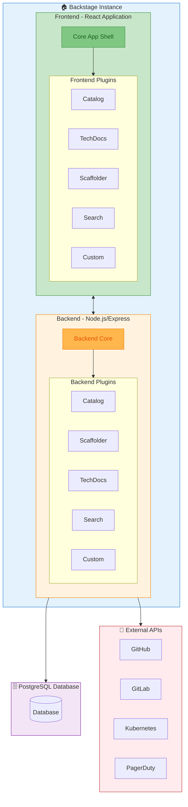

# Backstage Overview and Architecture

A comprehensive guide to understanding Backstage, the open platform for building
developer portals.

## Table of Contents

- [Backstage Overview and Architecture](#backstage-overview-and-architecture)
  - [Table of Contents](#table-of-contents)
  - [What is Backstage?](#what-is-backstage)
    - [Key Characteristics](#key-characteristics)
    - [The Problem Backstage Solves](#the-problem-backstage-solves)
  - [Why Backstage Matters for Platform Engineering](#why-backstage-matters-for-platform-engineering)
    - [Platform Engineering Principles Backstage Enables](#platform-engineering-principles-backstage-enables)
    - [The Internal Developer Platform Stack](#the-internal-developer-platform-stack)
  - [Core Concepts](#core-concepts)
    - [Entities](#entities)
    - [Entity Relationships](#entity-relationships)
    - [Relationship Diagram](#relationship-diagram)
  - [Architecture Overview](#architecture-overview)
    - [High-Level Architecture](#high-level-architecture)
    - [Backend Architecture (New Backend System)](#backend-architecture-new-backend-system)
    - [Key Backend Components](#key-backend-components)
    - [Frontend Architecture](#frontend-architecture)
  - [The Four Pillars of Backstage](#the-four-pillars-of-backstage)
    - [1. Software Catalog](#1-software-catalog)
    - [2. Software Templates (Scaffolder)](#2-software-templates-scaffolder)
    - [3. TechDocs](#3-techdocs)
    - [4. Plugin Ecosystem](#4-plugin-ecosystem)
  - [Backstage vs Other Solutions](#backstage-vs-other-solutions)
    - [When to Choose Backstage](#when-to-choose-backstage)
  - [When to Use Backstage](#when-to-use-backstage)
    - [Good Use Cases](#good-use-cases)
    - [Not Ideal For](#not-ideal-for)
  - [Next Steps](#next-steps)
  - [References](#references)

## What is Backstage?

Backstage is an open-source framework for building developer portals, originally
created at Spotify and now a CNCF (Cloud Native Computing Foundation) incubating
project. It provides a centralized platform where developers can discover,
create, and manage software components, documentation, and infrastructure.

### Key Characteristics

| Characteristic  | Description                                            |
| --------------- | ------------------------------------------------------ |
| Open Source     | Apache 2.0 licensed, community-driven development      |
| Plugin-based    | Highly extensible through a rich plugin ecosystem      |
| Self-hosted     | Deploy in your own infrastructure                      |
| Customizable    | Full control over branding, features, and integrations |
| React-based     | Modern frontend with TypeScript and Material UI        |
| Node.js Backend | Express-based backend with PostgreSQL support          |

### The Problem Backstage Solves

In modern organizations, developers face several challenges:

1. **Tool Fragmentation**: Dozens of tools for CI/CD, monitoring, documentation,
   cloud resources, etc.
2. **Cognitive Overload**: Difficulty finding the right tool or information
3. **Inconsistency**: Different teams using different approaches and standards
4. **Onboarding Friction**: New developers struggle to understand the ecosystem
5. **Lack of Ownership**: Unclear who owns what services and components

Backstage addresses these by providing:

- A **single pane of glass** for all developer tools and services
- **Service ownership** tracking and accountability
- **Standardized templates** for creating new projects
- **Centralized documentation** discoverable in context
- **Plugin ecosystem** integrating your existing tools

## Why Backstage Matters for Platform Engineering

Platform engineering is about building internal developer platforms (IDPs) that
enable self-service capabilities. Backstage is the de facto standard for
building the UI layer of an IDP.

### Platform Engineering Principles Backstage Enables



### The Internal Developer Platform Stack



## Core Concepts

### Entities

Everything in Backstage is an **Entity**. Entities are described using YAML
files (catalog-info.yaml) and represent real-world concepts:

| Entity Kind | Description                                      | Example                  |
| ----------- | ------------------------------------------------ | ------------------------ |
| Component   | A software component (service, website, library) | User API Service         |
| API         | An API exposed by a component                    | REST API, GraphQL Schema |
| Resource    | Infrastructure resources                         | Database, S3 bucket      |
| System      | A collection of related components               | Payment System           |
| Domain      | A business domain grouping systems               | Finance, Retail          |
| Group       | A team or organizational unit                    | Platform Team            |
| User        | An individual person                             | john.doe                 |
| Location    | A reference to external entity sources           | GitHub repository        |
| Template    | A software template for scaffolding              | Node.js Service Template |

### Entity Relationships

Entities connect through relationships:

```yaml
apiVersion: backstage.io/v1alpha1
kind: Component
metadata:
  name: user-service
  description: Handles user authentication and profiles
spec:
  type: service
  lifecycle: production
  owner: team-platform
  system: identity-system
  dependsOn:
    - resource:default/users-db
    - component:default/auth-library
  providesApis:
    - user-api
  consumesApis:
    - notification-api
```

### Relationship Diagram



## Architecture Overview

### High-Level Architecture



### Backend Architecture (New Backend System)

Backstage uses a modular backend system introduced in 2023:

```typescript
// backend/src/index.ts
import { createBackend } from '@backstage/backend-defaults'

const backend = createBackend()

// Core plugins
backend.add(import('@backstage/plugin-app-backend/alpha'))
backend.add(import('@backstage/plugin-catalog-backend/alpha'))
backend.add(import('@backstage/plugin-scaffolder-backend/alpha'))
backend.add(import('@backstage/plugin-techdocs-backend/alpha'))
backend.add(import('@backstage/plugin-search-backend/alpha'))

// Auth
backend.add(import('@backstage/plugin-auth-backend'))
backend.add(import('@backstage/plugin-auth-backend-module-github-provider'))

// Custom plugins
backend.add(import('./plugins/my-custom-plugin'))

backend.start()
```

### Key Backend Components

| Component          | Purpose                                       |
| ------------------ | --------------------------------------------- |
| Backend Core       | HTTP server, configuration, logging, database |
| Plugin System      | Modular functionality registration            |
| Catalog Backend    | Entity storage, processing, and relationships |
| Scaffolder Backend | Template execution and task management        |
| Auth Backend       | Authentication and identity management        |
| Search Backend     | Indexing and search across all entities       |
| Proxy Backend      | Secure proxy to external services             |

### Frontend Architecture

The frontend is a React single-page application:

```typescript
// packages/app/src/App.tsx
import { createApp } from '@backstage/app-defaults'
import { AppRouter, FlatRoutes } from '@backstage/core-app-api'

const app = createApp({
  apis,
  bindRoutes({ bind }) {
    bind(catalogPlugin.externalRoutes, {
      createComponent: scaffolderPlugin.routes.root,
    })
  },
})

export default app.createRoot(
  <>
    <AlertDisplay />
    <OAuthRequestDialog />
    <AppRouter>
      <FlatRoutes>
        <Route path="/" element={<HomepageCompositionRoot />} />
        <Route path="/catalog" element={<CatalogIndexPage />} />
        <Route
          path="/catalog/:namespace/:kind/:name"
          element={<CatalogEntityPage />}
        />
        <Route path="/create" element={<ScaffolderPage />} />
        <Route path="/docs" element={<TechDocsIndexPage />} />
        <Route path="/search" element={<SearchPage />} />
      </FlatRoutes>
    </AppRouter>
  </>
)
```

## The Four Pillars of Backstage

### 1. Software Catalog

The heart of Backstage. A centralized registry of all software components.

**Purpose:**

- Track ownership of all services and components
- Discover existing services before building new ones
- Understand dependencies between services
- Provide context for documentation and monitoring

**Key Features:**

- Entity definitions in YAML
- Automatic ingestion from Git repositories
- Relationship mapping
- Metadata and annotations
- Custom entity kinds

### 2. Software Templates (Scaffolder)

Create new projects from standardized templates.

**Purpose:**

- Enforce organizational standards from day one
- Reduce time to first deployment
- Include all necessary configuration automatically
- Provide "golden paths" for common use cases

**Key Features:**

- Template authoring with Nunjucks syntax
- Multi-step wizards with form validation
- Integration with Git providers
- Custom actions for CI/CD setup
- Parameter validation

### 3. TechDocs

Documentation-as-code system built on MkDocs.

**Purpose:**

- Keep documentation close to code
- Make documentation discoverable
- Standardize documentation format
- Enable search across all docs

**Key Features:**

- Markdown-based documentation
- Automatic publishing from repos
- Search integration
- Entity-linked documentation
- Custom MkDocs plugins support

### 4. Plugin Ecosystem

Extensible architecture for custom functionality.

**Purpose:**

- Integrate existing tools into Backstage
- Build custom features for your organization
- Share plugins across the community
- Avoid vendor lock-in

**Key Features:**

- Frontend and backend plugins
- Rich plugin marketplace
- APIs for data sharing between plugins
- Extension points for customization

## Backstage vs Other Solutions

| Feature          | Backstage            | Port      | Cortex  | OpsLevel |
| ---------------- | -------------------- | --------- | ------- | -------- |
| Open Source      | Yes                  | No        | No      | No       |
| Self-hosted      | Yes                  | Cloud     | Cloud   | Cloud    |
| Customization    | Full                 | Limited   | Limited | Limited  |
| Plugin System    | Extensive            | API-based | Limited | Limited  |
| Community        | Large                | N/A       | N/A     | N/A      |
| Cost             | Free (hosting costs) | Paid      | Paid    | Paid     |
| Setup Complexity | Higher               | Lower     | Lower   | Lower    |
| Maintenance      | Self-managed         | Managed   | Managed | Managed  |

### When to Choose Backstage

**Choose Backstage if:**

- You need full customization control
- You have engineering resources to maintain it
- You want to avoid vendor lock-in
- You need deep integrations with internal systems
- You value open-source and community contributions

**Consider alternatives if:**

- You need a quick, managed solution
- You have limited engineering resources
- You prefer SaaS over self-hosted
- Your customization needs are minimal

## When to Use Backstage

### Good Use Cases

1. **Large Engineering Organizations (50+ developers)**

   - Service sprawl makes discovery difficult
   - Onboarding new developers takes too long
   - Multiple teams need standardization

2. **Microservices Architectures**

   - Hundreds of services to track
   - Complex dependency graphs
   - Ownership clarity is critical

3. **Platform Engineering Initiatives**

   - Building an Internal Developer Platform
   - Implementing golden paths
   - Self-service infrastructure goals

4. **Documentation Centralization**
   - Documentation scattered across wikis
   - Need searchable, contextual docs
   - Want docs close to code

### Not Ideal For

1. **Small Teams (less than 10 developers)**

   - Overhead may exceed benefits
   - Simpler solutions might suffice

2. **Single Monolithic Application**

   - Limited need for service catalog
   - Documentation needs are simpler

3. **Organizations Without DevOps Maturity**
   - Prerequisites like CI/CD should exist first
   - Need foundational tooling before portal

## Next Steps

Continue your Backstage journey with these guides:

- [Backstage Installation Guide](./backstage-installation.md) - Get Backstage
  running
- [Software Catalog Deep Dive](./backstage-software-catalog.md) - Master the
  catalog
- [Software Templates Guide](./backstage-software-templates.md) - Create
  templates
- [TechDocs Guide](./backstage-techdocs.md) - Documentation as code
- [Plugin Development](./backstage-plugins.md) - Build custom plugins
- [Integrations Guide](./backstage-integrations.md) - Connect your tools
- [Authentication Guide](./backstage-authentication.md) - Secure your portal
- [Best Practices](./backstage-best-practices.md) - Platform engineering
  patterns

## References

- [Official Backstage Documentation](https://backstage.io/docs)
- [Backstage GitHub Repository](https://github.com/backstage/backstage)
- [CNCF Backstage Project](https://www.cncf.io/projects/backstage/)
- [Backstage Community Plugins](https://backstage.io/plugins)
- [Spotify Engineering Blog - Backstage](https://engineering.atspotify.com/tag/backstage/)
