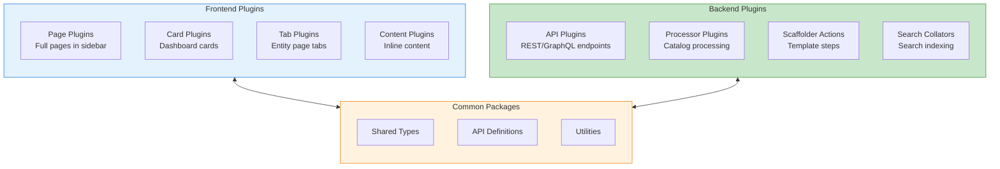
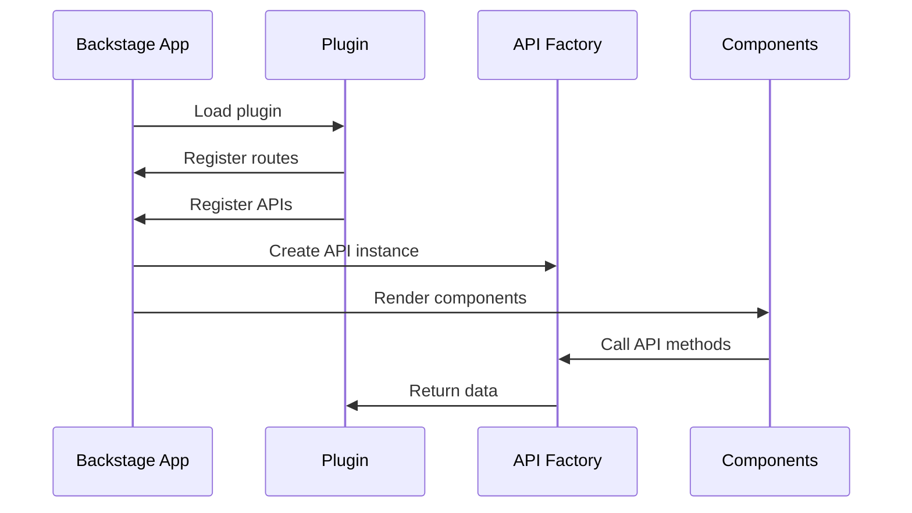
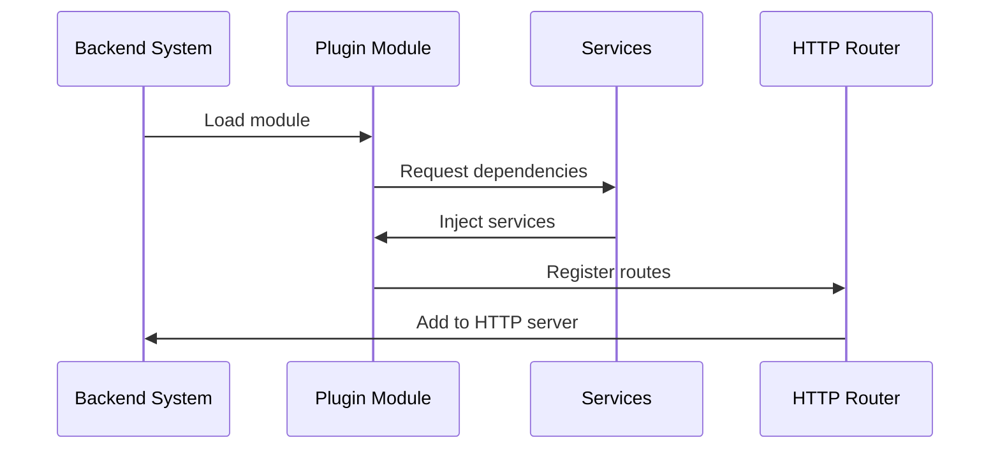
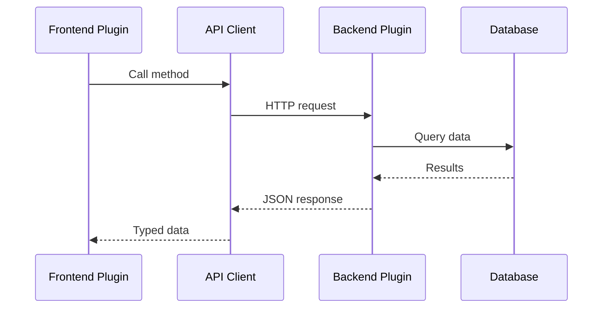
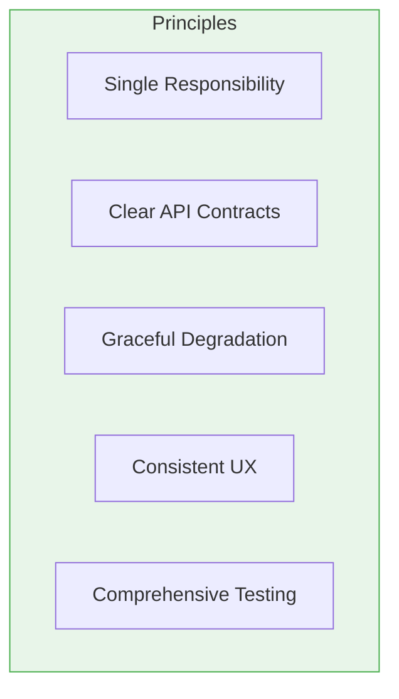

# Backstage Plugin Development Guide

Plugins are the heart of Backstage extensibility. This guide covers everything
you need to know to build custom frontend and backend plugins.

## Table of Contents

- [Backstage Plugin Development Guide](#backstage-plugin-development-guide)
  - [Table of Contents](#table-of-contents)
  - [Understanding Backstage Plugins](#understanding-backstage-plugins)
    - [Plugin Types](#plugin-types)
    - [Plugin Package Structure](#plugin-package-structure)
  - [Plugin Architecture](#plugin-architecture)
    - [Frontend Plugin Lifecycle](#frontend-plugin-lifecycle)
    - [Backend Plugin Lifecycle](#backend-plugin-lifecycle)
  - [Creating a Frontend Plugin](#creating-a-frontend-plugin)
    - [Generate Plugin Scaffold](#generate-plugin-scaffold)
    - [Plugin Definition](#plugin-definition)
    - [Route Definitions](#route-definitions)
    - [API Client](#api-client)
    - [React Components](#react-components)
    - [Entity Page Integration](#entity-page-integration)
    - [Register in App](#register-in-app)
  - [Creating a Backend Plugin](#creating-a-backend-plugin)
    - [Generate Backend Plugin](#generate-backend-plugin)
    - [Backend Plugin Definition (New Backend System)](#backend-plugin-definition-new-backend-system)
    - [Router Definition](#router-definition)
    - [Service Layer](#service-layer)
    - [Database Migrations](#database-migrations)
    - [Register Backend Plugin](#register-backend-plugin)
  - [Plugin APIs and Services](#plugin-apis-and-services)
    - [Core Services Reference](#core-services-reference)
    - [Using Configuration](#using-configuration)
    - [Using the Scheduler](#using-the-scheduler)
  - [Plugin Communication](#plugin-communication)
    - [Frontend to Backend](#frontend-to-backend)
    - [Between Backend Plugins](#between-backend-plugins)
  - [Testing Plugins](#testing-plugins)
    - [Frontend Testing](#frontend-testing)
    - [Backend Testing](#backend-testing)
  - [Publishing Plugins](#publishing-plugins)
    - [Package Configuration](#package-configuration)
    - [Build and Publish](#build-and-publish)
  - [Existing Plugin Ecosystem](#existing-plugin-ecosystem)
    - [Popular Community Plugins](#popular-community-plugins)
    - [Finding Plugins](#finding-plugins)
  - [Best Practices](#best-practices)
    - [1. Plugin Design Principles](#1-plugin-design-principles)
    - [2. Error Handling](#2-error-handling)
    - [3. Configuration Schema](#3-configuration-schema)
    - [4. Documentation](#4-documentation)
  - [Configuration](#configuration)
  - [Usage](#usage)
    - [5. Versioning and Compatibility](#5-versioning-and-compatibility)
  - [Next Steps](#next-steps)
  - [References](#references)

## Understanding Backstage Plugins

Plugins extend Backstage with new functionality, integrations, and features.
They can add UI components, backend services, or both.

### Plugin Types



### Plugin Package Structure

```text
plugins/
├── my-plugin/                    # Frontend plugin
│   ├── package.json
│   ├── src/
│   │   ├── index.ts             # Public exports
│   │   ├── plugin.ts            # Plugin definition
│   │   ├── routes.ts            # Route definitions
│   │   ├── components/          # React components
│   │   ├── api/                 # API client
│   │   └── hooks/               # Custom hooks
│   └── dev/                     # Development setup
│       └── index.tsx
├── my-plugin-backend/           # Backend plugin
│   ├── package.json
│   ├── src/
│   │   ├── index.ts
│   │   ├── plugin.ts
│   │   ├── router.ts
│   │   └── service/
│   └── migrations/              # Database migrations
└── my-plugin-common/            # Shared types
    ├── package.json
    └── src/
        └── index.ts
```

## Plugin Architecture

### Frontend Plugin Lifecycle



### Backend Plugin Lifecycle



## Creating a Frontend Plugin

### Generate Plugin Scaffold

```bash
# Using Backstage CLI
cd packages
yarn new --select plugin

# You'll be prompted for:
# ? Enter the ID of the plugin: my-plugin
# ? Select a plugin owner: my-org
```

### Plugin Definition

```typescript
// plugins/my-plugin/src/plugin.ts
import {
  createPlugin,
  createRoutableExtension,
  createApiFactory,
  discoveryApiRef,
  fetchApiRef,
} from '@backstage/core-plugin-api'
import { rootRouteRef } from './routes'
import { myPluginApiRef, MyPluginClient } from './api'

export const myPlugin = createPlugin({
  id: 'my-plugin',
  // Route references for this plugin
  routes: {
    root: rootRouteRef,
  },
  // API factories provided by this plugin
  apis: [
    createApiFactory({
      api: myPluginApiRef,
      deps: {
        discoveryApi: discoveryApiRef,
        fetchApi: fetchApiRef,
      },
      factory: ({ discoveryApi, fetchApi }) =>
        new MyPluginClient({ discoveryApi, fetchApi }),
    }),
  ],
})

// Routable extension for the main page
export const MyPluginPage = myPlugin.provide(
  createRoutableExtension({
    name: 'MyPluginPage',
    component: () =>
      import('./components/MyPluginPage').then((m) => m.MyPluginPage),
    mountPoint: rootRouteRef,
  })
)
```

### Route Definitions

```typescript
// plugins/my-plugin/src/routes.ts
import { createRouteRef, createSubRouteRef } from '@backstage/core-plugin-api'

export const rootRouteRef = createRouteRef({
  id: 'my-plugin',
})

export const detailsRouteRef = createSubRouteRef({
  id: 'my-plugin-details',
  parent: rootRouteRef,
  path: '/:id',
})
```

### API Client

```typescript
// plugins/my-plugin/src/api/types.ts
import { createApiRef } from '@backstage/core-plugin-api'

export interface MyPluginApi {
  getItems(): Promise<Item[]>
  getItem(id: string): Promise<Item>
  createItem(item: CreateItemRequest): Promise<Item>
}

export const myPluginApiRef = createApiRef<MyPluginApi>({
  id: 'plugin.my-plugin.api',
})

// plugins/my-plugin/src/api/client.ts
import { DiscoveryApi, FetchApi } from '@backstage/core-plugin-api'
import { MyPluginApi, Item, CreateItemRequest } from './types'

export class MyPluginClient implements MyPluginApi {
  private readonly discoveryApi: DiscoveryApi
  private readonly fetchApi: FetchApi

  constructor(options: { discoveryApi: DiscoveryApi; fetchApi: FetchApi }) {
    this.discoveryApi = options.discoveryApi
    this.fetchApi = options.fetchApi
  }

  private async getBaseUrl(): Promise<string> {
    return await this.discoveryApi.getBaseUrl('my-plugin')
  }

  async getItems(): Promise<Item[]> {
    const baseUrl = await this.getBaseUrl()
    const response = await this.fetchApi.fetch(`${baseUrl}/items`)
    if (!response.ok) {
      throw new Error(`Failed to fetch items: ${response.statusText}`)
    }
    return response.json()
  }

  async getItem(id: string): Promise<Item> {
    const baseUrl = await this.getBaseUrl()
    const response = await this.fetchApi.fetch(`${baseUrl}/items/${id}`)
    if (!response.ok) {
      throw new Error(`Failed to fetch item: ${response.statusText}`)
    }
    return response.json()
  }

  async createItem(item: CreateItemRequest): Promise<Item> {
    const baseUrl = await this.getBaseUrl()
    const response = await this.fetchApi.fetch(`${baseUrl}/items`, {
      method: 'POST',
      headers: { 'Content-Type': 'application/json' },
      body: JSON.stringify(item),
    })
    if (!response.ok) {
      throw new Error(`Failed to create item: ${response.statusText}`)
    }
    return response.json()
  }
}
```

### React Components

```typescript
// plugins/my-plugin/src/components/MyPluginPage/MyPluginPage.tsx
import React from 'react'
import { useApi } from '@backstage/core-plugin-api'
import {
  Page,
  Header,
  Content,
  ContentHeader,
  SupportButton,
  Table,
  TableColumn,
  Progress,
  ResponseErrorPanel,
} from '@backstage/core-components'
import { useAsync } from 'react-use'
import { myPluginApiRef, Item } from '../../api'

const columns: TableColumn<Item>[] = [
  { title: 'Name', field: 'name' },
  { title: 'Description', field: 'description' },
  { title: 'Status', field: 'status' },
  { title: 'Owner', field: 'owner' },
]

export const MyPluginPage = () => {
  const api = useApi(myPluginApiRef)

  const {
    value: items,
    loading,
    error,
  } = useAsync(async () => {
    return api.getItems()
  }, [api])

  if (loading) {
    return <Progress />
  }

  if (error) {
    return <ResponseErrorPanel error={error} />
  }

  return (
    <Page themeId="tool">
      <Header title="My Plugin" subtitle="Manage your items" />
      <Content>
        <ContentHeader title="Items">
          <SupportButton>View and manage items.</SupportButton>
        </ContentHeader>
        <Table
          title="Items"
          options={{ search: true, paging: true }}
          columns={columns}
          data={items || []}
        />
      </Content>
    </Page>
  )
}
```

### Entity Page Integration

```typescript
// plugins/my-plugin/src/components/EntityMyPluginCard/EntityMyPluginCard.tsx
import React from 'react'
import { useEntity } from '@backstage/plugin-catalog-react'
import { useApi } from '@backstage/core-plugin-api'
import { InfoCard, Progress } from '@backstage/core-components'
import { useAsync } from 'react-use'
import { myPluginApiRef } from '../../api'

export const EntityMyPluginCard = () => {
  const { entity } = useEntity()
  const api = useApi(myPluginApiRef)

  const { value, loading, error } = useAsync(async () => {
    const entityRef = `${entity.kind}:${entity.metadata.namespace}/${entity.metadata.name}`
    return api.getItemForEntity(entityRef)
  }, [entity, api])

  if (loading) {
    return <Progress />
  }

  return (
    <InfoCard title="My Plugin">
      {error ? (
        <p>Error loading data</p>
      ) : (
        <div>
          <p>Status: {value?.status}</p>
          <p>Last Updated: {value?.lastUpdated}</p>
        </div>
      )}
    </InfoCard>
  )
}

// Export with entity context check
export const isMyPluginAvailable = (entity: Entity) =>
  Boolean(entity.metadata.annotations?.['my-plugin/enabled'])
```

### Register in App

```typescript
// packages/app/src/App.tsx
import { MyPluginPage } from '@internal/plugin-my-plugin'

// In routes
;<Route path="/my-plugin" element={<MyPluginPage />} />

// packages/app/src/components/catalog/EntityPage.tsx
import {
  EntityMyPluginCard,
  isMyPluginAvailable,
} from '@internal/plugin-my-plugin'

// In entity page
;<EntitySwitch>
  <EntitySwitch.Case if={isMyPluginAvailable}>
    <EntityMyPluginCard />
  </EntitySwitch.Case>
</EntitySwitch>
```

## Creating a Backend Plugin

### Generate Backend Plugin

```bash
cd packages
yarn new --select backend-plugin

# Enter plugin ID: my-plugin
```

### Backend Plugin Definition (New Backend System)

```typescript
// plugins/my-plugin-backend/src/plugin.ts
import {
  coreServices,
  createBackendPlugin,
} from '@backstage/backend-plugin-api'
import { createRouter } from './router'

export const myPluginPlugin = createBackendPlugin({
  pluginId: 'my-plugin',
  register(env) {
    env.registerInit({
      deps: {
        httpRouter: coreServices.httpRouter,
        logger: coreServices.logger,
        config: coreServices.rootConfig,
        database: coreServices.database,
        discovery: coreServices.discovery,
        auth: coreServices.auth,
        httpAuth: coreServices.httpAuth,
      },
      async init({
        httpRouter,
        logger,
        config,
        database,
        discovery,
        auth,
        httpAuth,
      }) {
        const router = await createRouter({
          logger,
          config,
          database,
          discovery,
          auth,
          httpAuth,
        })

        httpRouter.use(router)
        httpRouter.addAuthPolicy({
          path: '/health',
          allow: 'unauthenticated',
        })
      },
    })
  },
})
```

### Router Definition

```typescript
// plugins/my-plugin-backend/src/router.ts
import { Router } from 'express'
import {
  LoggerService,
  DatabaseService,
  AuthService,
  HttpAuthService,
  DiscoveryService,
} from '@backstage/backend-plugin-api'
import { Config } from '@backstage/config'
import { MyPluginService } from './service/MyPluginService'

export interface RouterOptions {
  logger: LoggerService
  config: Config
  database: DatabaseService
  discovery: DiscoveryService
  auth: AuthService
  httpAuth: HttpAuthService
}

export async function createRouter(options: RouterOptions): Promise<Router> {
  const { logger, database, httpAuth } = options

  const service = new MyPluginService({ logger, database })
  await service.initialize()

  const router = Router()

  // Health check (unauthenticated)
  router.get('/health', (_, res) => {
    res.json({ status: 'ok' })
  })

  // List items (authenticated)
  router.get('/items', async (req, res) => {
    // Verify authentication
    const credentials = await httpAuth.credentials(req)
    const { principal } = credentials

    logger.info(`User ${principal.userEntityRef} fetching items`)

    const items = await service.getItems()
    res.json(items)
  })

  // Get single item
  router.get('/items/:id', async (req, res) => {
    await httpAuth.credentials(req)

    const { id } = req.params
    const item = await service.getItem(id)

    if (!item) {
      res.status(404).json({ error: 'Item not found' })
      return
    }

    res.json(item)
  })

  // Create item
  router.post('/items', async (req, res) => {
    const credentials = await httpAuth.credentials(req)
    const { principal } = credentials

    const item = await service.createItem({
      ...req.body,
      createdBy: principal.userEntityRef,
    })

    res.status(201).json(item)
  })

  // Update item
  router.put('/items/:id', async (req, res) => {
    await httpAuth.credentials(req)

    const { id } = req.params
    const item = await service.updateItem(id, req.body)

    res.json(item)
  })

  // Delete item
  router.delete('/items/:id', async (req, res) => {
    await httpAuth.credentials(req)

    const { id } = req.params
    await service.deleteItem(id)

    res.status(204).send()
  })

  return router
}
```

### Service Layer

```typescript
// plugins/my-plugin-backend/src/service/MyPluginService.ts
import { LoggerService, DatabaseService } from '@backstage/backend-plugin-api'
import { Knex } from 'knex'

export interface Item {
  id: string
  name: string
  description: string
  status: string
  createdBy: string
  createdAt: Date
  updatedAt: Date
}

export interface CreateItemRequest {
  name: string
  description: string
  createdBy: string
}

export class MyPluginService {
  private readonly logger: LoggerService
  private readonly database: DatabaseService
  private db: Knex | undefined

  constructor(options: { logger: LoggerService; database: DatabaseService }) {
    this.logger = options.logger
    this.database = options.database
  }

  async initialize(): Promise<void> {
    this.db = await this.database.getClient()

    // Run migrations
    const migrationsDir = `${__dirname}/../migrations`
    await this.db.migrate.latest({
      directory: migrationsDir,
    })

    this.logger.info('MyPluginService initialized')
  }

  async getItems(): Promise<Item[]> {
    if (!this.db) throw new Error('Database not initialized')

    return this.db<Item>('items').select('*').orderBy('created_at', 'desc')
  }

  async getItem(id: string): Promise<Item | undefined> {
    if (!this.db) throw new Error('Database not initialized')

    return this.db<Item>('items').where({ id }).first()
  }

  async createItem(request: CreateItemRequest): Promise<Item> {
    if (!this.db) throw new Error('Database not initialized')

    const id = crypto.randomUUID()
    const now = new Date()

    const item: Item = {
      id,
      name: request.name,
      description: request.description,
      status: 'active',
      createdBy: request.createdBy,
      createdAt: now,
      updatedAt: now,
    }

    await this.db('items').insert(item)
    this.logger.info(`Created item ${id}`)

    return item
  }

  async updateItem(
    id: string,
    updates: Partial<Omit<Item, 'id' | 'createdBy' | 'createdAt'>>
  ): Promise<Item> {
    if (!this.db) throw new Error('Database not initialized')

    await this.db('items')
      .where({ id })
      .update({ ...updates, updatedAt: new Date() })

    const item = await this.getItem(id)
    if (!item) throw new Error('Item not found after update')

    return item
  }

  async deleteItem(id: string): Promise<void> {
    if (!this.db) throw new Error('Database not initialized')

    await this.db('items').where({ id }).delete()
    this.logger.info(`Deleted item ${id}`)
  }
}
```

### Database Migrations

```typescript
// plugins/my-plugin-backend/src/migrations/20240101_init.ts
import { Knex } from 'knex'

export async function up(knex: Knex): Promise<void> {
  await knex.schema.createTable('items', (table) => {
    table.string('id').primary()
    table.string('name').notNullable()
    table.text('description')
    table.string('status').notNullable().defaultTo('active')
    table.string('created_by').notNullable()
    table.timestamp('created_at').notNullable()
    table.timestamp('updated_at').notNullable()

    table.index('status')
    table.index('created_by')
  })
}

export async function down(knex: Knex): Promise<void> {
  await knex.schema.dropTable('items')
}
```

### Register Backend Plugin

```typescript
// packages/backend/src/index.ts
import { createBackend } from '@backstage/backend-defaults'

const backend = createBackend()

// Core plugins
backend.add(import('@backstage/plugin-app-backend/alpha'))
backend.add(import('@backstage/plugin-catalog-backend/alpha'))

// Your plugin
backend.add(import('@internal/plugin-my-plugin-backend'))

backend.start()
```

## Plugin APIs and Services

### Core Services Reference

| Service                    | Purpose                 |
| -------------------------- | ----------------------- |
| `coreServices.logger`      | Logging                 |
| `coreServices.config`      | Configuration access    |
| `coreServices.database`    | Database client         |
| `coreServices.cache`       | Caching                 |
| `coreServices.discovery`   | Service discovery       |
| `coreServices.auth`        | Service-to-service auth |
| `coreServices.httpAuth`    | HTTP request auth       |
| `coreServices.httpRouter`  | HTTP routing            |
| `coreServices.scheduler`   | Task scheduling         |
| `coreServices.permissions` | Permission checks       |

### Using Configuration

```typescript
// Backend
const myConfigValue = config.getString('myPlugin.setting')
const myOptionalValue = config.getOptionalString('myPlugin.optional')

// app-config.yaml
myPlugin: setting: 'value'
optional: 'optional-value'
```

### Using the Scheduler

```typescript
import {
  coreServices,
  createBackendPlugin,
} from '@backstage/backend-plugin-api'

export const myPluginPlugin = createBackendPlugin({
  pluginId: 'my-plugin',
  register(env) {
    env.registerInit({
      deps: {
        scheduler: coreServices.scheduler,
        logger: coreServices.logger,
      },
      async init({ scheduler, logger }) {
        await scheduler.scheduleTask({
          id: 'my-plugin-sync',
          frequency: { minutes: 30 },
          timeout: { minutes: 10 },
          fn: async () => {
            logger.info('Running scheduled sync')
            // Your sync logic here
          },
        })
      },
    })
  },
})
```

## Plugin Communication

### Frontend to Backend



### Between Backend Plugins

```typescript
// Using extension points
import { createExtensionPoint } from '@backstage/backend-plugin-api'

// Define extension point
export interface MyPluginExtensionPoint {
  addProcessor(processor: Processor): void
}

export const myPluginExtensionPoint =
  createExtensionPoint<MyPluginExtensionPoint>({
    id: 'my-plugin.processors',
  })

// In your plugin
env.registerExtensionPoint(myPluginExtensionPoint, {
  addProcessor(processor) {
    processors.push(processor)
  },
})

// In another plugin
import { myPluginExtensionPoint } from '@internal/plugin-my-plugin-backend'

env.registerInit({
  deps: {
    myPlugin: myPluginExtensionPoint,
  },
  async init({ myPlugin }) {
    myPlugin.addProcessor(new MyProcessor())
  },
})
```

## Testing Plugins

### Frontend Testing

```typescript
// plugins/my-plugin/src/components/MyPluginPage.test.tsx
import React from 'react'
import { screen } from '@testing-library/react'
import { renderInTestApp, TestApiProvider } from '@backstage/test-utils'
import { MyPluginPage } from './MyPluginPage'
import { myPluginApiRef, MyPluginApi } from '../../api'

const mockApi: jest.Mocked<MyPluginApi> = {
  getItems: jest.fn(),
  getItem: jest.fn(),
  createItem: jest.fn(),
}

describe('MyPluginPage', () => {
  beforeEach(() => {
    jest.clearAllMocks()
  })

  it('should render items table', async () => {
    mockApi.getItems.mockResolvedValue([
      { id: '1', name: 'Item 1', description: 'Desc 1', status: 'active' },
      { id: '2', name: 'Item 2', description: 'Desc 2', status: 'inactive' },
    ])

    await renderInTestApp(
      <TestApiProvider apis={[[myPluginApiRef, mockApi]]}>
        <MyPluginPage />
      </TestApiProvider>
    )

    expect(await screen.findByText('Item 1')).toBeInTheDocument()
    expect(await screen.findByText('Item 2')).toBeInTheDocument()
  })

  it('should show error on API failure', async () => {
    mockApi.getItems.mockRejectedValue(new Error('API Error'))

    await renderInTestApp(
      <TestApiProvider apis={[[myPluginApiRef, mockApi]]}>
        <MyPluginPage />
      </TestApiProvider>
    )

    expect(await screen.findByText(/error/i)).toBeInTheDocument()
  })
})
```

### Backend Testing

```typescript
// plugins/my-plugin-backend/src/router.test.ts
import { createRouter } from './router'
import express from 'express'
import request from 'supertest'
import { mockServices } from '@backstage/backend-test-utils'

describe('createRouter', () => {
  let app: express.Express

  beforeAll(async () => {
    const router = await createRouter({
      logger: mockServices.logger.mock(),
      config: mockServices.rootConfig({
        data: { myPlugin: { setting: 'test' } },
      }),
      database: mockServices.database.mock(),
      discovery: mockServices.discovery.mock(),
      auth: mockServices.auth.mock(),
      httpAuth: mockServices.httpAuth.mock(),
    })

    app = express().use(router)
  })

  describe('GET /health', () => {
    it('should return ok', async () => {
      const response = await request(app).get('/health')

      expect(response.status).toBe(200)
      expect(response.body).toEqual({ status: 'ok' })
    })
  })

  describe('GET /items', () => {
    it('should return items', async () => {
      const response = await request(app)
        .get('/items')
        .set('Authorization', 'Bearer test-token')

      expect(response.status).toBe(200)
      expect(Array.isArray(response.body)).toBe(true)
    })
  })
})
```

## Publishing Plugins

### Package Configuration

```json
{
  "name": "@backstage/plugin-my-plugin",
  "version": "1.0.0",
  "main": "src/index.ts",
  "types": "src/index.ts",
  "license": "Apache-2.0",
  "publishConfig": {
    "access": "public",
    "main": "dist/index.esm.js",
    "types": "dist/index.d.ts"
  },
  "backstage": {
    "role": "frontend-plugin"
  },
  "scripts": {
    "build": "backstage-cli package build",
    "lint": "backstage-cli package lint",
    "test": "backstage-cli package test",
    "prepack": "backstage-cli package prepack",
    "postpack": "backstage-cli package postpack"
  }
}
```

### Build and Publish

```bash
# Build the plugin
yarn build

# Run tests
yarn test

# Publish to npm
npm publish
```

## Existing Plugin Ecosystem

### Popular Community Plugins

| Plugin                             | Category       | Description               |
| ---------------------------------- | -------------- | ------------------------- |
| `@backstage/plugin-kubernetes`     | Infrastructure | Kubernetes integration    |
| `@backstage/plugin-github-actions` | CI/CD          | GitHub Actions visibility |
| `@backstage/plugin-jenkins`        | CI/CD          | Jenkins integration       |
| `@backstage/plugin-pagerduty`      | Incident       | PagerDuty integration     |
| `@backstage/plugin-grafana`        | Monitoring     | Grafana dashboards        |
| `@backstage/plugin-lighthouse`     | Quality        | Lighthouse audits         |
| `@backstage/plugin-sonarqube`      | Quality        | SonarQube integration     |
| `@backstage/plugin-cost-insights`  | FinOps         | Cloud cost visibility     |

### Finding Plugins

- [Backstage Plugin Marketplace](https://backstage.io/plugins)
- [GitHub Backstage Organization](https://github.com/backstage)
- [Community Plugins](https://github.com/backstage/community-plugins)

## Best Practices

### 1. Plugin Design Principles



### 2. Error Handling

```typescript
// Frontend
import { ResponseErrorPanel } from '@backstage/core-components';

const MyComponent = () => {
  const { value, loading, error } = useAsync(...);

  if (error) {
    return <ResponseErrorPanel error={error} />;
  }
  // ...
};

// Backend
router.get('/items', async (req, res, next) => {
  try {
    const items = await service.getItems();
    res.json(items);
  } catch (error) {
    next(error); // Let error middleware handle it
  }
});
```

### 3. Configuration Schema

```typescript
// Define configuration schema
export const myPluginConfigSchema = {
  type: 'object',
  properties: {
    baseUrl: {
      type: 'string',
      description: 'Base URL for the external service',
    },
    apiKey: {
      type: 'string',
      visibility: 'secret',
      description: 'API key for authentication',
    },
  },
  required: ['baseUrl'],
}
```

### 4. Documentation

````markdown
<!-- plugins/my-plugin/README.md -->

# My Plugin

Description of what the plugin does.

## Installation

```bash
yarn add @internal/plugin-my-plugin
```
````

## Configuration

Add to `app-config.yaml`:

```yaml
myPlugin:
  baseUrl: https://api.example.com
```

## Usage

Add to your Backstage app:

```typescript
import { MyPluginPage } from '@internal/plugin-my-plugin'

// In routes
;<Route path="/my-plugin" element={<MyPluginPage />} />
```

### 5. Versioning and Compatibility

```json
{
  "peerDependencies": {
    "@backstage/core-plugin-api": "^1.0.0",
    "@backstage/core-components": "^0.14.0"
  }
}
```

## Next Steps

- [Integrations Guide](./backstage-integrations.md) - Connect external services
- [Authentication Guide](./backstage-authentication.md) - Secure your plugins
- [Best Practices](./backstage-best-practices.md) - Platform engineering
  patterns

## References

- [Plugin Development](https://backstage.io/docs/plugins/)
- [New Backend System](https://backstage.io/docs/backend-system/)
- [Frontend System](https://backstage.io/docs/frontend-system/)
- [API Reference](https://backstage.io/docs/reference/)
- [Community Plugins](https://github.com/backstage/community-plugins)
