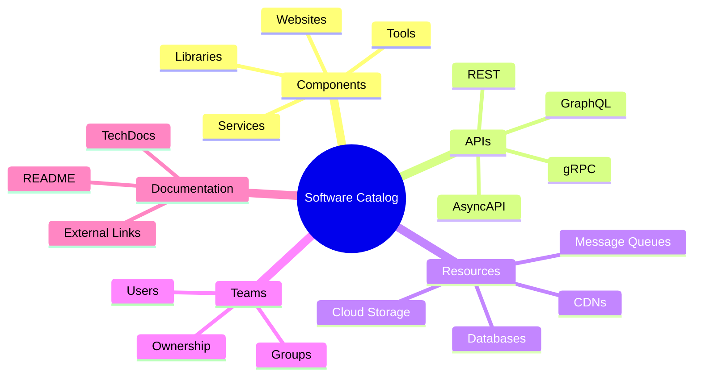
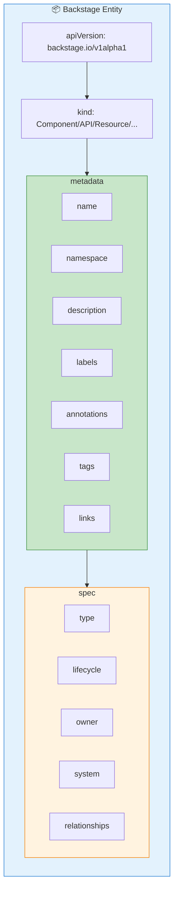
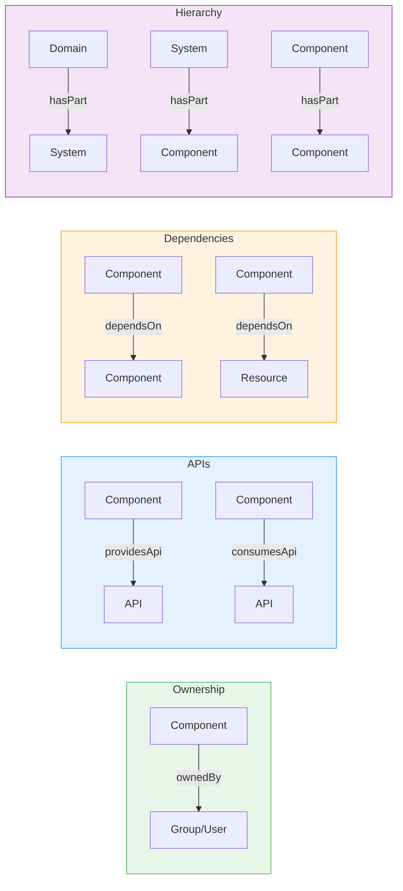
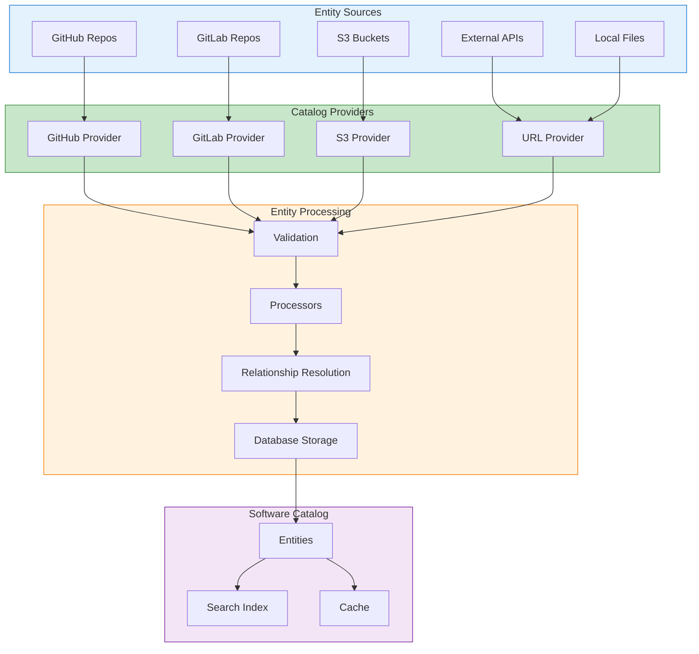
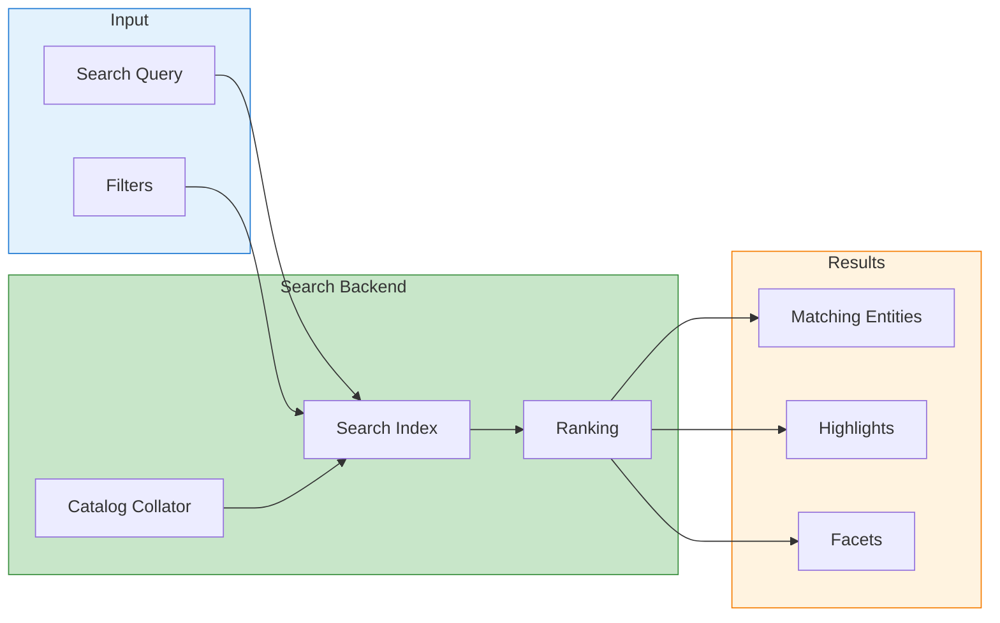
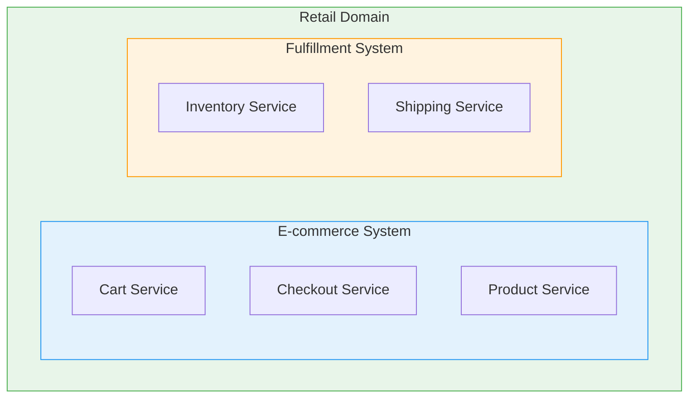

# Backstage Software Catalog Deep Dive

The Software Catalog is the heart of Backstage, providing a centralized registry
of all software components, APIs, resources, and their relationships.

## Table of Contents

- [Backstage Software Catalog Deep Dive](#backstage-software-catalog-deep-dive)
  - [Table of Contents](#table-of-contents)
  - [Understanding the Software Catalog](#understanding-the-software-catalog)
    - [What the Catalog Tracks](#what-the-catalog-tracks)
    - [Key Benefits](#key-benefits)
  - [Entity Model](#entity-model)
    - [Entity Structure Overview](#entity-structure-overview)
    - [Required vs Optional Fields](#required-vs-optional-fields)
  - [Catalog Entity YAML Format](#catalog-entity-yaml-format)
    - [Complete Entity Example](#complete-entity-example)
    - [Metadata Fields Deep Dive](#metadata-fields-deep-dive)
      - [Labels](#labels)
      - [Annotations](#annotations)
      - [Tags](#tags)
      - [Links](#links)
  - [Entity Kinds Reference](#entity-kinds-reference)
    - [Component](#component)
    - [API](#api)
    - [Resource](#resource)
    - [System](#system)
    - [Domain](#domain)
    - [Group](#group)
    - [User](#user)
    - [Location](#location)
    - [Template](#template)
  - [Entity Relationships](#entity-relationships)
    - [Relationship Types Overview](#relationship-types-overview)
    - [Defining Relationships](#defining-relationships)
    - [Relationship Reference Format](#relationship-reference-format)
    - [Complete Relationship Map](#complete-relationship-map)
  - [Catalog Locations and Ingestion](#catalog-locations-and-ingestion)
    - [Location Types](#location-types)
    - [GitHub Discovery Configuration](#github-discovery-configuration)
    - [GitLab Discovery Configuration](#gitlab-discovery-configuration)
    - [Ingestion Flow](#ingestion-flow)
  - [Entity Processors](#entity-processors)
    - [Built-in Processors](#built-in-processors)
    - [Custom Processor Example](#custom-processor-example)
    - [Register Custom Processor](#register-custom-processor)
  - [Search and Discovery](#search-and-discovery)
    - [Catalog Search](#catalog-search)
    - [Search Filters](#search-filters)
    - [Faceted Search Configuration](#faceted-search-configuration)
  - [Advanced Catalog Features](#advanced-catalog-features)
    - [Entity Facets](#entity-facets)
    - [Entity Validation](#entity-validation)
    - [Orphan Entity Strategy](#orphan-entity-strategy)
    - [Entity Refresh](#entity-refresh)
  - [Best Practices](#best-practices)
    - [1. Consistent Naming](#1-consistent-naming)
    - [2. Rich Metadata](#2-rich-metadata)
    - [3. Complete Relationships](#3-complete-relationships)
    - [4. Use Systems and Domains](#4-use-systems-and-domains)
    - [5. Automate Catalog Updates](#5-automate-catalog-updates)
  - [Next Steps](#next-steps)
  - [References](#references)

## Understanding the Software Catalog

The Software Catalog serves as the single source of truth for your
organization's software ecosystem.

### What the Catalog Tracks



### Key Benefits

| Benefit             | Description                                  |
| ------------------- | -------------------------------------------- |
| **Discoverability** | Find any service, API, or resource instantly |
| **Ownership**       | Clear accountability for every component     |
| **Dependencies**    | Understand what depends on what              |
| **Documentation**   | Access docs in context                       |
| **Standardization** | Consistent metadata across all components    |
| **Integration Hub** | Connect monitoring, CI/CD, and other tools   |

## Entity Model

### Entity Structure Overview



### Required vs Optional Fields

| Field                  | Required | Description                        |
| ---------------------- | -------- | ---------------------------------- |
| `apiVersion`           | Yes      | Always `backstage.io/v1alpha1`     |
| `kind`                 | Yes      | Entity type (Component, API, etc.) |
| `metadata.name`        | Yes      | Unique identifier (kebab-case)     |
| `metadata.namespace`   | No       | Defaults to `default`              |
| `metadata.description` | No       | Human-readable description         |
| `metadata.labels`      | No       | Key-value pairs for filtering      |
| `metadata.annotations` | No       | Tool-specific metadata             |
| `metadata.tags`        | No       | Searchable tags                    |
| `spec.type`            | Varies   | Entity subtype                     |
| `spec.owner`           | Varies   | Owner reference                    |
| `spec.lifecycle`       | Varies   | Lifecycle stage                    |

## Catalog Entity YAML Format

### Complete Entity Example

```yaml
# catalog-info.yaml
apiVersion: backstage.io/v1alpha1
kind: Component
metadata:
  # Required: unique identifier
  name: user-service

  # Optional: namespace (defaults to 'default')
  namespace: production

  # Optional: human-readable description
  description: |
    User authentication and profile management service.
    Handles login, registration, password reset, and user preferences.

  # Optional: key-value labels for filtering
  labels:
    team: platform
    cost-center: engineering
    environment: production

  # Optional: tool-specific annotations
  annotations:
    # GitHub integration
    github.com/project-slug: my-org/user-service

    # CI/CD integration
    jenkins.io/job-full-name: user-service/main

    # Monitoring integration
    grafana/dashboard-selector: user-service
    prometheus.io/alert: user-service-alerts

    # PagerDuty integration
    pagerduty.com/integration-key: abc123

    # Kubernetes integration
    backstage.io/kubernetes-id: user-service
    backstage.io/kubernetes-namespace: user-ns

    # TechDocs
    backstage.io/techdocs-ref: dir:.

    # Cloud cost tracking
    cloud.google.com/cost-center: platform-123

  # Optional: searchable tags
  tags:
    - python
    - fastapi
    - authentication
    - grpc

  # Optional: external links
  links:
    - url: https://grafana.example.com/d/user-service
      title: Grafana Dashboard
      icon: dashboard
    - url: https://runbooks.example.com/user-service
      title: Runbook
      icon: docs
    - url: https://slack.com/channels/team-platform
      title: Slack Channel
      icon: chat

spec:
  # Component type
  type: service

  # Lifecycle stage
  lifecycle: production

  # Owner reference (group or user)
  owner: group:platform-team

  # System this component belongs to
  system: identity-system

  # Subcomponent of (for monorepos)
  # subcomponentOf: component:monorepo

  # APIs provided by this component
  providesApis:
    - user-api
    - auth-api

  # APIs consumed by this component
  consumesApis:
    - notification-api
    - audit-log-api

  # Dependencies
  dependsOn:
    - resource:default/users-database
    - resource:default/redis-cache
    - component:default/auth-library
```

### Metadata Fields Deep Dive

#### Labels

Labels are key-value pairs used for filtering and organization:

```yaml
metadata:
  labels:
    # Organizational labels
    team: platform
    department: engineering
    cost-center: cc-1234

    # Technical labels
    language: python
    framework: fastapi
    runtime: kubernetes

    # Compliance labels
    data-classification: pii
    compliance: soc2
    gdpr: applicable
```

#### Annotations

Annotations connect entities to external tools:

```yaml
metadata:
  annotations:
    # Source control
    github.com/project-slug: org/repo
    gitlab.com/project-slug: org/repo
    bitbucket.org/project-slug: org/repo

    # CI/CD
    jenkins.io/job-full-name: folder/job
    circleci.com/project-slug: github/org/repo
    github.com/workflows: .github/workflows/main.yml

    # Kubernetes
    backstage.io/kubernetes-id: deployment-name
    backstage.io/kubernetes-namespace: namespace
    backstage.io/kubernetes-label-selector: app=myapp

    # Documentation
    backstage.io/techdocs-ref: dir:.
    backstage.io/techdocs-ref: url:https://github.com/org/repo/tree/main/docs

    # Monitoring & Alerting
    grafana/dashboard-selector: my-dashboard
    prometheus.io/rule: my-alert-rule
    datadog/dashboard: dashboard-id
    newrelic/guid: entity-guid

    # Incident Management
    pagerduty.com/integration-key: key
    pagerduty.com/service-id: service-id
    opsgenie.com/team: team-name

    # Cost Management
    aws.amazon.com/cost-allocation-tag: my-tag
    cloud.google.com/cost-center: center-id
```

#### Tags

Tags are simple strings for search and categorization:

```yaml
metadata:
  tags:
    # Languages
    - python
    - typescript
    - go

    # Frameworks
    - fastapi
    - react
    - express

    # Categories
    - backend
    - frontend
    - infrastructure

    # Features
    - authentication
    - payments
    - notifications
```

#### Links

Links provide quick access to related resources:

```yaml
metadata:
  links:
    - url: https://example.com/dashboard
      title: Dashboard
      icon: dashboard # Material icon name
      type: dashboard

    - url: https://example.com/runbook
      title: Runbook
      icon: article
      type: runbook

    - url: https://slack.com/channel
      title: Slack
      icon: chat
      type: chat
```

## Entity Kinds Reference

### Component

Software components (services, websites, libraries):

```yaml
apiVersion: backstage.io/v1alpha1
kind: Component
metadata:
  name: shopping-cart-service
  description: Manages shopping cart functionality
spec:
  type: service # service, website, library, tool, documentation
  lifecycle: production # experimental, production, deprecated
  owner: group:commerce-team
  system: e-commerce
  providesApis:
    - cart-api
  consumesApis:
    - inventory-api
    - pricing-api
  dependsOn:
    - resource:cart-database
```

**Component Types:**

| Type            | Description          | Example                     |
| --------------- | -------------------- | --------------------------- |
| `service`       | Backend service      | REST API, gRPC service      |
| `website`       | Frontend application | React app, static site      |
| `library`       | Shared code package  | npm package, Python library |
| `tool`          | Development tool     | CLI tool, build script      |
| `documentation` | Documentation site   | MkDocs site                 |

### API

API specifications exposed by components:

```yaml
apiVersion: backstage.io/v1alpha1
kind: API
metadata:
  name: cart-api
  description: Shopping cart API for managing items
  tags:
    - rest
    - commerce
spec:
  type: openapi # openapi, asyncapi, graphql, grpc
  lifecycle: production
  owner: group:commerce-team
  system: e-commerce
  definition: |
    openapi: 3.0.0
    info:
      title: Cart API
      version: 1.0.0
    paths:
      /cart:
        get:
          summary: Get cart contents
          responses:
            '200':
              description: Cart contents
```

**API Types:**

| Type       | Description      | Definition Format      |
| ---------- | ---------------- | ---------------------- |
| `openapi`  | REST API         | OpenAPI 3.x YAML/JSON  |
| `asyncapi` | Event-driven API | AsyncAPI 2.x YAML/JSON |
| `graphql`  | GraphQL API      | GraphQL SDL            |
| `grpc`     | gRPC service     | Protobuf definition    |

**External API Definition:**

```yaml
spec:
  type: openapi
  lifecycle: production
  owner: group:commerce-team
  definition:
    $text: https://api.example.com/openapi.yaml
```

### Resource

Infrastructure resources:

```yaml
apiVersion: backstage.io/v1alpha1
kind: Resource
metadata:
  name: cart-database
  description: PostgreSQL database for cart data
spec:
  type: database # database, storage, queue, cdn, cluster
  owner: group:platform-team
  system: e-commerce
  dependsOn:
    - resource:default/rds-cluster
```

**Resource Types:**

| Type       | Description       | Example                 |
| ---------- | ----------------- | ----------------------- |
| `database` | Database instance | PostgreSQL, MongoDB     |
| `storage`  | Object storage    | S3 bucket, GCS bucket   |
| `queue`    | Message queue     | SQS, Kafka topic        |
| `cdn`      | Content delivery  | CloudFront distribution |
| `cluster`  | Compute cluster   | Kubernetes cluster      |

### System

Collection of related components and resources:

```yaml
apiVersion: backstage.io/v1alpha1
kind: System
metadata:
  name: e-commerce
  description: E-commerce platform for online shopping
  tags:
    - commerce
    - customer-facing
spec:
  owner: group:commerce-team
  domain: retail
```

### Domain

Business domain grouping systems:

```yaml
apiVersion: backstage.io/v1alpha1
kind: Domain
metadata:
  name: retail
  description: Retail business domain covering all shopping experiences
spec:
  owner: group:retail-leadership
```

### Group

Teams and organizational units:

```yaml
apiVersion: backstage.io/v1alpha1
kind: Group
metadata:
  name: platform-team
  description: Platform engineering team
spec:
  type: team # team, business-unit, department
  profile:
    displayName: Platform Team
    email: platform@example.com
    picture: https://example.com/team-avatar.png
  parent: group:engineering
  children:
    - group:platform-sre
    - group:platform-dev
  members:
    - user:john.doe
    - user:jane.smith
```

### User

Individual people:

```yaml
apiVersion: backstage.io/v1alpha1
kind: User
metadata:
  name: john.doe
spec:
  profile:
    displayName: John Doe
    email: john.doe@example.com
    picture: https://example.com/john.png
  memberOf:
    - group:platform-team
```

### Location

References to external entity sources:

```yaml
apiVersion: backstage.io/v1alpha1
kind: Location
metadata:
  name: github-catalog
  description: All catalog files from GitHub
spec:
  type: url
  target: https://github.com/my-org/catalog/blob/main/all-entities.yaml
```

### Template

Software templates for scaffolding (covered in detail in
[Software Templates Guide](./backstage-software-templates.md)):

```yaml
apiVersion: scaffolder.backstage.io/v1beta3
kind: Template
metadata:
  name: python-service
  title: Python Service
  description: Create a new Python service
spec:
  owner: group:platform-team
  type: service
  parameters:
    # Form fields...
  steps:
    # Template actions...
```

## Entity Relationships

### Relationship Types Overview



### Defining Relationships

**In the source entity (explicit):**

```yaml
# Component explicitly declares its relationships
apiVersion: backstage.io/v1alpha1
kind: Component
metadata:
  name: order-service
spec:
  type: service
  lifecycle: production
  owner: group:commerce-team # ownedBy relationship
  system: e-commerce # partOf relationship
  providesApis: # providesApi relationship
    - order-api
  consumesApis: # consumesApi relationship
    - inventory-api
    - payment-api
  dependsOn: # dependsOn relationship
    - component:default/cart-service
    - resource:default/orders-db
```

**Automatic reverse relationships:**

When you define `providesApis: [order-api]`, Backstage automatically creates
the reverse relationship on the API: `apiProvidedBy: [order-service]`.

### Relationship Reference Format

References to other entities follow this format:

```text
[<kind>:][<namespace>/]<name>
```

Examples:

```yaml
# Full reference
owner: group:production/platform-team

# Kind and name (default namespace)
owner: group:platform-team

# Name only (default kind based on context)
owner: platform-team
```

### Complete Relationship Map

| Source Kind | Relationship       | Target Kind        | Reverse Relationship  |
| ----------- | ------------------ | ------------------ | --------------------- |
| Component   | `ownedBy`          | Group/User         | `ownerOf`             |
| Component   | `partOf` (system)  | System             | `hasPart`             |
| Component   | `providesApi`      | API                | `apiProvidedBy`       |
| Component   | `consumesApi`      | API                | `apiConsumedBy`       |
| Component   | `dependsOn`        | Component/Resource | `dependencyOf`        |
| Component   | `subcomponentOf`   | Component          | `hasSubcomponent`     |
| API         | `ownedBy`          | Group/User         | `ownerOf`             |
| System      | `ownedBy`          | Group/User         | `ownerOf`             |
| System      | `partOf` (domain)  | Domain             | `hasPart`             |
| Resource    | `ownedBy`          | Group/User         | `ownerOf`             |
| Resource    | `dependsOn`        | Resource           | `dependencyOf`        |
| Group       | `childOf` (parent) | Group              | `parentOf` (children) |
| User        | `memberOf`         | Group              | `hasMember`           |

## Catalog Locations and Ingestion

### Location Types

```yaml
# app-config.yaml
catalog:
  locations:
    # Static file location
    - type: file
      target: ./catalog/entities.yaml

    # GitHub discovery (all repos)
    - type: github-discovery
      target: https://github.com/my-org

    # GitHub org discovery (teams and users)
    - type: github-org
      target: https://github.com/my-org

    # Specific URL
    - type: url
      target: https://github.com/my-org/repo/blob/main/catalog-info.yaml

    # GitLab discovery
    - type: gitlab-discovery
      target: https://gitlab.com/my-group

    # Azure DevOps discovery
    - type: azure-discovery
      target: https://dev.azure.com/my-org

    # AWS S3 discovery
    - type: aws-s3-discovery
      target: https://my-bucket.s3.amazonaws.com/catalog/
```

### GitHub Discovery Configuration

```yaml
# app-config.yaml
catalog:
  providers:
    github:
      # Discover all repos in org
      myOrgProvider:
        organization: 'my-org'
        catalogPath: '/catalog-info.yaml'
        filters:
          branch: 'main'
          repository: '.*' # regex pattern
        schedule:
          frequency: { minutes: 30 }
          timeout: { minutes: 3 }

      # Discover from specific topic
      topicProvider:
        organization: 'my-org'
        catalogPath: '/catalog-info.yaml'
        filters:
          branch: 'main'
          topic:
            include: ['backstage-enabled']
            exclude: ['archived']
```

### GitLab Discovery Configuration

```yaml
catalog:
  providers:
    gitlab:
      myGitLabProvider:
        host: gitlab.com
        branch: main
        group: my-group
        entityFilename: catalog-info.yaml
        schedule:
          frequency: { hours: 1 }
          timeout: { minutes: 5 }
```

### Ingestion Flow



## Entity Processors

Processors transform and enrich entities during ingestion.

### Built-in Processors

| Processor                         | Purpose                            |
| --------------------------------- | ---------------------------------- |
| `BuiltinKindsEntityProcessor`     | Validates built-in entity kinds    |
| `AnnotateLocationEntityProcessor` | Adds source location annotation    |
| `AnnotateScmSlugEntityProcessor`  | Adds SCM slug annotation           |
| `FileReaderProcessor`             | Reads referenced files             |
| `GithubOrgReaderProcessor`        | Reads GitHub organization data     |
| `CodeOwnersProcessor`             | Extracts ownership from CODEOWNERS |

### Custom Processor Example

```typescript
// plugins/catalog-backend-module-custom/src/processor.ts
import {
  CatalogProcessor,
  CatalogProcessorEmit,
  processingResult,
} from '@backstage/plugin-catalog-node'
import { Entity } from '@backstage/catalog-model'
import { LocationSpec } from '@backstage/plugin-catalog-common'

export class CustomMetadataProcessor implements CatalogProcessor {
  getProcessorName(): string {
    return 'CustomMetadataProcessor'
  }

  async preProcessEntity(
    entity: Entity,
    _location: LocationSpec,
    emit: CatalogProcessorEmit
  ): Promise<Entity> {
    // Add custom annotations based on entity properties
    if (entity.kind === 'Component' && entity.spec?.type === 'service') {
      entity.metadata.annotations = {
        ...entity.metadata.annotations,
        'company.com/reviewed': new Date().toISOString(),
      }
    }

    return entity
  }

  async postProcessEntity(
    entity: Entity,
    _location: LocationSpec,
    emit: CatalogProcessorEmit
  ): Promise<Entity> {
    // Emit additional entities based on this entity
    if (entity.metadata.annotations?.['company.com/team-api']) {
      emit(
        processingResult.entity({
          apiVersion: 'backstage.io/v1alpha1',
          kind: 'API',
          metadata: {
            name: `${entity.metadata.name}-api`,
            namespace: entity.metadata.namespace,
          },
          spec: {
            type: 'openapi',
            lifecycle: entity.spec?.lifecycle || 'production',
            owner: entity.spec?.owner,
            definition: '...',
          },
        })
      )
    }

    return entity
  }
}
```

### Register Custom Processor

```typescript
// packages/backend/src/index.ts
import { createBackend } from '@backstage/backend-defaults'
import { catalogProcessingExtensionPoint } from '@backstage/plugin-catalog-node/alpha'
import { CustomMetadataProcessor } from './processors/CustomMetadataProcessor'

const backend = createBackend()

backend.add(
  createBackendModule({
    pluginId: 'catalog',
    moduleId: 'custom-processor',
    register(reg) {
      reg.registerInit({
        deps: {
          catalog: catalogProcessingExtensionPoint,
        },
        async init({ catalog }) {
          catalog.addProcessor(new CustomMetadataProcessor())
        },
      })
    },
  })
)

backend.start()
```

## Search and Discovery

### Catalog Search

Backstage provides powerful search capabilities:



### Search Filters

```typescript
// Using the Catalog API for programmatic search
const { items } = await catalogApi.getEntities({
  filter: {
    kind: 'Component',
    'spec.type': 'service',
    'spec.lifecycle': 'production',
    'metadata.tags': 'python',
    'relations.ownedBy': 'group:default/platform-team',
  },
  fields: ['metadata.name', 'metadata.description', 'spec.owner'],
  order: [{ field: 'metadata.name', order: 'asc' }],
})
```

### Faceted Search Configuration

```yaml
# app-config.yaml
search:
  collators:
    catalog:
      defaultRefreshIntervalSeconds: 600
      batchSize: 500
      filter:
        kind:
          - Component
          - API
          - System
          - Domain
```

## Advanced Catalog Features

### Entity Facets

The catalog supports custom facets for filtering:

```yaml
# app-config.yaml
catalog:
  facets:
    - name: custom-facet
      expression: metadata.labels.team
```

### Entity Validation

Add custom validation rules:

```typescript
// Custom validator
import { CatalogProcessor } from '@backstage/plugin-catalog-node'

export class ValidationProcessor implements CatalogProcessor {
  getProcessorName() {
    return 'ValidationProcessor'
  }

  validateEntityKind(entity: Entity): boolean {
    // Require description for all services
    if (
      entity.kind === 'Component' &&
      entity.spec?.type === 'service' &&
      !entity.metadata.description
    ) {
      throw new Error('Services must have a description')
    }

    // Require owner for all entities
    if (!entity.spec?.owner) {
      throw new Error('All entities must have an owner')
    }

    return true
  }
}
```

### Orphan Entity Strategy

Handle entities that lose their source:

```yaml
# app-config.yaml
catalog:
  orphanStrategy: delete # keep or delete
```

### Entity Refresh

Force refresh of specific entities:

```bash
# Via API
curl -X POST http://localhost:7007/api/catalog/refresh \
  -H "Content-Type: application/json" \
  -d '{"entityRef": "component:default/my-service"}'
```

## Best Practices

### 1. Consistent Naming

```yaml
# Good: kebab-case, descriptive
metadata:
  name: user-authentication-service

# Bad: inconsistent casing
metadata:
  name: UserAuthService
```

### 2. Rich Metadata

```yaml
# Good: complete metadata
metadata:
  name: user-service
  description: |
    Handles user authentication, registration, and profile management.
    Supports OAuth2, SAML, and local authentication.
  tags:
    - authentication
    - python
    - grpc
  labels:
    team: platform
    tier: critical
  annotations:
    grafana/dashboard: user-service
    pagerduty.com/service-id: P123456

# Bad: minimal metadata
metadata:
  name: user-service
```

### 3. Complete Relationships

```yaml
# Good: explicit relationships
spec:
  type: service
  lifecycle: production
  owner: group:platform-team
  system: identity
  providesApis:
    - user-api
  consumesApis:
    - notification-api
  dependsOn:
    - resource:users-database

# Bad: missing relationships
spec:
  type: service
  owner: platform-team
```

### 4. Use Systems and Domains



### 5. Automate Catalog Updates

Use CI/CD to validate and update catalog files:

```yaml
# .github/workflows/catalog-validation.yml
name: Validate Catalog
on:
  pull_request:
    paths:
      - 'catalog-info.yaml'

jobs:
  validate:
    runs-on: ubuntu-latest
    steps:
      - uses: actions/checkout@v4
      - name: Validate entity
        run: |
          npx @backstage/cli catalog validate catalog-info.yaml
```

## Next Steps

- [Software Templates Guide](./backstage-software-templates.md) - Create
  scaffolding templates
- [TechDocs Guide](./backstage-techdocs.md) - Documentation as code
- [Integrations Guide](./backstage-integrations.md) - Connect external tools

## References

- [Catalog Model](https://backstage.io/docs/features/software-catalog/descriptor-format)
- [Catalog Configuration](https://backstage.io/docs/features/software-catalog/configuration)
- [Entity Providers](https://backstage.io/docs/features/software-catalog/external-integrations)
- [Well-known Annotations](https://backstage.io/docs/features/software-catalog/well-known-annotations)
