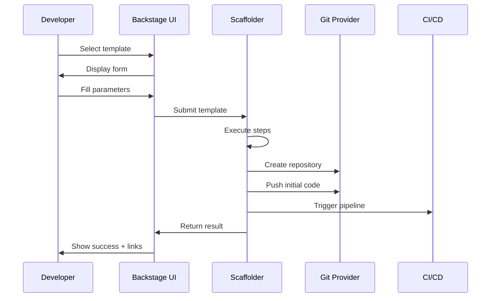
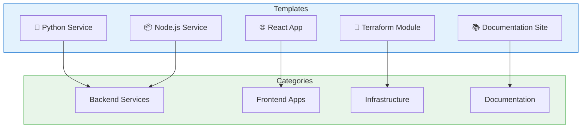

# Backstage Software Templates Guide

Software Templates (Scaffolder) enable self-service creation of new projects,
services, and components following organizational standards and best practices.

## Table of Contents

- [Backstage Software Templates Guide](#backstage-software-templates-guide)
  - [Table of Contents](#table-of-contents)
  - [Understanding Software Templates](#understanding-software-templates)
    - [Why Software Templates?](#why-software-templates)
    - [Template Workflow](#template-workflow)
  - [Template Anatomy](#template-anatomy)
    - [Basic Template Structure](#basic-template-structure)
    - [Template Directory Structure](#template-directory-structure)
  - [Parameters and Forms](#parameters-and-forms)
    - [Parameter Types](#parameter-types)
    - [UI Field Extensions](#ui-field-extensions)
    - [Conditional Fields](#conditional-fields)
    - [Multi-step Forms](#multi-step-forms)
  - [Template Steps and Actions](#template-steps-and-actions)
    - [Step Structure](#step-structure)
    - [Template Expressions](#template-expressions)
    - [Available Filters](#available-filters)
  - [Built-in Actions Reference](#built-in-actions-reference)
    - [Fetch Actions](#fetch-actions)
    - [Publish Actions](#publish-actions)
    - [Pull Request Actions](#pull-request-actions)
    - [Catalog Actions](#catalog-actions)
    - [File System Actions](#file-system-actions)
    - [Debug Actions](#debug-actions)
    - [HTTP Actions](#http-actions)
  - [Custom Actions](#custom-actions)
    - [Creating Custom Actions](#creating-custom-actions)
    - [Registering Custom Actions](#registering-custom-actions)
    - [Using Custom Actions in Templates](#using-custom-actions-in-templates)
  - [Template Examples](#template-examples)
    - [Complete Python Service Template](#complete-python-service-template)
    - [Skeleton Files Example](#skeleton-files-example)
    - [React Component Template](#react-component-template)
  - [Testing Templates](#testing-templates)
    - [Local Testing](#local-testing)
    - [Testing in Backstage UI](#testing-in-backstage-ui)
    - [Automated Testing](#automated-testing)
  - [Best Practices](#best-practices)
    - [1. Template Organization](#1-template-organization)
    - [2. Golden Path Principles](#2-golden-path-principles)
    - [3. Parameter Guidelines](#3-parameter-guidelines)
    - [4. Step Error Handling](#4-step-error-handling)
    - [5. Template Versioning](#5-template-versioning)
  - [Next Steps](#next-steps)
  - [References](#references)

## Understanding Software Templates

Software Templates provide "golden paths" for creating new software projects
with all required configurations, CI/CD pipelines, and documentation in place.

### Why Software Templates?

```mermaid
flowchart LR
    subgraph Before[Without Templates]
        direction TB
        B1[Manual setup]
        B2[Copy-paste from old projects]
        B3[Inconsistent configurations]
        B4[Missing best practices]
        B5[Days to first deployment]
    end

    subgraph After[With Templates]
        direction TB
        A1[Self-service creation]
        A2[Standardized structure]
        A3[Best practices built-in]
        A4[CI/CD configured]
        A5[Minutes to first deployment]
    end

    Before -->|Software Templates| After

    style Before fill:#FFEBEE,stroke:#C62828
    style After fill:#E8F5E9,stroke:#2E7D32
```



### Template Workflow



## Template Anatomy

### Basic Template Structure

```yaml
# template.yaml
apiVersion: scaffolder.backstage.io/v1beta3
kind: Template
metadata:
  name: python-service-template
  title: Python Service
  description: Create a new Python microservice with FastAPI
  tags:
    - python
    - fastapi
    - recommended
  annotations:
    backstage.io/techdocs-ref: dir:.
spec:
  owner: group:platform-team
  type: service

  # Input parameters (form fields)
  parameters:
    - title: Service Information
      required:
        - name
        - owner
      properties:
        name:
          title: Service Name
          type: string
          description: Unique name for the service
        owner:
          title: Owner
          type: string
          description: Team that owns this service
          ui:field: OwnerPicker
          ui:options:
            catalogFilter:
              kind: Group

    - title: Repository Configuration
      required:
        - repoUrl
      properties:
        repoUrl:
          title: Repository Location
          type: string
          ui:field: RepoUrlPicker
          ui:options:
            allowedHosts:
              - github.com

  # Execution steps
  steps:
    - id: fetch-base
      name: Fetch Base Template
      action: fetch:template
      input:
        url: ./skeleton
        values:
          name: ${{ parameters.name }}
          owner: ${{ parameters.owner }}

    - id: publish
      name: Publish to GitHub
      action: publish:github
      input:
        allowedHosts: ['github.com']
        repoUrl: ${{ parameters.repoUrl }}
        description: ${{ parameters.name }} service

    - id: register
      name: Register in Catalog
      action: catalog:register
      input:
        repoContentsUrl: ${{ steps['publish'].output.repoContentsUrl }}
        catalogInfoPath: '/catalog-info.yaml'

  # Output links
  output:
    links:
      - title: Repository
        url: ${{ steps['publish'].output.remoteUrl }}
      - title: Open in Catalog
        icon: catalog
        entityRef: ${{ steps['register'].output.entityRef }}
```

### Template Directory Structure

```text
templates/
├── python-service/
│   ├── template.yaml          # Template definition
│   ├── skeleton/              # Template files
│   │   ├── catalog-info.yaml  # Catalog entry (templated)
│   │   ├── README.md          # Project readme (templated)
│   │   ├── pyproject.toml     # Python config (templated)
│   │   ├── Dockerfile
│   │   ├── .github/
│   │   │   └── workflows/
│   │   │       └── ci.yml
│   │   └── src/
│   │       └── ${{ values.name | replace('-', '_') }}/
│   │           ├── __init__.py
│   │           └── main.py
│   └── docs/                  # Template documentation
│       └── index.md
```

## Parameters and Forms

### Parameter Types

```yaml
parameters:
  - title: Basic Information
    properties:
      # String input
      name:
        title: Name
        type: string
        description: Service name
        pattern: '^[a-z][a-z0-9-]*$'
        minLength: 3
        maxLength: 50

      # Number input
      replicas:
        title: Replicas
        type: number
        default: 2
        minimum: 1
        maximum: 10

      # Boolean checkbox
      enableMetrics:
        title: Enable Metrics
        type: boolean
        default: true

      # Enum dropdown
      language:
        title: Language
        type: string
        enum:
          - python
          - typescript
          - go
        enumNames:
          - Python
          - TypeScript
          - Go

      # Array of strings
      tags:
        title: Tags
        type: array
        items:
          type: string
        uniqueItems: true

      # Object (nested properties)
      database:
        title: Database Configuration
        type: object
        properties:
          type:
            type: string
            enum: [postgresql, mysql, mongodb]
          size:
            type: string
            enum: [small, medium, large]
```

### UI Field Extensions

Backstage provides special UI fields for common use cases:

```yaml
parameters:
  - title: Configuration
    properties:
      # Owner picker (users and groups)
      owner:
        title: Owner
        type: string
        ui:field: OwnerPicker
        ui:options:
          catalogFilter:
            kind: [Group, User]

      # Repository URL picker
      repoUrl:
        title: Repository Location
        type: string
        ui:field: RepoUrlPicker
        ui:options:
          allowedHosts:
            - github.com
            - gitlab.com
          allowedOwners:
            - my-org

      # Entity picker (any catalog entity)
      system:
        title: System
        type: string
        ui:field: EntityPicker
        ui:options:
          catalogFilter:
            kind: System
          defaultKind: System

      # Multi-entity picker
      dependencies:
        title: Dependencies
        type: array
        ui:field: EntityPicker
        ui:options:
          catalogFilter:
            kind: Component
          multiple: true

      # Text area for long content
      description:
        title: Description
        type: string
        ui:widget: textarea
        ui:options:
          rows: 5

      # Hidden field
      internalId:
        type: string
        ui:widget: hidden
        default: auto-generated
```

### Conditional Fields

```yaml
parameters:
  - title: Database Configuration
    properties:
      needsDatabase:
        title: Needs Database?
        type: boolean
        default: false

    dependencies:
      needsDatabase:
        oneOf:
          - properties:
              needsDatabase:
                const: false
          - properties:
              needsDatabase:
                const: true
              databaseType:
                title: Database Type
                type: string
                enum:
                  - postgresql
                  - mysql
                  - mongodb
              databaseSize:
                title: Database Size
                type: string
                enum:
                  - small
                  - medium
                  - large
            required:
              - databaseType
              - databaseSize
```

### Multi-step Forms

```yaml
parameters:
  # Step 1: Basic Info
  - title: Basic Information
    required:
      - name
      - description
    properties:
      name:
        title: Service Name
        type: string
      description:
        title: Description
        type: string
        ui:widget: textarea

  # Step 2: Technical Config
  - title: Technical Configuration
    required:
      - language
      - framework
    properties:
      language:
        title: Language
        type: string
        enum: [python, typescript, go]
      framework:
        title: Framework
        type: string
        # Dynamic based on language selection
        ui:field: SelectFieldFromContext
        ui:options:
          dependsOn: language
          optionSets:
            python: [fastapi, flask, django]
            typescript: [express, nestjs, fastify]
            go: [gin, echo, fiber]

  # Step 3: Repository
  - title: Repository Setup
    required:
      - repoUrl
    properties:
      repoUrl:
        title: Repository
        type: string
        ui:field: RepoUrlPicker
```

## Template Steps and Actions

### Step Structure

```yaml
steps:
  - id: unique-step-id # Required: unique identifier
    name: Human-readable name # Required: displayed in UI
    action: action:name # Required: action to execute
    input: # Action-specific inputs
      key: value
      templated: ${{ parameters.name }}
    if: ${{ parameters.condition === true }} # Optional: conditional execution
```

### Template Expressions

Use Nunjucks syntax for templating:

```yaml
steps:
  - id: example
    action: debug:log
    input:
      # Direct parameter reference
      message: ${{ parameters.name }}

      # String concatenation
      fullName: ${{ parameters.firstName }}-${{ parameters.lastName }}

      # Filters
      snakeCase: ${{ parameters.name | replace('-', '_') }}
      upperCase: ${{ parameters.name | upper }}
      lowerCase: ${{ parameters.name | lower }}

      # Conditionals
      env: ${{ parameters.production ? 'prod' : 'dev' }}

      # Previous step outputs
      repoUrl: ${{ steps['publish'].output.remoteUrl }}

      # JSON output
      config: |
        {
          "name": "${{ parameters.name }}",
          "enabled": ${{ parameters.enabled }}
        }
```

### Available Filters

| Filter         | Description       | Example                                          |
| -------------- | ----------------- | ------------------------------------------------ |
| `lower`        | Lowercase         | `${{ "Hello" \| lower }}` -> `hello`             |
| `upper`        | Uppercase         | `${{ "Hello" \| upper }}` -> `HELLO`             |
| `title`        | Title case        | `${{ "hello world" \| title }}` -> `Hello World` |
| `replace`      | Replace substring | `${{ "a-b" \| replace('-', '_') }}` -> `a_b`     |
| `trim`         | Remove whitespace | `${{ " hello " \| trim }}` -> `hello`            |
| `dump`         | JSON stringify    | `${{ obj \| dump }}`                             |
| `parseRepoUrl` | Parse repo URL    | `${{ parameters.repoUrl \| parseRepoUrl }}`      |

## Built-in Actions Reference

### Fetch Actions

```yaml
# Fetch and template files
- id: fetch
  action: fetch:template
  input:
    url: ./skeleton # Source location
    targetPath: ./ # Destination (default: ./)
    values: # Template variables
      name: ${{ parameters.name }}
      owner: ${{ parameters.owner }}
    templateFileExtension: .njk # Only template these files

# Fetch plain files (no templating)
- id: fetch-plain
  action: fetch:plain
  input:
    url: https://example.com/files.zip
    targetPath: ./vendor

# Fetch from GitHub
- id: fetch-github
  action: fetch:plain:file
  input:
    url: https://github.com/org/repo/blob/main/file.txt
    targetPath: ./file.txt
```

### Publish Actions

```yaml
# Publish to GitHub
- id: publish-github
  action: publish:github
  input:
    allowedHosts: ['github.com']
    repoUrl: ${{ parameters.repoUrl }}
    description: ${{ parameters.description }}
    defaultBranch: main
    repoVisibility: private
    collaborators:
      - team: my-team
        access: push
    topics:
      - backstage
      - service
    protectDefaultBranch: true
    requireCodeOwnerReviews: true

# Publish to GitLab
- id: publish-gitlab
  action: publish:gitlab
  input:
    allowedHosts: ['gitlab.com']
    repoUrl: ${{ parameters.repoUrl }}
    description: ${{ parameters.description }}
    defaultBranch: main
    repoVisibility: private

# Publish to Azure DevOps
- id: publish-azure
  action: publish:azure
  input:
    allowedHosts: ['dev.azure.com']
    repoUrl: ${{ parameters.repoUrl }}
    description: ${{ parameters.description }}

# Publish to Bitbucket
- id: publish-bitbucket
  action: publish:bitbucket
  input:
    allowedHosts: ['bitbucket.org']
    repoUrl: ${{ parameters.repoUrl }}
    description: ${{ parameters.description }}
```

### Pull Request Actions

```yaml
# Create GitHub PR
- id: create-pr
  action: publish:github:pull-request
  input:
    repoUrl: github.com?owner=org&repo=repo
    branchName: feature/${{ parameters.name }}
    title: Add ${{ parameters.name }}
    description: |
      ## Summary
      Adding new component: ${{ parameters.name }}

      ## Changes
      - Added configuration files
      - Updated dependencies
    sourcePath: ./changes
    targetPath: ./

# Create GitLab MR
- id: create-mr
  action: publish:gitlab:merge-request
  input:
    repoUrl: gitlab.com?owner=group&repo=repo
    branchName: feature/${{ parameters.name }}
    title: Add ${{ parameters.name }}
    description: Adding new component
```

### Catalog Actions

```yaml
# Register entity in catalog
- id: register
  action: catalog:register
  input:
    repoContentsUrl: ${{ steps['publish'].output.repoContentsUrl }}
    catalogInfoPath: /catalog-info.yaml
    optional: false # Fail if registration fails

# Fetch entity from catalog
- id: fetch-entity
  action: catalog:fetch
  input:
    entityRef: component:default/my-service
```

### File System Actions

```yaml
# Rename files
- id: rename
  action: fs:rename
  input:
    files:
      - from: ./template-name
        to: ./${{ parameters.name }}
      - from: ./src/template
        to: ./src/${{ parameters.name }}

# Delete files
- id: delete
  action: fs:delete
  input:
    files:
      - ./unnecessary-file.txt
      - ./temp/

# Append to file
- id: append
  action: fs:append
  input:
    path: ./README.md
    content: |
      ## Additional Notes
      Generated by Backstage
```

### Debug Actions

```yaml
# Log message
- id: log
  action: debug:log
  input:
    message: Processing ${{ parameters.name }}
    listWorkspace: true # List workspace files

# Wait (for testing)
- id: wait
  action: debug:wait
  input:
    seconds: 5
```

### HTTP Actions

```yaml
# Make HTTP request
- id: webhook
  action: http:backstage:request
  input:
    method: POST
    path: /api/proxy/custom-api/webhook
    headers:
      Content-Type: application/json
    body:
      service: ${{ parameters.name }}
      owner: ${{ parameters.owner }}
```

## Custom Actions

### Creating Custom Actions

```typescript
// plugins/scaffolder-backend-module-custom/src/actions/createDatabase.ts
import { createTemplateAction } from '@backstage/plugin-scaffolder-node'
import { z } from 'zod'

export const createDatabaseAction = () => {
  return createTemplateAction({
    id: 'custom:database:create',
    description: 'Creates a new database instance',
    schema: {
      input: z.object({
        name: z.string().describe('Database name'),
        type: z
          .enum(['postgresql', 'mysql', 'mongodb'])
          .describe('Database type'),
        size: z.enum(['small', 'medium', 'large']).describe('Instance size'),
        owner: z.string().describe('Owner team'),
      }),
      output: z.object({
        connectionString: z.string().describe('Database connection string'),
        host: z.string().describe('Database host'),
        port: z.number().describe('Database port'),
      }),
    },
    async handler(ctx) {
      const { name, type, size, owner } = ctx.input

      ctx.logger.info(`Creating ${type} database: ${name}`)

      // Your database provisioning logic here
      const result = await provisionDatabase({
        name,
        type,
        size,
        owner,
      })

      ctx.logger.info(`Database created: ${result.host}:${result.port}`)

      // Set outputs for use in subsequent steps
      ctx.output('connectionString', result.connectionString)
      ctx.output('host', result.host)
      ctx.output('port', result.port)
    },
  })
}
```

### Registering Custom Actions

```typescript
// packages/backend/src/index.ts
import { createBackend } from '@backstage/backend-defaults'
import { scaffolderActionsExtensionPoint } from '@backstage/plugin-scaffolder-node/alpha'
import { createDatabaseAction } from './actions/createDatabase'

const backend = createBackend()

backend.add(
  createBackendModule({
    pluginId: 'scaffolder',
    moduleId: 'custom-actions',
    register(reg) {
      reg.registerInit({
        deps: {
          scaffolder: scaffolderActionsExtensionPoint,
        },
        async init({ scaffolder }) {
          scaffolder.addActions(createDatabaseAction())
        },
      })
    },
  })
)

backend.start()
```

### Using Custom Actions in Templates

```yaml
steps:
  - id: create-db
    name: Create Database
    action: custom:database:create
    input:
      name: ${{ parameters.name }}-db
      type: postgresql
      size: ${{ parameters.databaseSize }}
      owner: ${{ parameters.owner }}

  - id: update-config
    name: Update Configuration
    action: fs:append
    input:
      path: ./config/database.yaml
      content: |
        database:
          host: ${{ steps['create-db'].output.host }}
          port: ${{ steps['create-db'].output.port }}
          connectionString: ${{ steps['create-db'].output.connectionString }}
```

## Template Examples

### Complete Python Service Template

```yaml
# templates/python-service/template.yaml
apiVersion: scaffolder.backstage.io/v1beta3
kind: Template
metadata:
  name: python-fastapi-service
  title: Python FastAPI Service
  description: |
    Create a production-ready Python service with FastAPI, including:
    - FastAPI application structure
    - Docker configuration
    - GitHub Actions CI/CD
    - Kubernetes manifests
    - TechDocs setup
  tags:
    - python
    - fastapi
    - kubernetes
    - recommended
spec:
  owner: group:platform-team
  type: service

  parameters:
    - title: Service Information
      required:
        - name
        - description
        - owner
      properties:
        name:
          title: Service Name
          type: string
          description: Unique name for the service (lowercase, hyphens allowed)
          pattern: '^[a-z][a-z0-9-]*$'
          ui:autofocus: true
        description:
          title: Description
          type: string
          description: Brief description of the service
          ui:widget: textarea
        owner:
          title: Owner
          type: string
          description: Team that will own this service
          ui:field: OwnerPicker
          ui:options:
            catalogFilter:
              kind: Group

    - title: Technical Configuration
      required:
        - pythonVersion
      properties:
        pythonVersion:
          title: Python Version
          type: string
          enum:
            - '3.11'
            - '3.12'
          default: '3.12'
        enableDatabase:
          title: Include Database Support
          type: boolean
          default: true
        databaseType:
          title: Database Type
          type: string
          enum:
            - postgresql
            - mysql
          default: postgresql
          ui:options:
            hidden: true
        enableRedis:
          title: Include Redis Support
          type: boolean
          default: false
        enableMetrics:
          title: Enable Prometheus Metrics
          type: boolean
          default: true

    - title: Repository Configuration
      required:
        - repoUrl
      properties:
        repoUrl:
          title: Repository Location
          type: string
          ui:field: RepoUrlPicker
          ui:options:
            allowedHosts:
              - github.com
            allowedOwners:
              - my-org

    dependencies:
      enableDatabase:
        oneOf:
          - properties:
              enableDatabase:
                const: false
          - properties:
              enableDatabase:
                const: true
              databaseType:
                title: Database Type
                type: string
                enum:
                  - postgresql
                  - mysql
                default: postgresql

  steps:
    - id: fetch-base
      name: Fetch Base Template
      action: fetch:template
      input:
        url: ./skeleton
        values:
          name: ${{ parameters.name }}
          description: ${{ parameters.description }}
          owner: ${{ parameters.owner }}
          pythonVersion: ${{ parameters.pythonVersion }}
          enableDatabase: ${{ parameters.enableDatabase }}
          databaseType: ${{ parameters.databaseType }}
          enableRedis: ${{ parameters.enableRedis }}
          enableMetrics: ${{ parameters.enableMetrics }}
          repoUrl: ${{ parameters.repoUrl | parseRepoUrl }}

    - id: rename-package
      name: Rename Package Directory
      action: fs:rename
      input:
        files:
          - from: ./src/service_name
            to: ./src/${{ parameters.name | replace('-', '_') }}

    - id: publish
      name: Publish to GitHub
      action: publish:github
      input:
        allowedHosts: ['github.com']
        repoUrl: ${{ parameters.repoUrl }}
        description: ${{ parameters.description }}
        defaultBranch: main
        repoVisibility: private
        protectDefaultBranch: true
        requireCodeOwnerReviews: true
        topics:
          - python
          - fastapi
          - backstage

    - id: register
      name: Register in Catalog
      action: catalog:register
      input:
        repoContentsUrl: ${{ steps['publish'].output.repoContentsUrl }}
        catalogInfoPath: /catalog-info.yaml

  output:
    links:
      - title: Repository
        url: ${{ steps['publish'].output.remoteUrl }}
      - title: Open in Catalog
        icon: catalog
        entityRef: ${{ steps['register'].output.entityRef }}
      - title: View CI/CD
        url: ${{ steps['publish'].output.remoteUrl }}/actions
```

### Skeleton Files Example

```yaml
# templates/python-service/skeleton/catalog-info.yaml
apiVersion: backstage.io/v1alpha1
kind: Component
metadata:
  name: ${{ values.name }}
  description: ${{ values.description }}
  annotations:
    github.com/project-slug: ${{ values.repoUrl.owner }}/${{ values.repoUrl.repo }}
    backstage.io/techdocs-ref: dir:.
  tags:
    - python
    - fastapi
spec:
  type: service
  lifecycle: experimental
  owner: ${{ values.owner }}
  providesApis:
    - ${{ values.name }}-api
---
apiVersion: backstage.io/v1alpha1
kind: API
metadata:
  name: ${{ values.name }}-api
  description: API for ${{ values.name }}
spec:
  type: openapi
  lifecycle: experimental
  owner: ${{ values.owner }}
  definition:
    $text: ./openapi.yaml
```

```python
# templates/python-service/skeleton/src/service_name/main.py
"""${{ values.description }}"""
from fastapi import FastAPI

from prometheus_client import make_asgi_app


from .database import engine, Base


app = FastAPI(
    title='${{ values.name }}',
    description='${{ values.description }}',
    version='0.1.0',
)


metrics_app = make_asgi_app()
app.mount('/metrics', metrics_app)


@app.get('/health')
async def health():
    return {'status': 'healthy'}

@app.get('/')
async def root():
    return {'service': '${{ values.name }}', 'version': '0.1.0'}
```

### React Component Template

```yaml
apiVersion: scaffolder.backstage.io/v1beta3
kind: Template
metadata:
  name: react-component
  title: React Component
  description: Create a new React component in an existing repository
spec:
  owner: group:frontend-team
  type: component

  parameters:
    - title: Component Details
      required:
        - componentName
        - targetRepo
      properties:
        componentName:
          title: Component Name
          type: string
          pattern: '^[A-Z][a-zA-Z0-9]*$'
          description: PascalCase component name
        targetRepo:
          title: Target Repository
          type: string
          ui:field: EntityPicker
          ui:options:
            catalogFilter:
              kind: Component
              spec.type: website
        componentType:
          title: Component Type
          type: string
          enum:
            - functional
            - class
          default: functional
        withTests:
          title: Include Tests
          type: boolean
          default: true
        withStorybook:
          title: Include Storybook Story
          type: boolean
          default: true

  steps:
    - id: fetch-component
      action: fetch:template
      input:
        url: ./skeleton
        targetPath: ./components/${{ parameters.componentName }}
        values:
          componentName: ${{ parameters.componentName }}
          componentType: ${{ parameters.componentType }}
          withTests: ${{ parameters.withTests }}
          withStorybook: ${{ parameters.withStorybook }}

    - id: create-pr
      action: publish:github:pull-request
      input:
        repoUrl: ${{ steps['fetch-entity'].output.repoUrl }}
        branchName: add-${{ parameters.componentName | lower }}-component
        title: 'feat: Add ${{ parameters.componentName }} component'
        description: |
          ## New Component: ${{ parameters.componentName }}

          This PR adds a new React component with:
          
          - Unit tests
          
          
          - Storybook story
          

          Generated by Backstage Software Templates.
        sourcePath: ./components

  output:
    links:
      - title: Pull Request
        url: ${{ steps['create-pr'].output.remoteUrl }}
```

## Testing Templates

### Local Testing

```bash
# Validate template syntax
yarn backstage-cli scaffold:validate ./templates/python-service/template.yaml

# Test template locally (dry run)
yarn backstage-cli scaffold:test ./templates/python-service/template.yaml \
  --values '{"name": "test-service", "owner": "group:platform-team"}'
```

### Testing in Backstage UI

1. Navigate to `/create`
2. Find your template
3. Click "Choose" and fill in test values
4. Watch the execution logs
5. Verify the output

### Automated Testing

```typescript
// templates/python-service/template.test.ts
import { TemplateRunner } from '@backstage/plugin-scaffolder-backend'

describe('Python Service Template', () => {
  let runner: TemplateRunner

  beforeAll(async () => {
    runner = await TemplateRunner.create({
      templatePath: './template.yaml',
    })
  })

  it('should create valid catalog-info.yaml', async () => {
    const result = await runner.run({
      name: 'test-service',
      description: 'Test service',
      owner: 'group:platform-team',
      pythonVersion: '3.12',
      enableDatabase: true,
      databaseType: 'postgresql',
      repoUrl: 'github.com?owner=my-org&repo=test-service',
    })

    expect(result.files['catalog-info.yaml']).toContain('name: test-service')
    expect(result.files['catalog-info.yaml']).toContain(
      'owner: group:platform-team'
    )
  })

  it('should include database config when enabled', async () => {
    const result = await runner.run({
      name: 'test-service',
      enableDatabase: true,
      databaseType: 'postgresql',
      // ... other params
    })

    expect(result.files['src/test_service/database.py']).toBeDefined()
  })
})
```

## Best Practices

### 1. Template Organization



### 2. Golden Path Principles

| Principle                   | Implementation               |
| --------------------------- | ---------------------------- |
| **Opinionated defaults**    | Pre-configure best practices |
| **Minimal required inputs** | Only ask what's necessary    |
| **Progressive disclosure**  | Hide advanced options        |
| **Consistent structure**    | Same layout across templates |
| **Documentation included**  | TechDocs setup by default    |
| **CI/CD ready**             | Pipelines configured         |
| **Observable**              | Metrics and logging included |

### 3. Parameter Guidelines

```yaml
# Good: Clear, minimal, helpful
parameters:
  - title: Service Information
    required:
      - name
      - owner
    properties:
      name:
        title: Service Name
        type: string
        description: |
          Unique identifier for your service.
          Use lowercase letters and hyphens only.
        pattern: '^[a-z][a-z0-9-]{2,30}$'
        ui:autofocus: true
        ui:help: 'Example: user-authentication-service'

# Bad: Confusing, too many options
parameters:
  - title: Config
    properties:
      svcName:
        type: string
      # No description, no validation, unclear purpose
```

### 4. Step Error Handling

```yaml
steps:
  - id: critical-step
    name: Critical Operation
    action: custom:action
    input:
      data: ${{ parameters.data }}
    # Continue on failure for non-critical steps
    continueOnError: false

  - id: optional-step
    name: Optional Enhancement
    action: custom:optional
    continueOnError: true

  - id: cleanup
    name: Cleanup
    action: fs:delete
    if: ${{ steps['critical-step'].status === 'failed' }}
    input:
      files:
        - ./partial-output
```

### 5. Template Versioning

```yaml
# Use semantic versioning in template names
metadata:
  name: python-service-v2
  title: Python Service (v2)
  annotations:
    backstage.io/template-version: '2.0.0'
    backstage.io/template-changelog: |
      ## 2.0.0
      - Upgraded to Python 3.12
      - Added OpenTelemetry support
      - New CI/CD pipeline

      ## 1.0.0
      - Initial release
```

## Next Steps

- [TechDocs Guide](./backstage-techdocs.md) - Include documentation in templates
- [Plugin Development](./backstage-plugins.md) - Create custom scaffolder
  actions
- [Integrations Guide](./backstage-integrations.md) - Connect to CI/CD systems

## References

- [Scaffolder Documentation](https://backstage.io/docs/features/software-templates/)
- [Built-in Actions](https://backstage.io/docs/features/software-templates/builtin-actions)
- [Writing Custom Actions](https://backstage.io/docs/features/software-templates/writing-custom-actions)
- [Template Examples](https://github.com/backstage/software-templates)
