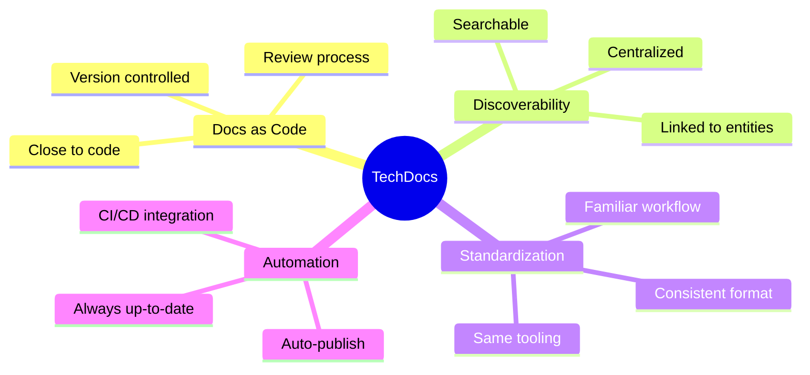
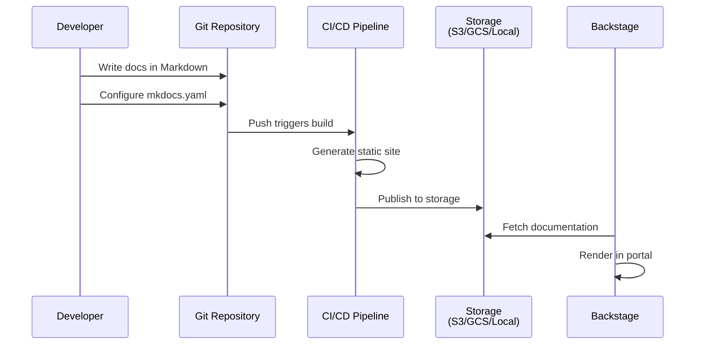
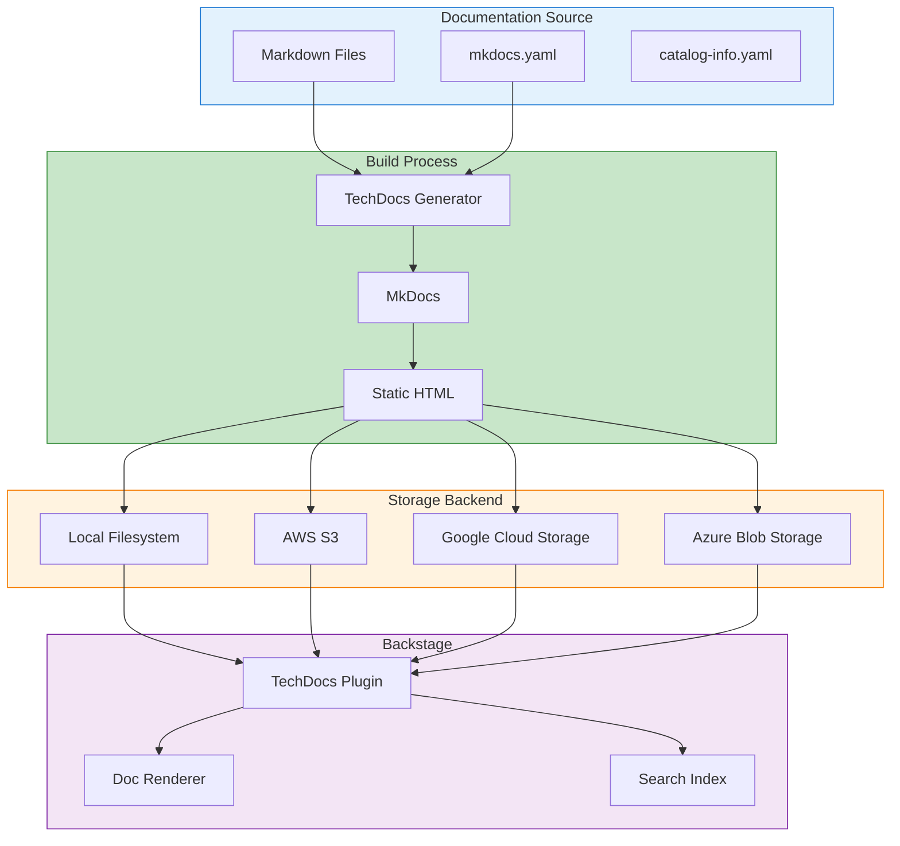
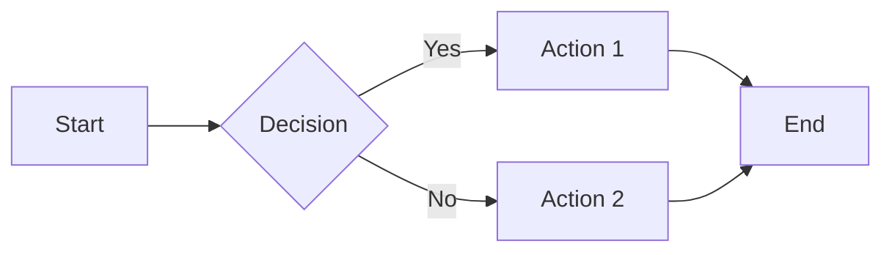
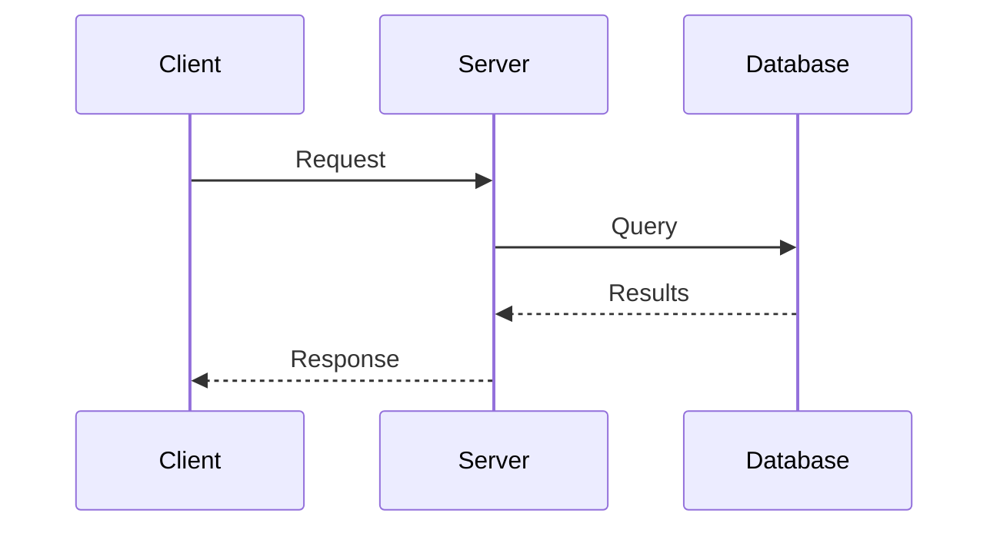
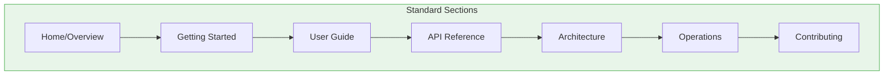
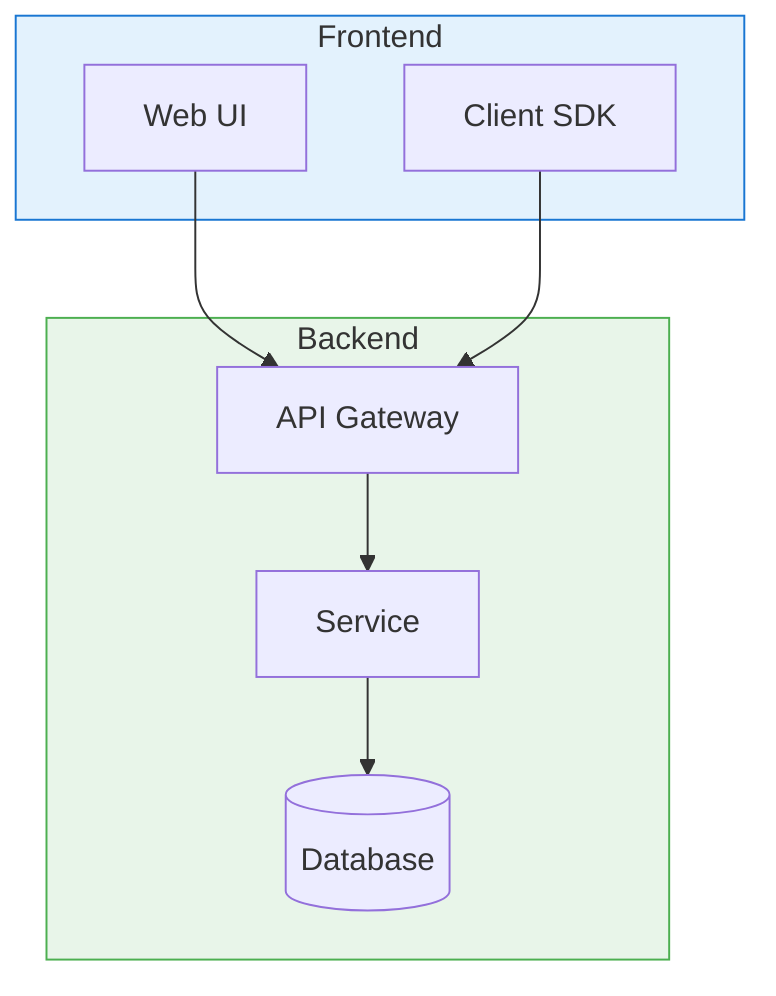

# Backstage TechDocs Guide

TechDocs is Backstage's built-in documentation-as-code solution that brings
technical documentation to life within the developer portal.

## Table of Contents

- [Backstage TechDocs Guide](#backstage-techdocs-guide)
  - [Table of Contents](#table-of-contents)
  - [Understanding TechDocs](#understanding-techdocs)
    - [Key Benefits](#key-benefits)
    - [How It Works](#how-it-works)
  - [Architecture and Flow](#architecture-and-flow)
    - [TechDocs Components](#techdocs-components)
    - [Build Strategies](#build-strategies)
  - [Setting Up TechDocs](#setting-up-techdocs)
    - [Basic Configuration](#basic-configuration)
    - [Production Configuration (External Build)](#production-configuration-external-build)
    - [Google Cloud Storage Configuration](#google-cloud-storage-configuration)
    - [Azure Blob Storage Configuration](#azure-blob-storage-configuration)
    - [Installing Dependencies (Local Build)](#installing-dependencies-local-build)
  - [Writing Documentation](#writing-documentation)
    - [Directory Structure](#directory-structure)
    - [Entity Configuration](#entity-configuration)
    - [Basic mkdocs.yaml](#basic-mkdocsyaml)
    - [Markdown Best Practices](#markdown-best-practices)
  - [MkDocs Configuration](#mkdocs-configuration)
    - [Full Configuration Example](#full-configuration-example)
    - [Supported Markdown Extensions](#supported-markdown-extensions)
    - [Admonitions (Callouts)](#admonitions-callouts)
    - [Code Blocks with Features](#code-blocks-with-features)
    - [Content Tabs](#content-tabs)
    - [Mermaid Diagrams](#mermaid-diagrams)
  - [Advanced Features](#advanced-features)
    - [Including External Files](#including-external-files)
    - [API Documentation Integration](#api-documentation-integration)
    - [Custom Variables](#custom-variables)
  - [Publishing and Storage](#publishing-and-storage)
    - [CI/CD Pipeline (GitHub Actions)](#cicd-pipeline-github-actions)
    - [GitLab CI Pipeline](#gitlab-ci-pipeline)
    - [Manual Publishing](#manual-publishing)
  - [Search Integration](#search-integration)
    - [Search Configuration](#search-configuration)
    - [Search Backend Setup](#search-backend-setup)
    - [Search Features](#search-features)
  - [Customization](#customization)
    - [Custom TechDocs Addon](#custom-techdocs-addon)
    - [Reader Page Customization](#reader-page-customization)
    - [Built-in Addons](#built-in-addons)
  - [Best Practices](#best-practices)
    - [1. Documentation Structure](#1-documentation-structure)
    - [2. Content Guidelines](#2-content-guidelines)
    - [3. Keep Docs Close to Code](#3-keep-docs-close-to-code)
    - [4. Automate Documentation Updates](#4-automate-documentation-updates)
    - [5. Include Diagrams](#5-include-diagrams)
    - [6. Documentation Templates](#6-documentation-templates)
  - [Next Steps](#next-steps)
  - [References](#references)

## Understanding TechDocs

TechDocs is a "docs-like-code" solution that enables documentation to live
alongside your code and be automatically published to Backstage.

### Key Benefits



### How It Works



## Architecture and Flow

### TechDocs Components



### Build Strategies

| Strategy     | Description                     | Use Case                       |
| ------------ | ------------------------------- | ------------------------------ |
| **Local**    | Backstage builds docs on demand | Development, small deployments |
| **External** | CI/CD builds and publishes docs | Production, large scale        |

## Setting Up TechDocs

### Basic Configuration

```yaml
# app-config.yaml
techdocs:
  # Build strategy: 'local' or 'external'
  builder: 'local'

  # Generator settings
  generator:
    runIn: 'local' # 'local' or 'docker'
    # Docker image for generator
    dockerImage: spotify/techdocs

  # Publisher settings
  publisher:
    type: 'local'
    local:
      publishDirectory: '/tmp/techdocs'
```

### Production Configuration (External Build)

```yaml
# app-config.yaml
techdocs:
  builder: 'external'

  generator:
    runIn: 'docker'
    dockerImage: spotify/techdocs:latest

  publisher:
    type: 'awsS3'
    awsS3:
      bucketName: ${TECHDOCS_S3_BUCKET}
      region: ${AWS_REGION}
      credentials:
        accessKeyId: ${AWS_ACCESS_KEY_ID}
        secretAccessKey: ${AWS_SECRET_ACCESS_KEY}
      # Optional: custom endpoint for S3-compatible storage
      # endpoint: https://minio.example.com
      # s3ForcePathStyle: true
```

### Google Cloud Storage Configuration

```yaml
techdocs:
  builder: 'external'
  publisher:
    type: 'googleGcs'
    googleGcs:
      bucketName: ${TECHDOCS_GCS_BUCKET}
      projectId: ${GCP_PROJECT_ID}
      credentials:
        # Service account key JSON
        $file: ${GOOGLE_APPLICATION_CREDENTIALS}
```

### Azure Blob Storage Configuration

```yaml
techdocs:
  builder: 'external'
  publisher:
    type: 'azureBlobStorage'
    azureBlobStorage:
      containerName: ${TECHDOCS_CONTAINER}
      credentials:
        accountName: ${AZURE_ACCOUNT_NAME}
        accountKey: ${AZURE_ACCOUNT_KEY}
```

### Installing Dependencies (Local Build)

```bash
# Install Python and MkDocs
pip install mkdocs mkdocs-material mkdocs-techdocs-core

# Or use Docker (recommended for consistency)
docker pull spotify/techdocs
```

## Writing Documentation

### Directory Structure

```text
my-service/
├── catalog-info.yaml      # Entity with TechDocs annotation
├── mkdocs.yaml           # MkDocs configuration
├── docs/
│   ├── index.md          # Home page (required)
│   ├── getting-started.md
│   ├── architecture.md
│   ├── api/
│   │   ├── overview.md
│   │   └── endpoints.md
│   ├── operations/
│   │   ├── deployment.md
│   │   ├── monitoring.md
│   │   └── runbook.md
│   └── assets/
│       ├── architecture.png
│       └── diagrams/
└── src/
    └── ... # Your code
```

### Entity Configuration

```yaml
# catalog-info.yaml
apiVersion: backstage.io/v1alpha1
kind: Component
metadata:
  name: user-service
  description: User authentication service
  annotations:
    # Point to docs location
    backstage.io/techdocs-ref: dir:.

    # Alternative: reference docs in a different location
    # backstage.io/techdocs-ref: url:https://github.com/org/repo/tree/main/docs

    # Alternative: reference docs in a monorepo subdirectory
    # backstage.io/techdocs-ref: dir:./services/user-service
spec:
  type: service
  owner: group:platform-team
```

### Basic mkdocs.yaml

```yaml
# mkdocs.yaml
site_name: User Service Documentation
site_description: Documentation for the User Service

# Navigation structure
nav:
  - Home: index.md
  - Getting Started:
      - Quick Start: getting-started/quick-start.md
      - Installation: getting-started/installation.md
  - Architecture:
      - Overview: architecture/overview.md
      - Components: architecture/components.md
  - API Reference:
      - REST API: api/rest.md
      - GraphQL: api/graphql.md
  - Operations:
      - Deployment: operations/deployment.md
      - Monitoring: operations/monitoring.md
      - Runbook: operations/runbook.md

# Plugins required by TechDocs
plugins:
  - techdocs-core
```

### Markdown Best Practices

````markdown
# Page Title

Brief description of what this page covers.

## Overview

Introduction paragraph explaining the topic.

## Key Concepts

### Concept One

Explanation of the first concept.

### Concept Two

Explanation of the second concept.

## Examples

### Basic Example

Description of what this example shows.

```python
def hello_world():
    """Example function."""
    return "Hello, World!"
```

### Advanced Example

More complex example with explanation.

## Related Pages

- [Related Topic 1](./related-topic-1.md)
- [Related Topic 2](./related-topic-2.md)

## References

- [External Documentation](https://example.com)
- [API Specification](./api/spec.md)
````

## MkDocs Configuration

### Full Configuration Example

```yaml
# mkdocs.yaml
site_name: My Service Documentation
site_description: Comprehensive documentation for My Service
site_author: Platform Team
site_url: https://backstage.example.com/docs/default/component/my-service

# Repository information
repo_name: my-org/my-service
repo_url: https://github.com/my-org/my-service
edit_uri: edit/main/docs/

# Navigation
nav:
  - Home: index.md
  - Getting Started:
      - Quick Start: getting-started/quick-start.md
      - Installation: getting-started/installation.md
      - Configuration: getting-started/configuration.md
  - User Guide:
      - Overview: user-guide/overview.md
      - Features: user-guide/features.md
      - Best Practices: user-guide/best-practices.md
  - API Reference:
      - REST API: api/rest.md
      - GraphQL API: api/graphql.md
      - SDK: api/sdk.md
  - Architecture:
      - System Design: architecture/design.md
      - Data Flow: architecture/data-flow.md
      - Security: architecture/security.md
  - Operations:
      - Deployment: ops/deployment.md
      - Monitoring: ops/monitoring.md
      - Troubleshooting: ops/troubleshooting.md
      - Runbook: ops/runbook.md
  - Contributing:
      - Development Setup: contributing/setup.md
      - Guidelines: contributing/guidelines.md
      - Code Review: contributing/review.md
  - Changelog: changelog.md

# Theme configuration (handled by techdocs-core)
# Note: Custom themes not supported in TechDocs

# Required plugins
plugins:
  - techdocs-core

# Markdown extensions
markdown_extensions:
  # Tables
  - tables
  # Code highlighting
  - pymdownx.highlight:
      anchor_linenums: true
  - pymdownx.inlinehilite
  - pymdownx.snippets
  - pymdownx.superfences:
      custom_fences:
        - name: mermaid
          class: mermaid
          format:
            !!python/name:pymdownx.superfences.fence_code_format # Admonitions (callouts)


  - admonition
  - pymdownx.details
  # Task lists
  - pymdownx.tasklist:
      custom_checkbox: true
  # Keyboard keys
  - pymdownx.keys
  # Tabs
  - pymdownx.tabbed:
      alternate_style: true
  # Table of contents
  - toc:
      permalink: true
      toc_depth: 3
  # Abbreviations
  - abbr
  # Footnotes
  - footnotes
  # Definition lists
  - def_list
  # Attributes
  - attr_list
  - md_in_html
```

### Supported Markdown Extensions

| Extension              | Purpose            | Example              |
| ---------------------- | ------------------ | -------------------- |
| `tables`               | Markdown tables    | `\| Col1 \| Col2 \|` |
| `admonition`           | Callout boxes      | `!!! note "Title"`   |
| `pymdownx.superfences` | Fenced code blocks | ` ```python `        |
| `pymdownx.tabbed`      | Content tabs       | `=== "Tab 1"`        |
| `pymdownx.tasklist`    | Checkboxes         | `- [x] Done`         |
| `toc`                  | Table of contents  | `[TOC]`              |

### Admonitions (Callouts)

```markdown
!!! note "Note Title"
This is a note admonition.

!!! warning "Warning"
This is a warning message.

!!! danger "Critical"
This is a critical warning.

!!! tip "Pro Tip"
This is a helpful tip.

!!! info "Information"
Additional information.

!!! example "Example"
Example content here.

??? note "Collapsible Note"
This content is collapsed by default.

???+ note "Expanded by Default"
This content is expanded by default.
```

### Code Blocks with Features

```python title="example.py" linenums="1" hl_lines="2 3"
def greet(name: str) -> str:
    """Greet a user by name."""
    return f"Hello, {name}!"

result = greet("World")
```

```bash title="Installation"
pip install my-package
```

### Content Tabs

````markdown
=== "Python"

    ```python
    def hello():
        print("Hello, World!")
    ```

=== "JavaScript"

    ```javascript
    function hello() {
        console.log("Hello, World!");
    }
    ```

=== "Go"

    ```go
    func hello() {
        fmt.Println("Hello, World!")
    }
    ```
````

### Mermaid Diagrams

````markdown



````

## Advanced Features

### Including External Files

````markdown
<!-- Include a code file -->

--8<-- "src/main.py"

<!-- Include specific lines -->

--8<-- "src/main.py:10:20"

<!-- Include with title -->

```python title="src/main.py"
--8<-- "src/main.py"
```
````

### API Documentation Integration

```yaml
# mkdocs.yaml
plugins:
  - techdocs-core
  - render_swagger # OpenAPI rendering

nav:
  - API Reference:
      - Overview: api/overview.md
      - Swagger UI: api/swagger.md
```

```markdown
<!-- api/swagger.md -->

# API Reference

Below is the interactive API documentation:

!!swagger openapi.yaml!!
```

### Custom Variables

```yaml
# mkdocs.yaml
extra:
  service_name: My Service
  version: 1.0.0
  contact_email: team@example.com
```

```markdown
<!-- In your docs -->

Welcome to {{ service_name }} version {{ version }}.

Contact us at {{ contact_email }}.
```

## Publishing and Storage

### CI/CD Pipeline (GitHub Actions)

```yaml
# .github/workflows/techdocs.yml
name: Publish TechDocs

on:
  push:
    branches: [main]
    paths:
      - 'docs/**'
      - 'mkdocs.yaml'

jobs:
  publish:
    runs-on: ubuntu-latest
    steps:
      - uses: actions/checkout@v4

      - name: Setup Node.js
        uses: actions/setup-node@v4
        with:
          node-version: '20'

      - name: Setup Python
        uses: actions/setup-python@v5
        with:
          python-version: '3.12'

      - name: Install techdocs-cli
        run: npm install -g @techdocs/cli

      - name: Install MkDocs dependencies
        run: pip install mkdocs-techdocs-core

      - name: Generate TechDocs
        run: techdocs-cli generate --no-docker

      - name: Publish to S3
        run: |
          techdocs-cli publish \
            --publisher-type awsS3 \
            --storage-name ${{ secrets.TECHDOCS_S3_BUCKET }} \
            --entity default/component/my-service \
            --awsRoleArn ${{ secrets.AWS_ROLE_ARN }} \
            --awsRegion us-east-1
        env:
          AWS_ACCESS_KEY_ID: ${{ secrets.AWS_ACCESS_KEY_ID }}
          AWS_SECRET_ACCESS_KEY: ${{ secrets.AWS_SECRET_ACCESS_KEY }}
```

### GitLab CI Pipeline

```yaml
# .gitlab-ci.yml
stages:
  - publish-docs

publish-techdocs:
  stage: publish-docs
  image: spotify/techdocs:latest
  script:
    - techdocs-cli generate --no-docker
    - techdocs-cli publish
      --publisher-type googleGcs
      --storage-name $TECHDOCS_GCS_BUCKET
      --entity default/component/$CI_PROJECT_NAME
  only:
    changes:
      - docs/**
      - mkdocs.yaml
    refs:
      - main
```

### Manual Publishing

```bash
# Install techdocs-cli
npm install -g @techdocs/cli

# Generate documentation
techdocs-cli generate --source-dir . --output-dir ./site

# Publish to S3
techdocs-cli publish \
  --publisher-type awsS3 \
  --storage-name my-techdocs-bucket \
  --entity default/component/my-service \
  --directory ./site

# Publish to GCS
techdocs-cli publish \
  --publisher-type googleGcs \
  --storage-name my-techdocs-bucket \
  --entity default/component/my-service \
  --directory ./site

# Publish to Azure
techdocs-cli publish \
  --publisher-type azureBlobStorage \
  --storage-name my-container \
  --entity default/component/my-service \
  --directory ./site
```

## Search Integration

TechDocs integrates with Backstage Search for full-text documentation search.

### Search Configuration

```yaml
# app-config.yaml
search:
  collators:
    techdocs:
      defaultRefreshIntervalSeconds: 600
      batchSize: 100
```

### Search Backend Setup

```typescript
// packages/backend/src/index.ts
import { createBackend } from '@backstage/backend-defaults'

const backend = createBackend()

// Search plugins
backend.add(import('@backstage/plugin-search-backend/alpha'))
backend.add(import('@backstage/plugin-search-backend-module-techdocs/alpha'))

backend.start()
```

### Search Features

| Feature          | Description                             |
| ---------------- | --------------------------------------- |
| Full-text search | Search across all documentation content |
| Entity context   | Results linked to catalog entities      |
| Highlighting     | Search terms highlighted in results     |
| Filtering        | Filter by entity type, owner, etc.      |

## Customization

### Custom TechDocs Addon

```typescript
// packages/app/src/components/techdocs/CustomTechDocsAddon.tsx
import React from 'react'
import { TechDocsAddonTester } from '@backstage/plugin-techdocs-react'

export const CustomTechDocsAddon = () => {
  return (
    <TechDocsAddonTester>
      {({ entity, metadata, techdocsMetadata }) => (
        <div>
          <h3>Custom Info</h3>
          <p>Entity: {entity.metadata.name}</p>
          <p>Last updated: {techdocsMetadata?.build_timestamp}</p>
        </div>
      )}
    </TechDocsAddonTester>
  )
}
```

### Reader Page Customization

```typescript
// packages/app/src/App.tsx
import { TechDocsReaderPage } from '@backstage/plugin-techdocs'
import { TechDocsAddons } from '@backstage/plugin-techdocs-react'
import {
  ReportIssue,
  TextSize,
} from '@backstage/plugin-techdocs-module-addons-contrib'

// In your routes
;<Route path="/docs/:namespace/:kind/:name/*" element={<TechDocsReaderPage />}>
  <TechDocsAddons>
    <ReportIssue />
    <TextSize />
    <CustomTechDocsAddon />
  </TechDocsAddons>
</Route>
```

### Built-in Addons

| Addon                  | Description                         |
| ---------------------- | ----------------------------------- |
| `ReportIssue`          | Link to report documentation issues |
| `TextSize`             | Adjust text size                    |
| `LightBox`             | Image lightbox on click             |
| `ExpandableNavigation` | Collapsible navigation              |

## Best Practices

### 1. Documentation Structure



### 2. Content Guidelines

| Section             | Content                               |
| ------------------- | ------------------------------------- |
| **Home**            | Overview, quick links, key features   |
| **Getting Started** | Installation, first steps, tutorials  |
| **User Guide**      | Features, use cases, best practices   |
| **API Reference**   | Endpoints, schemas, examples          |
| **Architecture**    | Design decisions, diagrams, data flow |
| **Operations**      | Deployment, monitoring, runbooks      |
| **Contributing**    | Dev setup, guidelines, process        |

### 3. Keep Docs Close to Code

```text
service/
├── src/
│   └── main.py
├── tests/
│   └── test_main.py
├── docs/                    # Docs alongside code
│   ├── index.md
│   └── api.md
├── catalog-info.yaml
└── mkdocs.yaml
```

### 4. Automate Documentation Updates

```yaml
# Generate API docs from code
# .github/workflows/docs.yml
- name: Generate API Documentation
  run: |
    # Generate OpenAPI spec from code
    python scripts/generate_openapi.py > docs/api/openapi.yaml

    # Generate markdown from OpenAPI
    npx openapi-generator-cli generate \
      -i docs/api/openapi.yaml \
      -g markdown \
      -o docs/api/generated
```

### 5. Include Diagrams

Use Mermaid for consistent, version-controlled diagrams:

````markdown

````

### 6. Documentation Templates

Create templates for consistent documentation:

```markdown
<!-- templates/service-doc-template.md -->

# Service Name

Brief description of the service.

## Overview

What this service does and why it exists.

## Getting Started

### Prerequisites

- Requirement 1
- Requirement 2

### Installation

Steps to install...

## Configuration

| Variable | Description | Default |
| -------- | ----------- | ------- |
| `VAR1`   | Description | `value` |

## API Reference

See [API Documentation](./api/index.md).

## Architecture

See [Architecture](./architecture/index.md).

## Operations

### Deployment

How to deploy...

### Monitoring

Dashboards and alerts...

### Troubleshooting

Common issues and solutions...

## Contributing

How to contribute...
```

## Next Steps

- [Plugin Development](./backstage-plugins.md) - Create TechDocs addons
- [Software Templates](./backstage-software-templates.md) - Include TechDocs in
  templates
- [Integrations Guide](./backstage-integrations.md) - CI/CD integration

## References

- [TechDocs Documentation](https://backstage.io/docs/features/techdocs/)
- [MkDocs Documentation](https://www.mkdocs.org/)
- [MkDocs Material Theme](https://squidfunk.github.io/mkdocs-material/)
- [TechDocs CLI](https://backstage.io/docs/features/techdocs/cli)
- [PyMdown Extensions](https://facelessuser.github.io/pymdown-extensions/)
