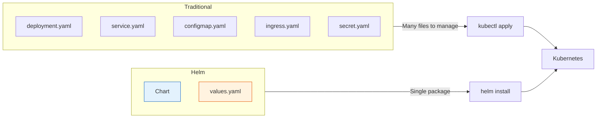
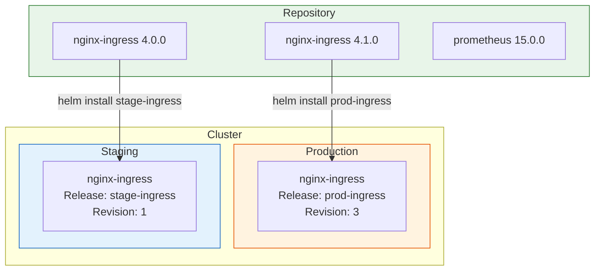
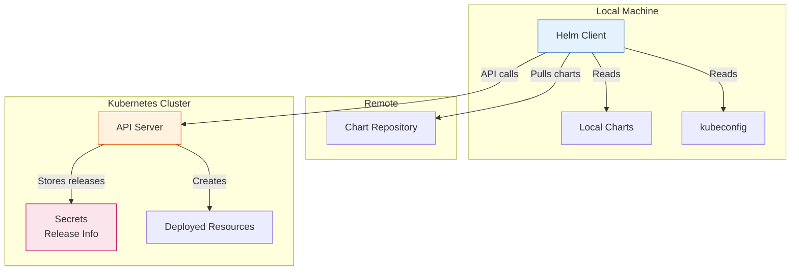
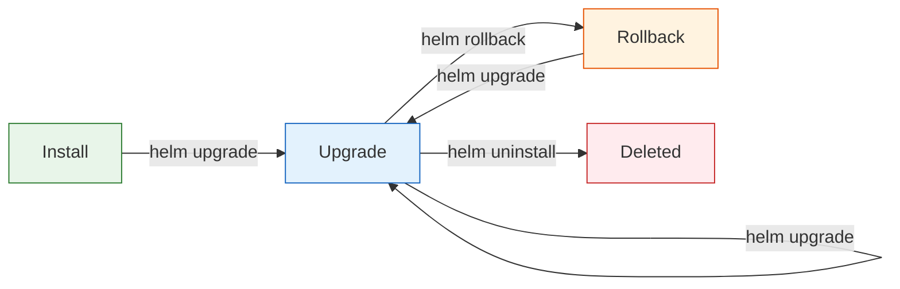

# Helm: The Complete Guide

A comprehensive guide to mastering Helm, the package manager for Kubernetes. This document covers everything from basic concepts to advanced chart development.

## Table of Contents

- [Helm: The Complete Guide](#helm-the-complete-guide)
  - [Table of Contents](#table-of-contents)
  - [What is Helm?](#what-is-helm)
  - [Why Use Helm?](#why-use-helm)
    - [Key Benefits](#key-benefits)
  - [Core Concepts](#core-concepts)
  - [Helm Architecture](#helm-architecture)
    - [How Helm Installs a Release](#how-helm-installs-a-release)
  - [Chart Structure](#chart-structure)
    - [File Purposes](#file-purposes)
  - [Chart.yaml Deep Dive](#chartyaml-deep-dive)
    - [Chart.yaml Field Reference](#chartyaml-field-reference)
    - [Version vs AppVersion](#version-vs-appversion)
  - [values.yaml Deep Dive](#valuesyaml-deep-dive)
    - [Values Best Practices](#values-best-practices)
    - [Overriding Values](#overriding-values)
  - [Template Syntax](#template-syntax)
    - [Basic Syntax](#basic-syntax)
    - [Whitespace Control](#whitespace-control)
  - [Built-in Objects](#built-in-objects)
    - [.Release Object](#release-object)
    - [.Chart Object](#chart-object)
    - [.Capabilities Object](#capabilities-object)
    - [.Files Object](#files-object)
  - [Template Functions](#template-functions)
    - [String Functions](#string-functions)
    - [Numeric Functions](#numeric-functions)
    - [List Functions](#list-functions)
    - [Dictionary Functions](#dictionary-functions)
    - [Type Conversion Functions](#type-conversion-functions)
    - [Encoding Functions](#encoding-functions)
    - [Date Functions](#date-functions)
  - [Flow Control](#flow-control)
    - [Conditionals](#conditionals)
    - [Comparison Operators](#comparison-operators)
    - [Loops with range](#loops-with-range)
    - [Variables](#variables)
    - [with (Change Scope)](#with-change-scope)
  - [Named Templates and Helpers](#named-templates-and-helpers)
    - [\_helpers.tpl Explained](#_helperstpl-explained)
    - [Using Named Templates](#using-named-templates)
    - [include vs template](#include-vs-template)
  - [NOTES.txt](#notestxt)
  - [Helm CLI Reference](#helm-cli-reference)
    - [Installation and Setup](#installation-and-setup)
    - [Chart Operations](#chart-operations)
    - [Release Management](#release-management)
    - [Repository Commands](#repository-commands)
    - [Plugin Commands](#plugin-commands)
    - [Useful Plugins](#useful-plugins)
  - [Managing Releases](#managing-releases)
    - [Release Lifecycle](#release-lifecycle)
    - [Release Naming](#release-naming)
    - [Upgrade Strategies](#upgrade-strategies)
    - [Release Information](#release-information)
  - [Working with Repositories](#working-with-repositories)
    - [Repository Types](#repository-types)
    - [Setting Up Repositories](#setting-up-repositories)
    - [Publishing Charts](#publishing-charts)
    - [Installing from Repositories](#installing-from-repositories)
  - [Helm Dependencies](#helm-dependencies)
    - [Declaring Dependencies](#declaring-dependencies)
    - [Managing Dependencies](#managing-dependencies)
    - [Dependency Configuration](#dependency-configuration)
    - [Accessing Dependency Values](#accessing-dependency-values)
  - [Helm Hooks](#helm-hooks)
    - [Hook Types](#hook-types)
    - [Hook Example](#hook-example)
    - [Hook Annotations](#hook-annotations)
    - [Hook Delete Policies](#hook-delete-policies)
  - [Chart Testing](#chart-testing)
    - [Test Files](#test-files)
    - [Running Tests](#running-tests)
    - [Unit Testing with helm-unittest](#unit-testing-with-helm-unittest)
  - [Debugging and Troubleshooting](#debugging-and-troubleshooting)
    - [Template Debugging](#template-debugging)
    - [Linting](#linting)
    - [Common Issues and Solutions](#common-issues-and-solutions)
    - [Debug Template Issues](#debug-template-issues)
    - [Release Debugging](#release-debugging)
    - [Kubernetes Debugging](#kubernetes-debugging)
  - [Best Practices](#best-practices)
    - [Chart Development](#chart-development)
    - [Security](#security)
    - [Values Organization](#values-organization)
    - [Template Organization](#template-organization)
    - [Required Values](#required-values)
  - [Common Patterns](#common-patterns)
    - [Conditional Resources](#conditional-resources)
    - [Multiple Environments](#multiple-environments)
    - [ConfigMap from Files](#configmap-from-files)
    - [Secret from Files](#secret-from-files)
    - [Loop Over Services](#loop-over-services)
    - [Merging Values](#merging-values)
    - [Image Pull Secrets](#image-pull-secrets)
    - [Init Containers](#init-containers)
    - [Extra Volumes](#extra-volumes)
  - [Quick Reference Card](#quick-reference-card)

---

## What is Helm?

Helm is the package manager for Kubernetes. Just as `apt` manages packages on Debian/Ubuntu or `brew` on macOS, Helm manages Kubernetes applications.

A Helm **chart** is a collection of files that describe a related set of Kubernetes resources. A single chart might deploy:

- A simple pod
- A full web application stack (deployment, service, ingress, configmap, secret)
- An entire microservices architecture



---

## Why Use Helm?

| Challenge Without Helm               | Solution With Helm                                        |
| ------------------------------------ | --------------------------------------------------------- |
| Copy-paste YAML between environments | Single chart with different `values.yaml` per environment |
| No versioning of deployments         | Charts are versioned; releases track history              |
| Manual templating with sed/envsubst  | Native Go templating with functions                       |
| No rollback capability               | `helm rollback` to any previous revision                  |
| Hard to share configurations         | Package and publish charts to repositories                |
| Repetitive boilerplate YAML          | Template once, reuse everywhere                           |
| No dependency management             | Declare chart dependencies in `Chart.yaml`                |

### Key Benefits

1. **Reproducibility**: Same chart + same values = identical deployment
2. **Version Control**: Track what is deployed and when
3. **Rollbacks**: One command to revert to a previous state
4. **Templating**: DRY principle for Kubernetes manifests
5. **Sharing**: Package and distribute applications
6. **Dependencies**: Manage complex multi-chart applications

---

## Core Concepts

| Concept        | Description                                               | Example                                      |
| -------------- | --------------------------------------------------------- | -------------------------------------------- |
| **Chart**      | A Helm package containing Kubernetes resource definitions | `nginx-ingress`, `prometheus`, `fastapi-app` |
| **Repository** | A server hosting charts                                   | `https://charts.helm.sh/stable`              |
| **Release**    | An instance of a chart running in a cluster               | `production-nginx`, `staging-nginx`          |
| **Revision**   | A snapshot of a release at a point in time                | Revision 1, Revision 2, etc.                 |
| **Values**     | Configuration that customizes a chart                     | `replicaCount: 3`, `image.tag: v2.0`         |



---

## Helm Architecture

Helm 3 uses a client-only architecture. The Helm client directly communicates with the Kubernetes API server.



### How Helm Installs a Release

1. Helm reads the chart (local or from repository)
2. Helm renders templates with provided values
3. Helm sends rendered manifests to Kubernetes API
4. Helm stores release metadata as a Secret in the cluster
5. Kubernetes creates the resources

---

## Chart Structure

A Helm chart follows a specific directory structure:

```text
mychart/
  Chart.yaml          # Required: Chart metadata
  values.yaml         # Default configuration values
  charts/             # Directory for chart dependencies
  templates/          # Kubernetes manifest templates
    _helpers.tpl      # Template helper functions
    deployment.yaml   # Deployment template
    service.yaml      # Service template
    ingress.yaml      # Ingress template
    NOTES.txt         # Post-install instructions
    tests/            # Test pod definitions
  .helmignore         # Patterns to ignore when packaging
  LICENSE             # License file
  README.md           # Documentation
```

### File Purposes

| File/Directory           | Purpose                                                | Required             |
| ------------------------ | ------------------------------------------------------ | -------------------- |
| `Chart.yaml`             | Metadata about the chart (name, version, dependencies) | Yes                  |
| `values.yaml`            | Default configuration values                           | No (but recommended) |
| `templates/`             | Kubernetes manifests with Go templating                | Yes                  |
| `templates/_helpers.tpl` | Reusable template definitions                          | No (but recommended) |
| `templates/NOTES.txt`    | Usage instructions shown after install                 | No                   |
| `charts/`                | Dependency charts (downloaded or vendored)             | No                   |
| `.helmignore`            | Files to exclude from packaging                        | No                   |

---

## Chart.yaml Deep Dive

The `Chart.yaml` file defines the chart's metadata. Here is a comprehensive example:

```yaml
# API version - v2 for Helm 3, v1 for Helm 2
apiVersion: v2

# Chart name (required)
name: fastapi-app

# A one-sentence description (required for ArtifactHub)
description: A Helm chart for deploying a FastAPI application

# Chart type: "application" or "library"
type: application

# Chart version - follows SemVer 2 (required)
version: 0.1.0

# Version of the app being deployed (informational)
appVersion: '1.0.0'

# Minimum Kubernetes version
kubeVersion: '>=1.23.0'

# Chart maintainers
maintainers:
  - name: Dom Hallan
    email: dom@example.com
    url: https://github.com/domhallan

# Keywords for searching
keywords:
  - fastapi
  - python
  - api

# Project home page
home: https://github.com/domhallan/fastapi-app

# Source code locations
sources:
  - https://github.com/domhallan/fastapi-app

# Chart dependencies
dependencies:
  - name: postgresql
    version: '12.1.0'
    repository: 'https://charts.bitnami.com/bitnami'
    condition: postgresql.enabled
    tags:
      - database

# Annotations (used by tools like ArtifactHub)
annotations:
  artifacthub.io/changes: |
    - kind: added
      description: Initial release
```

### Chart.yaml Field Reference

| Field          | Description                          | Required |
| -------------- | ------------------------------------ | -------- |
| `apiVersion`   | `v2` for Helm 3 charts               | Yes      |
| `name`         | Name of the chart                    | Yes      |
| `version`      | SemVer 2 version of the chart        | Yes      |
| `description`  | Single-sentence description          | No       |
| `type`         | `application` (default) or `library` | No       |
| `appVersion`   | Version of the contained application | No       |
| `kubeVersion`  | Kubernetes version constraint        | No       |
| `maintainers`  | List of maintainer objects           | No       |
| `dependencies` | List of chart dependencies           | No       |
| `keywords`     | Search keywords                      | No       |
| `home`         | Project homepage URL                 | No       |
| `sources`      | List of source code URLs             | No       |
| `annotations`  | Arbitrary key-value metadata         | No       |

### Version vs AppVersion

| Field        | What it versions             | When to bump                |
| ------------ | ---------------------------- | --------------------------- |
| `version`    | The chart itself             | Any change to chart files   |
| `appVersion` | The application in the chart | When updating the app image |

---

## values.yaml Deep Dive

The `values.yaml` file provides default configuration that users can override. Structure your values logically:

```yaml
# Number of pod replicas
replicaCount: 2

# Container image configuration
image:
  repository: domniniquehallan/python-fastapi-app
  tag: v1
  pullPolicy: IfNotPresent

# Name overrides for customization
nameOverride: ''
fullnameOverride: ''

# Namespace to deploy into
namespace: platform-demo

# Service configuration
service:
  type: ClusterIP
  port: 80
  targetPort: 8000

# Ingress configuration
ingress:
  enabled: true
  className: nginx
  host: fastapi-app.k8s.orb.local
  annotations: {}
  tls: []

# Resource requests and limits
resources:
  requests:
    cpu: 100m
    memory: 128Mi
  limits:
    cpu: 500m
    memory: 256Mi

# Health check configuration
probes:
  liveness:
    path: /api/v1/healthz
    initialDelaySeconds: 10
    periodSeconds: 30
    timeoutSeconds: 10
    failureThreshold: 3
  readiness:
    path: /api/v1/healthz
    initialDelaySeconds: 5
    periodSeconds: 10
    timeoutSeconds: 5
    failureThreshold: 3

# Pod-level security context
securityContext:
  runAsNonRoot: true
  runAsUser: 1000
  runAsGroup: 1000
  fsGroup: 1000

# Container-level security context
containerSecurityContext:
  allowPrivilegeEscalation: false
  readOnlyRootFilesystem: true
  capabilities:
    drop:
      - ALL

# Environment variables
env:
  - name: PYTHONUNBUFFERED
    value: '1'
```

### Values Best Practices

| Practice                  | Example                         | Reason                |
| ------------------------- | ------------------------------- | --------------------- |
| Group related values      | `image.repository`, `image.tag` | Logical organization  |
| Provide sensible defaults | `replicaCount: 2`               | Works out of the box  |
| Use `enabled` flags       | `ingress.enabled: true`         | Feature toggles       |
| Document values           | Comments above each value       | Self-documenting      |
| Use nested structures     | `probes.liveness.path`          | Avoids flat namespace |

### Overriding Values

Values can be overridden in multiple ways (in order of precedence):

```bash
# 1. Inline --set flags (highest precedence)
helm install myapp ./chart --set replicaCount=5

# 2. Multiple --set flags for nested values
helm install myapp ./chart --set image.repository=nginx --set image.tag=latest

# 3. Values file
helm install myapp ./chart -f production-values.yaml

# 4. Multiple values files (later files take precedence)
helm install myapp ./chart -f values.yaml -f production.yaml -f secrets.yaml

# 5. Default values.yaml in chart (lowest precedence)
```

---

## Template Syntax

Helm uses Go templating with additional Sprig functions. Templates are enclosed in `{{ }}`.

### Basic Syntax

```yaml
# Accessing values
apiVersion: v1
kind: ConfigMap
metadata:
  # Simple value access
  name: { { .Values.name } }

  # Nested value access
  namespace: { { .Values.namespace } }

data:
  # String values
  app-name: { { .Values.app.name } }

  # Quoted strings (preserves type)
  version: { { .Values.version | quote } }

  # Default values
  environment: { { .Values.environment | default "development" } }
```

### Whitespace Control

Whitespace can be tricky in templates. Use `-` to trim:

```yaml
# Without trimming - produces empty lines
metadata:
  labels:
    {{ if .Values.extraLabels }}
    extra: "true"
    {{ end }}

# With trimming - clean output
metadata:
  labels:
    {{- if .Values.extraLabels }}
    extra: "true"
    {{- end }}
```

| Syntax    | Effect                          |
| --------- | ------------------------------- |
| `{{`      | Normal - preserves whitespace   |
| `{{-`     | Trim whitespace before template |
| `-}}`     | Trim whitespace after template  |
| `{{- -}}` | Trim both sides                 |

---

## Built-in Objects

Helm provides several built-in objects accessible in templates:

| Object          | Description                             | Common Uses           |
| --------------- | --------------------------------------- | --------------------- |
| `.Values`       | Values from `values.yaml` and overrides | Configuration         |
| `.Release`      | Information about the release           | Naming, labels        |
| `.Chart`        | Contents of `Chart.yaml`                | Versioning, labels    |
| `.Files`        | Access to non-template files            | Config files, scripts |
| `.Capabilities` | Kubernetes cluster capabilities         | Version checks        |
| `.Template`     | Current template information            | Debugging             |

### .Release Object

```yaml
# .Release contains release information
metadata:
  name: { { .Release.Name } } # Release name (e.g., "my-release")
  namespace: { { .Release.Namespace } } # Namespace of release
  labels:
    # Revision number (increments on upgrade)
    revision: { { .Release.Revision | quote } }

    # Is this an install or upgrade?
    is-install: { { .Release.IsInstall | quote } }
    is-upgrade: { { .Release.IsUpgrade | quote } }

    # Service creating the release (always "Helm")
    service: { { .Release.Service } }
```

### .Chart Object

```yaml
# .Chart mirrors Chart.yaml contents
metadata:
  labels:
    chart: {{ .Chart.Name }}-{{ .Chart.Version }}
    app-version: {{ .Chart.AppVersion }}

    # Processed chart name and version
    helm.sh/chart: {{ printf "%s-%s" .Chart.Name .Chart.Version | replace "+" "_" }}
```

### .Capabilities Object

```yaml
# Check Kubernetes version for API compatibility
{{- if .Capabilities.APIVersions.Has "networking.k8s.io/v1" }}
apiVersion: networking.k8s.io/v1
{{- else }}
apiVersion: networking.k8s.io/v1beta1
{{- end }}

# Get Kubernetes version
# {{ .Capabilities.KubeVersion.Major }}
# {{ .Capabilities.KubeVersion.Minor }}
# {{ .Capabilities.KubeVersion.Version }}
```

### .Files Object

```yaml
# Include file contents
apiVersion: v1
kind: ConfigMap
metadata:
  name: {{ .Release.Name }}-config
data:
  # Get file as string
  config.json: |
    {{ .Files.Get "config/config.json" | indent 4 }}

  # Get file as base64
  cert.pem: {{ .Files.Get "certs/cert.pem" | b64enc }}

# Create configmap from all files in directory
{{ (.Files.Glob "config/*").AsConfig | indent 2 }}
```

---

## Template Functions

Helm includes all Sprig functions plus some Helm-specific ones.

### String Functions

| Function     | Example                            | Result        |
| ------------ | ---------------------------------- | ------------- |
| `quote`      | `{{ "hello" \| quote }}`           | `"hello"`     |
| `upper`      | `{{ "hello" \| upper }}`           | `HELLO`       |
| `lower`      | `{{ "HELLO" \| lower }}`           | `hello`       |
| `title`      | `{{ "hello world" \| title }}`     | `Hello World` |
| `trim`       | `{{ " hello " \| trim }}`          | `hello`       |
| `trimPrefix` | `{{ "hello" \| trimPrefix "he" }}` | `llo`         |
| `trimSuffix` | `{{ "hello" \| trimSuffix "lo" }}` | `hel`         |
| `replace`    | `{{ "hello" \| replace "l" "x" }}` | `hexxo`       |
| `trunc`      | `{{ "hello" \| trunc 3 }}`         | `hel`         |
| `contains`   | `{{ contains "ell" "hello" }}`     | `true`        |
| `hasPrefix`  | `{{ hasPrefix "he" "hello" }}`     | `true`        |
| `hasSuffix`  | `{{ hasSuffix "lo" "hello" }}`     | `true`        |
| `repeat`     | `{{ "ab" \| repeat 3 }}`           | `ababab`      |
| `nospace`    | `{{ "h e l l o" \| nospace }}`     | `hello`       |
| `indent`     | `{{ "text" \| indent 4 }}`         | `    text`    |
| `nindent`    | `{{ "text" \| nindent 4 }}`        | `\n    text`  |

### Numeric Functions

| Function | Example           | Result |
| -------- | ----------------- | ------ |
| `add`    | `{{ add 1 2 }}`   | `3`    |
| `sub`    | `{{ sub 5 2 }}`   | `3`    |
| `mul`    | `{{ mul 2 3 }}`   | `6`    |
| `div`    | `{{ div 6 2 }}`   | `3`    |
| `mod`    | `{{ mod 5 2 }}`   | `1`    |
| `max`    | `{{ max 1 5 3 }}` | `5`    |
| `min`    | `{{ min 1 5 3 }}` | `1`    |
| `floor`  | `{{ floor 1.5 }}` | `1`    |
| `ceil`   | `{{ ceil 1.5 }}`  | `2`    |
| `round`  | `{{ round 1.5 }}` | `2`    |

### List Functions

| Function    | Example                               | Result    |
| ----------- | ------------------------------------- | --------- |
| `list`      | `{{ list 1 2 3 }}`                    | `[1 2 3]` |
| `first`     | `{{ first (list 1 2 3) }}`            | `1`       |
| `last`      | `{{ last (list 1 2 3) }}`             | `3`       |
| `rest`      | `{{ rest (list 1 2 3) }}`             | `[2 3]`   |
| `initial`   | `{{ initial (list 1 2 3) }}`          | `[1 2]`   |
| `append`    | `{{ append (list 1 2) 3 }}`           | `[1 2 3]` |
| `prepend`   | `{{ prepend (list 2 3) 1 }}`          | `[1 2 3]` |
| `concat`    | `{{ concat (list 1) (list 2 3) }}`    | `[1 2 3]` |
| `has`       | `{{ has 2 (list 1 2 3) }}`            | `true`    |
| `uniq`      | `{{ list 1 2 2 3 \| uniq }}`          | `[1 2 3]` |
| `sortAlpha` | `{{ list "b" "a" "c" \| sortAlpha }}` | `[a b c]` |

### Dictionary Functions

| Function | Example                         | Result           |
| -------- | ------------------------------- | ---------------- |
| `dict`   | `{{ dict "key" "value" }}`      | `map[key:value]` |
| `get`    | `{{ get $myDict "key" }}`       | value at key     |
| `set`    | `{{ set $myDict "key" "val" }}` | modified dict    |
| `unset`  | `{{ unset $myDict "key" }}`     | dict without key |
| `hasKey` | `{{ hasKey $myDict "key" }}`    | `true/false`     |
| `keys`   | `{{ keys $myDict }}`            | list of keys     |
| `values` | `{{ values $myDict }}`          | list of values   |
| `merge`  | `{{ merge $dict1 $dict2 }}`     | merged dict      |

### Type Conversion Functions

| Function   | Example                      | Result          |
| ---------- | ---------------------------- | --------------- |
| `toYaml`   | `{{ toYaml .Values.data }}`  | YAML string     |
| `toJson`   | `{{ toJson .Values.data }}`  | JSON string     |
| `fromYaml` | `{{ fromYaml $yamlString }}` | Go object       |
| `fromJson` | `{{ fromJson $jsonString }}` | Go object       |
| `int`      | `{{ int "123" }}`            | `123` (int)     |
| `int64`    | `{{ int64 "123" }}`          | `123` (int64)   |
| `float64`  | `{{ float64 "1.5" }}`        | `1.5` (float64) |
| `toString` | `{{ toString 123 }}`         | `"123"`         |

### Encoding Functions

| Function    | Example                      | Result      |
| ----------- | ---------------------------- | ----------- |
| `b64enc`    | `{{ "hello" \| b64enc }}`    | `aGVsbG8=`  |
| `b64dec`    | `{{ "aGVsbG8=" \| b64dec }}` | `hello`     |
| `sha256sum` | `{{ "hello" \| sha256sum }}` | SHA256 hash |

### Date Functions

| Function     | Example                          | Result         |
| ------------ | -------------------------------- | -------------- |
| `now`        | `{{ now }}`                      | Current time   |
| `date`       | `{{ now \| date "2006-01-02" }}` | Formatted date |
| `dateModify` | `{{ now \| dateModify "-1h" }}`  | Modified time  |

---

## Flow Control

### Conditionals

```yaml
# if/else
{{- if .Values.ingress.enabled }}
apiVersion: networking.k8s.io/v1
kind: Ingress
# ... ingress definition
{{- end }}

# if/else if/else
{{- if eq .Values.service.type "LoadBalancer" }}
  type: LoadBalancer
{{- else if eq .Values.service.type "NodePort" }}
  type: NodePort
{{- else }}
  type: ClusterIP
{{- end }}

# Negation with not
{{- if not .Values.service.enabled }}
# Service is disabled
{{- end }}

# Multiple conditions with and/or
{{- if and .Values.ingress.enabled .Values.ingress.tls }}
  tls:
    - secretName: {{ .Values.ingress.tlsSecret }}
{{- end }}

{{- if or .Values.persistence.enabled .Values.persistence.existingClaim }}
  # Either persistence is enabled or using existing claim
{{- end }}
```

### Comparison Operators

| Operator | Description           | Example                  |
| -------- | --------------------- | ------------------------ |
| `eq`     | Equal                 | `{{ if eq .Val "foo" }}` |
| `ne`     | Not equal             | `{{ if ne .Val "foo" }}` |
| `lt`     | Less than             | `{{ if lt .Val 10 }}`    |
| `le`     | Less than or equal    | `{{ if le .Val 10 }}`    |
| `gt`     | Greater than          | `{{ if gt .Val 10 }}`    |
| `ge`     | Greater than or equal | `{{ if ge .Val 10 }}`    |
| `and`    | Logical AND           | `{{ if and .A .B }}`     |
| `or`     | Logical OR            | `{{ if or .A .B }}`      |
| `not`    | Logical NOT           | `{{ if not .A }}`        |
| `empty`  | Check if empty        | `{{ if empty .Val }}`    |

### Loops with range

```yaml
# Iterate over a list
env:
{{- range .Values.env }}
  - name: {{ .name }}
    value: {{ .value | quote }}
{{- end }}

# Iterate with index
{{- range $index, $value := .Values.items }}
  - index: {{ $index }}
    value: {{ $value }}
{{- end }}

# Iterate over a map
{{- range $key, $value := .Values.annotations }}
  {{ $key }}: {{ $value | quote }}
{{- end }}

# Range with else (if empty)
{{- range .Values.extraVolumes }}
  - {{ . }}
{{- else }}
  # No extra volumes configured
{{- end }}
```

### Variables

```yaml
# Define a variable
{{- $fullName := include "myapp.fullname" . -}}

# Use the variable
metadata:
  name: {{ $fullName }}

# Variables in loops (scope changes inside range)
{{- $root := . -}}
{{- range .Values.services }}
  name: {{ $root.Release.Name }}-{{ .name }}
{{- end }}
```

### with (Change Scope)

```yaml
# without 'with' - verbose
spec:
  containers:
    - name: app
      resources:
        requests:
          cpu: {{ .Values.resources.requests.cpu }}
          memory: {{ .Values.resources.requests.memory }}
        limits:
          cpu: {{ .Values.resources.limits.cpu }}
          memory: {{ .Values.resources.limits.memory }}

# with 'with' - cleaner, but changes scope
spec:
  containers:
    - name: app
      {{- with .Values.resources }}
      resources:
        {{- toYaml . | nindent 8 }}
      {{- end }}
```

---

## Named Templates and Helpers

Named templates (partials) are defined in `_helpers.tpl` and reused across templates.

### \_helpers.tpl Explained

```yaml
{{/*
Expand the name of the chart.
Truncates to 63 characters (Kubernetes name limit).
*/}}
{{- define "fastapi-app.name" -}}
{{- default .Chart.Name .Values.nameOverride | trunc 63 | trimSuffix "-" }}
{{- end }}

{{/*
Create a default fully qualified app name.
Handles:
- fullnameOverride (complete override)
- nameOverride (partial override)
- Default: release-name + chart-name
*/}}
{{- define "fastapi-app.fullname" -}}
{{- if .Values.fullnameOverride }}
{{- .Values.fullnameOverride | trunc 63 | trimSuffix "-" }}
{{- else }}
{{- $name := default .Chart.Name .Values.nameOverride }}
{{- if contains $name .Release.Name }}
{{- .Release.Name | trunc 63 | trimSuffix "-" }}
{{- else }}
{{- printf "%s-%s" .Release.Name $name | trunc 63 | trimSuffix "-" }}
{{- end }}
{{- end }}
{{- end }}

{{/*
Create chart name and version for chart label.
*/}}
{{- define "fastapi-app.chart" -}}
{{- printf "%s-%s" .Chart.Name .Chart.Version | replace "+" "_" | trunc 63 | trimSuffix "-" }}
{{- end }}

{{/*
Common labels - applied to all resources.
*/}}
{{- define "fastapi-app.labels" -}}
helm.sh/chart: {{ include "fastapi-app.chart" . }}
{{ include "fastapi-app.selectorLabels" . }}
{{- if .Chart.AppVersion }}
app.kubernetes.io/version: {{ .Chart.AppVersion | quote }}
{{- end }}
app.kubernetes.io/managed-by: {{ .Release.Service }}
{{- end }}

{{/*
Selector labels - used for selecting pods.
Must match between Deployment selector and Pod template.
*/}}
{{- define "fastapi-app.selectorLabels" -}}
app.kubernetes.io/name: {{ include "fastapi-app.name" . }}
app.kubernetes.io/instance: {{ .Release.Name }}
{{- end }}
```

### Using Named Templates

```yaml
# include - renders template and returns string
metadata:
  name: {{ include "fastapi-app.fullname" . }}
  labels:
    {{- include "fastapi-app.labels" . | nindent 4 }}

# template - renders template (use include instead)
# template does not support pipelines properly
metadata:
  labels:
{{ template "fastapi-app.labels" . }}
```

### include vs template

| Feature     | `include`            | `template`       |
| ----------- | -------------------- | ---------------- |
| Returns     | String               | Directly outputs |
| Pipelines   | Yes (`\| nindent 4`) | No               |
| Recommended | Yes                  | No               |

Always use `include` with `nindent` for proper indentation:

```yaml
# Correct
labels:
  {{- include "myapp.labels" . | nindent 4 }}

# Incorrect - breaks indentation
labels:
{{ template "myapp.labels" . }}
```

---

## NOTES.txt

The `NOTES.txt` file displays helpful information after installation. It is templated like other files.

```text
Thank you for installing {{ .Chart.Name }}!

Your release is named: {{ .Release.Name }}

To get the application URL:
{{- if .Values.ingress.enabled }}
  https://{{ .Values.ingress.host }}
{{- else }}
  kubectl port-forward -n {{ .Values.namespace }} svc/{{ include "fastapi-app.fullname" . }} 8080:{{ .Values.service.port }}
  Then visit: http://localhost:8080
{{- end }}

To check the deployment status:
  kubectl get pods -n {{ .Values.namespace }} -l "app.kubernetes.io/name={{ include "fastapi-app.name" . }}"

Available endpoints:
  - /api/v1/hello    - Hello World message
  - /api/v1/healthz  - Health check
  - /api/v1/details  - Pod hostname and IP
  - /api/v1/getdate  - Current date
```

---

## Helm CLI Reference

### Installation and Setup

```bash
# Install Helm (macOS)
brew install helm

# Install Helm (Linux)
curl https://raw.githubusercontent.com/helm/helm/main/scripts/get-helm-3 | bash

# Verify installation
helm version
```

### Chart Operations

| Command         | Description                | Example                       |
| --------------- | -------------------------- | ----------------------------- |
| `helm create`   | Create a new chart         | `helm create myapp`           |
| `helm package`  | Package chart into archive | `helm package ./myapp`        |
| `helm lint`     | Check chart for issues     | `helm lint ./myapp`           |
| `helm template` | Render templates locally   | `helm template myapp ./myapp` |
| `helm show`     | Show chart information     | `helm show values ./myapp`    |

```bash
# Create new chart with default structure
helm create myapp

# Lint chart for errors
helm lint ./myapp

# Package chart into .tgz
helm package ./myapp

# Render templates without installing
helm template myrelease ./myapp

# Render with custom values
helm template myrelease ./myapp -f production.yaml

# Show chart values
helm show values ./myapp

# Show all chart info
helm show all ./myapp

# Show chart readme
helm show readme ./myapp
```

### Release Management

| Command          | Description             | Example                      |
| ---------------- | ----------------------- | ---------------------------- |
| `helm install`   | Install a chart         | `helm install myapp ./chart` |
| `helm upgrade`   | Upgrade a release       | `helm upgrade myapp ./chart` |
| `helm uninstall` | Remove a release        | `helm uninstall myapp`       |
| `helm rollback`  | Rollback to revision    | `helm rollback myapp 2`      |
| `helm list`      | List releases           | `helm list`                  |
| `helm status`    | Show release status     | `helm status myapp`          |
| `helm history`   | Show release history    | `helm history myapp`         |
| `helm get`       | Get release information | `helm get values myapp`      |

```bash
# Install a release
helm install myapp ./myapp

# Install with custom values
helm install myapp ./myapp -f values-prod.yaml

# Install with inline overrides
helm install myapp ./myapp --set replicaCount=3

# Install in specific namespace
helm install myapp ./myapp -n production

# Install and create namespace if not exists
helm install myapp ./myapp -n production --create-namespace

# Install with dry-run (see what would be created)
helm install myapp ./myapp --dry-run

# Upgrade a release
helm upgrade myapp ./myapp

# Upgrade or install if not exists
helm upgrade --install myapp ./myapp

# Upgrade with atomic (rollback on failure)
helm upgrade myapp ./myapp --atomic

# Upgrade with wait (wait for resources to be ready)
helm upgrade myapp ./myapp --wait --timeout 5m

# Rollback to previous revision
helm rollback myapp

# Rollback to specific revision
helm rollback myapp 2

# Uninstall a release
helm uninstall myapp

# Uninstall and keep history
helm uninstall myapp --keep-history

# List all releases
helm list

# List releases in all namespaces
helm list -A

# List releases including failed
helm list -a

# Get release status
helm status myapp

# Get release history
helm history myapp

# Get values used in release
helm get values myapp

# Get all values (including defaults)
helm get values myapp --all

# Get rendered manifests
helm get manifest myapp

# Get release notes
helm get notes myapp
```

### Repository Commands

| Command            | Description         | Example                             |
| ------------------ | ------------------- | ----------------------------------- |
| `helm repo add`    | Add a repository    | `helm repo add bitnami https://...` |
| `helm repo update` | Update repo index   | `helm repo update`                  |
| `helm repo list`   | List repositories   | `helm repo list`                    |
| `helm repo remove` | Remove a repository | `helm repo remove bitnami`          |
| `helm search`      | Search for charts   | `helm search repo nginx`            |

```bash
# Add popular repositories
helm repo add bitnami https://charts.bitnami.com/bitnami
helm repo add ingress-nginx https://kubernetes.github.io/ingress-nginx
helm repo add jetstack https://charts.jetstack.io
helm repo add prometheus-community https://prometheus-community.github.io/helm-charts

# Update all repositories
helm repo update

# List configured repositories
helm repo list

# Search for charts
helm search repo nginx

# Search with versions
helm search repo nginx --versions

# Search Artifact Hub (online)
helm search hub nginx
```

### Plugin Commands

```bash
# List installed plugins
helm plugin list

# Install a plugin
helm plugin install https://github.com/databus23/helm-diff

# Update plugins
helm plugin update diff

# Remove a plugin
helm plugin uninstall diff
```

### Useful Plugins

| Plugin          | Description                 | Install                                                              |
| --------------- | --------------------------- | -------------------------------------------------------------------- |
| `helm-diff`     | Shows diff between releases | `helm plugin install https://github.com/databus23/helm-diff`         |
| `helm-secrets`  | Manage encrypted secrets    | `helm plugin install https://github.com/jkroepke/helm-secrets`       |
| `helm-unittest` | Unit test charts            | `helm plugin install https://github.com/helm-unittest/helm-unittest` |

---

## Managing Releases

### Release Lifecycle



### Release Naming

```bash
# Explicit name
helm install production-api ./api-chart

# Auto-generated name
helm install ./api-chart --generate-name
# Output: api-chart-1640000000

# Best practice: meaningful names
helm install api-prod ./api-chart -n production
helm install api-staging ./api-chart -n staging
```

### Upgrade Strategies

```bash
# Standard upgrade
helm upgrade myapp ./myapp

# Atomic upgrade (rollback on failure)
helm upgrade myapp ./myapp --atomic

# With cleanup on failure
helm upgrade myapp ./myapp --cleanup-on-fail

# Force resource recreation
helm upgrade myapp ./myapp --force

# Reset values to defaults
helm upgrade myapp ./myapp --reset-values

# Reuse previous values
helm upgrade myapp ./myapp --reuse-values
```

### Release Information

```bash
# Full status
helm status myapp

# JSON output for parsing
helm status myapp -o json

# Release history
helm history myapp

# Example output:
# REVISION  UPDATED                   STATUS      CHART           APP VERSION  DESCRIPTION
# 1         Mon Jan  1 12:00:00 2024  superseded  myapp-0.1.0     1.0.0        Install complete
# 2         Mon Jan  2 12:00:00 2024  superseded  myapp-0.2.0     1.1.0        Upgrade complete
# 3         Mon Jan  3 12:00:00 2024  deployed    myapp-0.2.1     1.1.1        Upgrade complete
```

---

## Working with Repositories

### Repository Types

| Type       | Description        | Example                      |
| ---------- | ------------------ | ---------------------------- |
| HTTP/HTTPS | Static file server | ChartMuseum, GitHub Pages    |
| OCI        | Container registry | Docker Hub, ECR, GCR, Harbor |

### Setting Up Repositories

```bash
# Add HTTP repository
helm repo add myrepo https://charts.example.com

# Add with authentication
helm repo add myrepo https://charts.example.com \
  --username admin \
  --password secret

# Add OCI repository (Helm 3.8+)
helm registry login registry.example.com
helm pull oci://registry.example.com/charts/myapp --version 1.0.0
```

### Publishing Charts

```bash
# Package the chart
helm package ./myapp
# Output: myapp-0.1.0.tgz

# Generate index file for repository
helm repo index . --url https://charts.example.com

# Push to ChartMuseum
curl --data-binary "@myapp-0.1.0.tgz" https://chartmuseum.example.com/api/charts

# Push to OCI registry
helm push myapp-0.1.0.tgz oci://registry.example.com/charts
```

### Installing from Repositories

```bash
# Install from repo
helm install myapp bitnami/nginx

# Install specific version
helm install myapp bitnami/nginx --version 13.2.0

# Install from OCI
helm install myapp oci://registry.example.com/charts/myapp --version 1.0.0

# Download chart without installing
helm pull bitnami/nginx
helm pull bitnami/nginx --untar  # Extract immediately
```

---

## Helm Dependencies

### Declaring Dependencies

In `Chart.yaml`:

```yaml
dependencies:
  - name: postgresql
    version: '12.1.0'
    repository: 'https://charts.bitnami.com/bitnami'
    condition: postgresql.enabled
    tags:
      - database

  - name: redis
    version: '17.0.0'
    repository: 'https://charts.bitnami.com/bitnami'
    condition: redis.enabled
    tags:
      - cache

  - name: common
    version: '2.0.0'
    repository: 'https://charts.bitnami.com/bitnami'
    # Library chart - provides templates only
```

### Managing Dependencies

```bash
# Download dependencies to charts/ directory
helm dependency update ./myapp

# List dependencies
helm dependency list ./myapp

# Build dependencies (update + package)
helm dependency build ./myapp
```

### Dependency Configuration

In `values.yaml`:

```yaml
# Enable/disable dependencies
postgresql:
  enabled: true
  # Override postgresql chart values
  auth:
    username: myapp
    password: secret
    database: myappdb
  primary:
    persistence:
      size: 10Gi

redis:
  enabled: false
```

### Accessing Dependency Values

```yaml
# Parent chart can access subchart values
# In templates/deployment.yaml:
env:
  - name: DATABASE_HOST
    value: {{ .Release.Name }}-postgresql
  - name: DATABASE_NAME
    value: {{ .Values.postgresql.auth.database }}
```

---

## Helm Hooks

Hooks allow running operations at specific points in the release lifecycle.

### Hook Types

| Hook            | When it runs                       |
| --------------- | ---------------------------------- |
| `pre-install`   | Before any resources are installed |
| `post-install`  | After all resources are installed  |
| `pre-delete`    | Before any resources are deleted   |
| `post-delete`   | After all resources are deleted    |
| `pre-upgrade`   | Before upgrade starts              |
| `post-upgrade`  | After upgrade completes            |
| `pre-rollback`  | Before rollback starts             |
| `post-rollback` | After rollback completes           |
| `test`          | When `helm test` is run            |

### Hook Example

```yaml
apiVersion: batch/v1
kind: Job
metadata:
  name: {{ .Release.Name }}-db-migrate
  annotations:
    # Define this as a hook
    "helm.sh/hook": pre-upgrade,pre-install
    # Run before other hooks with same hook type
    "helm.sh/hook-weight": "-5"
    # Delete previous job before creating new one
    "helm.sh/hook-delete-policy": before-hook-creation
spec:
  template:
    spec:
      containers:
        - name: migrate
          image: {{ .Values.image.repository }}:{{ .Values.image.tag }}
          command: ["./migrate.sh"]
      restartPolicy: Never
  backoffLimit: 1
```

### Hook Annotations

| Annotation                   | Description                  | Values                                                  |
| ---------------------------- | ---------------------------- | ------------------------------------------------------- |
| `helm.sh/hook`               | Hook type(s)                 | `pre-install`, `post-upgrade`, etc.                     |
| `helm.sh/hook-weight`        | Execution order              | Integer (lower runs first)                              |
| `helm.sh/hook-delete-policy` | When to delete hook resource | `before-hook-creation`, `hook-succeeded`, `hook-failed` |

### Hook Delete Policies

| Policy                 | Description                              |
| ---------------------- | ---------------------------------------- |
| `before-hook-creation` | Delete previous hook before new one runs |
| `hook-succeeded`       | Delete hook after successful execution   |
| `hook-failed`          | Delete hook after failed execution       |

---

## Chart Testing

### Test Files

Place test pods in `templates/tests/`:

```yaml
# templates/tests/test-connection.yaml
apiVersion: v1
kind: Pod
metadata:
  name: "{{ include "myapp.fullname" . }}-test-connection"
  annotations:
    "helm.sh/hook": test
    "helm.sh/hook-delete-policy": before-hook-creation
spec:
  containers:
    - name: wget
      image: busybox
      command: ['wget']
      args: ['{{ include "myapp.fullname" . }}:{{ .Values.service.port }}']
  restartPolicy: Never
```

### Running Tests

```bash
# Run tests for a release
helm test myapp

# Run tests with logs
helm test myapp --logs

# Run tests with timeout
helm test myapp --timeout 5m
```

### Unit Testing with helm-unittest

Install the plugin:

```bash
helm plugin install https://github.com/helm-unittest/helm-unittest
```

Create test files in `tests/`:

```yaml
# tests/deployment_test.yaml
suite: deployment tests
templates:
  - deployment.yaml
tests:
  - it: should set correct replica count
    set:
      replicaCount: 3
    asserts:
      - equal:
          path: spec.replicas
          value: 3

  - it: should use correct image
    set:
      image:
        repository: nginx
        tag: '1.25'
    asserts:
      - equal:
          path: spec.template.spec.containers[0].image
          value: nginx:1.25

  - it: should apply resource limits
    asserts:
      - isNotNull:
          path: spec.template.spec.containers[0].resources.limits
```

Run unit tests:

```bash
helm unittest ./myapp
```

---

## Debugging and Troubleshooting

### Template Debugging

```bash
# Render templates without installing
helm template myapp ./myapp

# Render with debug output
helm template myapp ./myapp --debug

# Render specific template
helm template myapp ./myapp -s templates/deployment.yaml

# Dry-run install (validates against cluster)
helm install myapp ./myapp --dry-run

# Dry-run with debug (shows computed values)
helm install myapp ./myapp --dry-run --debug
```

### Linting

```bash
# Basic lint
helm lint ./myapp

# Lint with values file
helm lint ./myapp -f production.yaml

# Strict lint (warnings are errors)
helm lint ./myapp --strict
```

### Common Issues and Solutions

| Issue                                           | Cause                         | Solution                          |
| ----------------------------------------------- | ----------------------------- | --------------------------------- |
| `Error: YAML parse error`                       | Invalid YAML syntax           | Run `helm template` to find line  |
| `Error: template: no value`                     | Missing required value        | Add default or check values       |
| `UPGRADE FAILED: another operation in progress` | Previous operation incomplete | `helm rollback` or delete secret  |
| `Error: cannot re-use a name`                   | Release exists                | Use `--replace` or different name |
| `Error: release not found`                      | Wrong namespace               | Add `-n namespace` flag           |

### Debug Template Issues

```yaml
# Print variable for debugging
# Add temporarily to template:
{{- $debug := dict "Values" .Values "Release" .Release -}}
{{ $debug | toYaml }}

# Check if value exists
{{- if .Values.some.deep.value }}
  value: {{ .Values.some.deep.value }}
{{- else }}
  # Value not set - add debug message
  value: "DEBUG: some.deep.value not set"
{{- end }}
```

### Release Debugging

```bash
# Get release status
helm status myapp -n production

# Get all release info
helm get all myapp

# Get specific release info
helm get values myapp      # User-supplied values
helm get values myapp -a   # All values (including defaults)
helm get manifest myapp    # Rendered templates
helm get hooks myapp       # Hook resources
helm get notes myapp       # Release notes

# Check release history
helm history myapp

# Compare releases (with helm-diff plugin)
helm diff revision myapp 2 3
```

### Kubernetes Debugging

```bash
# After helm install, debug with kubectl:

# Check pods
kubectl get pods -l app.kubernetes.io/instance=myapp

# Check events
kubectl get events --sort-by='.lastTimestamp'

# Describe failing pod
kubectl describe pod myapp-xxx

# Check logs
kubectl logs myapp-xxx
kubectl logs myapp-xxx --previous  # Previous container logs
```

---

## Best Practices

### Chart Development

| Practice                  | Description                                  |
| ------------------------- | -------------------------------------------- |
| Use `_helpers.tpl`        | Centralize naming and labels                 |
| Provide defaults          | Charts should work with minimal config       |
| Validate inputs           | Use `required` function for mandatory values |
| Document values           | Comment every value in `values.yaml`         |
| Follow naming conventions | `app.kubernetes.io/*` labels                 |
| Version semantically      | Chart version reflects changes               |

### Security

| Practice          | Description                                  |
| ----------------- | -------------------------------------------- |
| Scan charts       | Use `helm lint` and security scanners        |
| Sign charts       | Use `helm package --sign`                    |
| Verify charts     | Use `helm verify` before installing          |
| Limit permissions | Use RBAC, don't run as root                  |
| Encrypt secrets   | Use helm-secrets or external secret managers |

### Values Organization

```yaml
# Group by resource/concern
replicaCount: 2

image:
  repository: nginx
  tag: '1.25'
  pullPolicy: IfNotPresent

service:
  type: ClusterIP
  port: 80

ingress:
  enabled: false
  className: ''
  hosts: []
  tls: []

resources:
  limits:
    cpu: 100m
    memory: 128Mi
  requests:
    cpu: 100m
    memory: 128Mi

# Feature flags at the end
autoscaling:
  enabled: false
  minReplicas: 1
  maxReplicas: 10

podDisruptionBudget:
  enabled: false
  minAvailable: 1
```

### Template Organization

```text
templates/
  _helpers.tpl           # Named templates
  deployment.yaml        # Main workload
  service.yaml          # Service
  ingress.yaml          # Ingress (with enabled check)
  configmap.yaml        # ConfigMaps
  secret.yaml           # Secrets
  serviceaccount.yaml   # ServiceAccount
  hpa.yaml              # HorizontalPodAutoscaler
  pdb.yaml              # PodDisruptionBudget
  NOTES.txt             # Post-install notes
  tests/
    test-connection.yaml
```

### Required Values

```yaml
# Force users to provide critical values
{{- required "image.repository is required" .Values.image.repository }}

# With custom error message
metadata:
  name: {{ required "A valid .Values.name is required!" .Values.name }}
```

---

## Common Patterns

### Conditional Resources

```yaml
{{- if .Values.ingress.enabled -}}
apiVersion: networking.k8s.io/v1
kind: Ingress
# ...
{{- end }}
```

### Multiple Environments

Structure:

```text
myapp/
  Chart.yaml
  values.yaml           # Defaults
  values-dev.yaml      # Development overrides
  values-staging.yaml  # Staging overrides
  values-prod.yaml     # Production overrides
  templates/
```

Deploy:

```bash
# Development
helm install myapp ./myapp -f values-dev.yaml -n dev

# Production
helm install myapp ./myapp -f values-prod.yaml -n prod
```

### ConfigMap from Files

```yaml
apiVersion: v1
kind: ConfigMap
metadata:
  name: {{ include "myapp.fullname" . }}-config
data:
  {{- (.Files.Glob "config/*").AsConfig | nindent 2 }}
```

### Secret from Files

```yaml
apiVersion: v1
kind: Secret
metadata:
  name: {{ include "myapp.fullname" . }}-certs
type: Opaque
data:
  {{- (.Files.Glob "certs/*").AsSecrets | nindent 2 }}
```

### Loop Over Services

```yaml
{{- range $name, $config := .Values.services }}
---
apiVersion: v1
kind: Service
metadata:
  name: {{ $.Release.Name }}-{{ $name }}
spec:
  ports:
    - port: {{ $config.port }}
  selector:
    app: {{ $name }}
{{- end }}
```

### Merging Values

```yaml
# Merge user annotations with defaults
metadata:
  annotations:
    {{- $defaultAnnotations := dict "checksum/config" (include (print $.Template.BasePath "/configmap.yaml") . | sha256sum) }}
    {{- $mergedAnnotations := merge .Values.podAnnotations $defaultAnnotations }}
    {{- toYaml $mergedAnnotations | nindent 4 }}
```

### Image Pull Secrets

```yaml
{{- with .Values.imagePullSecrets }}
imagePullSecrets:
  {{- toYaml . | nindent 2 }}
{{- end }}
```

### Init Containers

```yaml
{{- if .Values.initContainers }}
initContainers:
  {{- toYaml .Values.initContainers | nindent 2 }}
{{- end }}
```

### Extra Volumes

```yaml
volumes:
  - name: config
    configMap:
      name: {{ include "myapp.fullname" . }}
  {{- with .Values.extraVolumes }}
  {{- toYaml . | nindent 2 }}
  {{- end }}
```

---

## Quick Reference Card

```text
CHART OPERATIONS
  helm create mychart        Create new chart
  helm lint ./mychart        Validate chart
  helm template ./mychart    Render templates
  helm package ./mychart     Create .tgz archive

RELEASE OPERATIONS
  helm install name ./chart   Install release
  helm upgrade name ./chart   Upgrade release
  helm rollback name [rev]    Rollback release
  helm uninstall name         Delete release
  helm list                   List releases
  helm status name            Show release status
  helm history name           Show release history

VALUES
  -f values.yaml             Use values file
  --set key=value            Override value
  --set-string key=value     Override as string
  --set-file key=path        Set from file

DEBUGGING
  --dry-run                  Simulate install
  --debug                    Enable debug output
  helm get values name       Get release values
  helm get manifest name     Get rendered manifests

REPOSITORIES
  helm repo add name url     Add repository
  helm repo update           Update repos
  helm repo list             List repos
  helm search repo keyword   Search charts

DEPENDENCIES
  helm dependency update     Download dependencies
  helm dependency list       List dependencies
```
