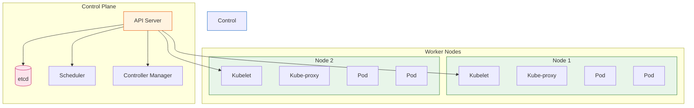

# Kubernetes Deep Dive for DevOps Engineers

A comprehensive guide to Kubernetes concepts, kubectl commands, and productivity aliases for DevOps engineers.

## Table of Contents

- [What is Kubernetes?](#what-is-kubernetes)
- [Core Architecture](#core-architecture)
- [kubectl Command Reference](#kubectl-command-reference)
  - [Basic Commands (Beginner)](#basic-commands-beginner)
  - [Basic Commands (Intermediate)](#basic-commands-intermediate)
  - [Deploy Commands](#deploy-commands)
  - [Cluster Management Commands](#cluster-management-commands)
  - [Troubleshooting and Debugging Commands](#troubleshooting-and-debugging-commands)
  - [Advanced Commands](#advanced-commands)
  - [Settings Commands](#settings-commands)
- [Shell Aliases Reference](#shell-aliases-reference)
- [Common Workflows](#common-workflows)
- [Best Practices](#best-practices)

---

## What is Kubernetes?

Kubernetes (K8s) is an open-source container orchestration platform that automates:

- **Deployment**: Rolling out containerized applications
- **Scaling**: Adjusting replicas based on demand
- **Management**: Self-healing, load balancing, service discovery
- **Configuration**: Managing secrets, configs, and environment variables



---

## Core Architecture

### Control Plane Components

| Component          | Purpose                                                              |
| ------------------ | -------------------------------------------------------------------- |
| API Server         | Frontend for the control plane; all communication goes through it    |
| etcd               | Distributed key-value store holding all cluster state                |
| Scheduler          | Assigns pods to nodes based on resource requirements and constraints |
| Controller Manager | Runs controllers (Deployment, ReplicaSet, Node, etc.)                |
| Cloud Controller   | Integrates with cloud provider APIs (load balancers, volumes, etc.)  |

### Node Components

| Component         | Purpose                                                       |
| ----------------- | ------------------------------------------------------------- |
| Kubelet           | Agent on each node; ensures containers are running in pods    |
| Kube-proxy        | Network proxy maintaining network rules for pod communication |
| Container Runtime | Software running containers (containerd, CRI-O, Docker)       |

### Key Resources

| Resource    | Description                                      | Use Case                              |
| ----------- | ------------------------------------------------ | ------------------------------------- |
| Pod         | Smallest deployable unit; one or more containers | Running application containers        |
| Deployment  | Manages ReplicaSets and pod lifecycle            | Stateless applications                |
| Service     | Stable network endpoint for pods                 | Load balancing, service discovery     |
| ConfigMap   | Non-sensitive configuration data                 | Environment variables, config files   |
| Secret      | Sensitive data (passwords, tokens)               | Credentials, TLS certificates         |
| Namespace   | Virtual cluster for resource isolation           | Multi-tenancy, environment separation |
| Ingress     | HTTP/HTTPS routing to services                   | External access, TLS termination      |
| StatefulSet | Manages stateful applications                    | Databases, message queues             |
| DaemonSet   | Ensures pod runs on all (or some) nodes          | Log collectors, monitoring agents     |
| Job/CronJob | Run-to-completion or scheduled tasks             | Batch processing, backups             |

---

## kubectl Command Reference

`kubectl` is the command-line tool for interacting with Kubernetes clusters. It communicates with the API server to manage resources.

### Basic Commands (Beginner)

These commands are for users just starting with Kubernetes.

| Command  | Description                            | When to Use                                  |
| -------- | -------------------------------------- | -------------------------------------------- |
| `create` | Create a resource from a file or stdin | Quick resource creation without full YAML    |
| `expose` | Expose a resource as a new Service     | Create a Service for existing Deployment/Pod |
| `run`    | Run a particular image in the cluster  | Quick testing, one-off containers            |
| `set`    | Set specific features on objects       | Update image, resources, or env vars         |

#### Beginner Command Examples

```bash
# Create a deployment from an image
kubectl create deployment nginx --image=nginx:latest

# Expose deployment as a service
kubectl expose deployment nginx --port=80 --type=ClusterIP

# Run a one-off pod for debugging
kubectl run debug --image=busybox --rm -it -- sh

# Update deployment image
kubectl set image deployment/nginx nginx=nginx:1.25
```

### Basic Commands (Intermediate)

Commands for day-to-day cluster interaction.

| Command   | Description                      | When to Use                                  |
| --------- | -------------------------------- | -------------------------------------------- |
| `explain` | Get documentation for a resource | Understanding resource fields and structure  |
| `get`     | Display one or many resources    | Listing and viewing resources                |
| `edit`    | Edit a resource on the server    | Quick modifications without re-applying YAML |
| `delete`  | Delete resources                 | Removing resources from the cluster          |

#### Intermediate Command Examples

```bash
# Get documentation for deployment spec
kubectl explain deployment.spec.replicas

# List all pods in current namespace
kubectl get pods

# List pods across all namespaces with extra info
kubectl get pods -A -o wide

# Edit a deployment in your default editor
kubectl edit deployment nginx

# Delete a pod
kubectl delete pod nginx-abc123

# Delete resources from a YAML file
kubectl delete -f deployment.yaml
```

### Deploy Commands

Commands for managing application deployments and scaling.

| Command     | Description                                          | When to Use                             |
| ----------- | ---------------------------------------------------- | --------------------------------------- |
| `rollout`   | Manage the rollout of a resource                     | Check status, history, undo deployments |
| `scale`     | Set a new size for Deployment/ReplicaSet/StatefulSet | Manual horizontal scaling               |
| `autoscale` | Auto-scale based on CPU utilization                  | Set up Horizontal Pod Autoscaler        |

#### Deploy Command Examples

```bash
# Check rollout status
kubectl rollout status deployment/nginx

# View rollout history
kubectl rollout history deployment/nginx

# Undo last rollout
kubectl rollout undo deployment/nginx

# Undo to specific revision
kubectl rollout undo deployment/nginx --to-revision=2

# Restart deployment (rolling restart)
kubectl rollout restart deployment/nginx

# Scale deployment to 5 replicas
kubectl scale deployment nginx --replicas=5

# Set up autoscaling (2-10 pods, target 50% CPU)
kubectl autoscale deployment nginx --min=2 --max=10 --cpu-percent=50
```

### Cluster Management Commands

Commands for cluster administration and node management.

| Command        | Description                         | When to Use                                 |
| -------------- | ----------------------------------- | ------------------------------------------- |
| `certificate`  | Modify certificate resources        | Managing TLS certificates                   |
| `cluster-info` | Display cluster information         | Verify cluster connectivity and endpoints   |
| `top`          | Display resource usage (CPU/memory) | Monitoring resource consumption             |
| `cordon`       | Mark node as unschedulable          | Preparing node for maintenance              |
| `uncordon`     | Mark node as schedulable            | Returning node to service after maintenance |
| `drain`        | Drain node for maintenance          | Safely evict pods before node maintenance   |
| `taint`        | Update taints on nodes              | Control pod scheduling to specific nodes    |

#### Cluster Management Examples

```bash
# Show cluster info
kubectl cluster-info

# Show resource usage for nodes
kubectl top nodes

# Show resource usage for pods
kubectl top pods

# Cordon a node (no new pods scheduled)
kubectl cordon node-1

# Drain a node (evict pods, cordon)
kubectl drain node-1 --ignore-daemonsets --delete-emptydir-data

# Return node to service
kubectl uncordon node-1

# Add a taint to prevent scheduling
kubectl taint nodes node-1 key=value:NoSchedule

# Remove a taint
kubectl taint nodes node-1 key=value:NoSchedule-
```

### Troubleshooting and Debugging Commands

Essential commands for diagnosing issues.

| Command        | Description                      | When to Use                                        |
| -------------- | -------------------------------- | -------------------------------------------------- |
| `describe`     | Show details of a resource       | Investigating events, conditions, errors           |
| `logs`         | Print logs for a container       | Debugging application issues                       |
| `attach`       | Attach to a running container    | Interactive debugging of running processes         |
| `exec`         | Execute a command in a container | Running commands inside containers                 |
| `port-forward` | Forward local ports to a pod     | Local access to cluster services                   |
| `proxy`        | Run a proxy to the API server    | Accessing the API or dashboard locally             |
| `cp`           | Copy files to/from containers    | Extracting logs, configs, or debugging data        |
| `auth`         | Inspect authorization            | Checking RBAC permissions                          |
| `debug`        | Create debugging sessions        | Advanced troubleshooting with ephemeral containers |
| `events`       | List events                      | Seeing what happened in the cluster                |

#### Troubleshooting Examples

```bash
# Describe a pod (shows events, conditions, etc.)
kubectl describe pod nginx-abc123

# Get logs from a pod
kubectl logs nginx-abc123

# Follow logs in real-time
kubectl logs -f nginx-abc123

# Get logs from specific container in multi-container pod
kubectl logs nginx-abc123 -c sidecar

# Get logs from last hour
kubectl logs --since=1h nginx-abc123

# Execute command in pod
kubectl exec nginx-abc123 -- ls /etc/nginx

# Get interactive shell in pod
kubectl exec -it nginx-abc123 -- /bin/sh

# Port forward local 8080 to pod 80
kubectl port-forward pod/nginx-abc123 8080:80

# Port forward to a service
kubectl port-forward svc/nginx 8080:80

# Copy file from pod
kubectl cp nginx-abc123:/etc/nginx/nginx.conf ./nginx.conf

# Check if you can create pods
kubectl auth can-i create pods

# List all events sorted by time
kubectl get events --sort-by='.lastTimestamp'

# Debug a node with ephemeral container
kubectl debug node/node-1 -it --image=busybox
```

### Advanced Commands

Commands for advanced operations and GitOps workflows.

| Command     | Description                                        | When to Use                              |
| ----------- | -------------------------------------------------- | ---------------------------------------- |
| `diff`      | Diff live version against would-be applied version | Preview changes before applying          |
| `apply`     | Apply configuration to a resource                  | Declarative resource management (GitOps) |
| `patch`     | Update fields of a resource                        | Partial updates without full YAML        |
| `replace`   | Replace a resource by filename                     | Complete replacement of a resource       |
| `wait`      | Wait for a specific condition                      | Scripting, CI/CD pipelines               |
| `kustomize` | Build a kustomization target                       | Kustomize-based deployments              |

#### Advanced Command Examples

```bash
# Preview changes before applying
kubectl diff -f deployment.yaml

# Apply configuration (create or update)
kubectl apply -f deployment.yaml

# Apply all YAML files in a directory
kubectl apply -f ./k8s/

# Apply with kustomize
kubectl apply -k ./overlays/production/

# Patch a resource (strategic merge patch)
kubectl patch deployment nginx -p '{"spec":{"replicas":3}}'

# Patch using JSON patch
kubectl patch deployment nginx --type='json' -p='[{"op":"replace","path":"/spec/replicas","value":5}]'

# Wait for deployment to be ready
kubectl wait --for=condition=available deployment/nginx --timeout=60s

# Wait for pod to be ready
kubectl wait --for=condition=ready pod -l app=nginx --timeout=120s

# Build kustomization (dry-run)
kubectl kustomize ./overlays/production/
```

### Settings Commands

Commands for managing resource metadata and shell configuration.

| Command      | Description                      | When to Use                              |
| ------------ | -------------------------------- | ---------------------------------------- |
| `label`      | Update labels on a resource      | Organizing resources, enabling selectors |
| `annotate`   | Update annotations on a resource | Adding metadata, tool configuration      |
| `completion` | Output shell completion code     | Setting up tab completion                |

#### Settings Command Examples

```bash
# Add a label to a pod
kubectl label pod nginx-abc123 environment=production

# Remove a label
kubectl label pod nginx-abc123 environment-

# Add annotation
kubectl annotate deployment nginx description="Web server"

# Set up zsh completion
source <(kubectl completion zsh)
```

---

## Shell Aliases Reference

These aliases are from the oh-my-zsh kubectl plugin. They dramatically speed up daily Kubernetes operations.

### Core Aliases

| Alias   | Expands To                 | Description                            |
| ------- | -------------------------- | -------------------------------------- |
| `k`     | `kubectl`                  | The foundation - shorthand for kubectl |
| `kaf`   | `kubectl apply -f`         | Apply a YAML file                      |
| `kapk`  | `kubectl apply -k`         | Apply a kustomization directory        |
| `kca`   | `kubectl --all-namespaces` | Run command across all namespaces      |
| `kdel`  | `kubectl delete`           | Delete a resource                      |
| `kdelf` | `kubectl delete -f`        | Delete resources from file             |
| `kdelk` | `kubectl delete -k`        | Delete kustomization resources         |

### Context and Configuration

| Alias  | Expands To                                         | Description                               |
| ------ | -------------------------------------------------- | ----------------------------------------- |
| `kccc` | `kubectl config current-context`                   | Show current context                      |
| `kcgc` | `kubectl config get-contexts`                      | List all contexts                         |
| `kcuc` | `kubectl config use-context`                       | Switch to a different context             |
| `kcsc` | `kubectl config set-context`                       | Modify a context                          |
| `kcdc` | `kubectl config delete-context`                    | Delete a context                          |
| `kcn`  | `kubectl config set-context --current --namespace` | Set default namespace for current context |

### Pod Management

| Alias    | Expands To                          | Description                     |
| -------- | ----------------------------------- | ------------------------------- |
| `kgp`    | `kubectl get pods`                  | List pods in current namespace  |
| `kgpa`   | `kubectl get pods --all-namespaces` | List pods in all namespaces     |
| `kgpall` | `kubectl get pods -A -o wide`       | List all pods with node info    |
| `kgpsl`  | `kubectl get pods --show-labels`    | List pods with their labels     |
| `kdp`    | `kubectl describe pods`             | Describe a pod                  |
| `kep`    | `kubectl edit pods`                 | Edit a pod                      |
| `kdelp`  | `kubectl delete pods`               | Delete a pod                    |
| `keti`   | `kubectl exec -t -i`                | Interactive exec into container |

### Service Management

| Alias   | Expands To                         | Description                     |
| ------- | ---------------------------------- | ------------------------------- |
| `kgs`   | `kubectl get svc`                  | List services                   |
| `kgsa`  | `kubectl get svc --all-namespaces` | List services in all namespaces |
| `kds`   | `kubectl describe svc`             | Describe a service              |
| `kes`   | `kubectl edit svc`                 | Edit a service                  |
| `kdels` | `kubectl delete svc`               | Delete a service                |

### Deployment Management

| Alias   | Expands To                           | Description                        |
| ------- | ------------------------------------ | ---------------------------------- |
| `kgd`   | `kubectl get deployment`             | List deployments                   |
| `kgda`  | `kubectl get deployment -A`          | List deployments in all namespaces |
| `kdd`   | `kubectl describe deployment`        | Describe a deployment              |
| `ked`   | `kubectl edit deployment`            | Edit a deployment                  |
| `kdeld` | `kubectl delete deployment`          | Delete a deployment                |
| `ksd`   | `kubectl scale deployment`           | Scale a deployment                 |
| `krsd`  | `kubectl rollout status deployment`  | Check deployment rollout status    |
| `krrd`  | `kubectl rollout restart deployment` | Rolling restart a deployment       |

### StatefulSet Management

| Alias    | Expands To                            | Description                         |
| -------- | ------------------------------------- | ----------------------------------- |
| `kgss`   | `kubectl get statefulset`             | List statefulsets                   |
| `kgssa`  | `kubectl get statefulset -A`          | List statefulsets in all namespaces |
| `kdss`   | `kubectl describe statefulset`        | Describe a statefulset              |
| `kess`   | `kubectl edit statefulset`            | Edit a statefulset                  |
| `kdelss` | `kubectl delete statefulset`          | Delete a statefulset                |
| `ksss`   | `kubectl scale statefulset`           | Scale a statefulset                 |
| `krsss`  | `kubectl rollout status statefulset`  | Check statefulset rollout status    |
| `krrss`  | `kubectl rollout restart statefulset` | Rolling restart a statefulset       |

### DaemonSet Management

| Alias    | Expands To                   | Description                       |
| -------- | ---------------------------- | --------------------------------- |
| `kgds`   | `kubectl get daemonset`      | List daemonsets                   |
| `kgdsa`  | `kubectl get daemonset -A`   | List daemonsets in all namespaces |
| `kdds`   | `kubectl describe daemonset` | Describe a daemonset              |
| `keds`   | `kubectl edit daemonset`     | Edit a daemonset                  |
| `kdelds` | `kubectl delete daemonset`   | Delete a daemonset                |

### ConfigMap and Secret Management

| Alias     | Expands To                   | Description                       |
| --------- | ---------------------------- | --------------------------------- |
| `kgcm`    | `kubectl get configmaps`     | List configmaps                   |
| `kgcma`   | `kubectl get configmaps -A`  | List configmaps in all namespaces |
| `kdcm`    | `kubectl describe configmap` | Describe a configmap              |
| `kecm`    | `kubectl edit configmap`     | Edit a configmap                  |
| `kdelcm`  | `kubectl delete configmap`   | Delete a configmap                |
| `kgsec`   | `kubectl get secret`         | List secrets                      |
| `kgseca`  | `kubectl get secret -A`      | List secrets in all namespaces    |
| `kdsec`   | `kubectl describe secret`    | Describe a secret                 |
| `kdelsec` | `kubectl delete secret`      | Delete a secret                   |

### Namespace Management

| Alias    | Expands To                   | Description          |
| -------- | ---------------------------- | -------------------- |
| `kgns`   | `kubectl get namespaces`     | List all namespaces  |
| `kdns`   | `kubectl describe namespace` | Describe a namespace |
| `kens`   | `kubectl edit namespace`     | Edit a namespace     |
| `kdelns` | `kubectl delete namespace`   | Delete a namespace   |

### Node Management

| Alias    | Expands To                        | Description            |
| -------- | --------------------------------- | ---------------------- |
| `kgno`   | `kubectl get nodes`               | List all nodes         |
| `kgnosl` | `kubectl get nodes --show-labels` | List nodes with labels |
| `kdno`   | `kubectl describe node`           | Describe a node        |
| `keno`   | `kubectl edit node`               | Edit a node            |
| `kdelno` | `kubectl delete node`             | Delete a node          |

### Ingress Management

| Alias   | Expands To                 | Description                      |
| ------- | -------------------------- | -------------------------------- |
| `kgi`   | `kubectl get ingress`      | List ingresses                   |
| `kgia`  | `kubectl get ingress -A`   | List ingresses in all namespaces |
| `kdi`   | `kubectl describe ingress` | Describe an ingress              |
| `kei`   | `kubectl edit ingress`     | Edit an ingress                  |
| `kdeli` | `kubectl delete ingress`   | Delete an ingress                |

### PVC Management

| Alias     | Expands To             | Description                   |
| --------- | ---------------------- | ----------------------------- |
| `kgpvc`   | `kubectl get pvc`      | List persistent volume claims |
| `kgpvca`  | `kubectl get pvc -A`   | List PVCs in all namespaces   |
| `kdpvc`   | `kubectl describe pvc` | Describe a PVC                |
| `kepvc`   | `kubectl edit pvc`     | Edit a PVC                    |
| `kdelpvc` | `kubectl delete pvc`   | Delete a PVC                  |

### Job and CronJob Management

| Alias    | Expands To                 | Description        |
| -------- | -------------------------- | ------------------ |
| `kgj`    | `kubectl get job`          | List jobs          |
| `kdj`    | `kubectl describe job`     | Describe a job     |
| `kej`    | `kubectl edit job`         | Edit a job         |
| `kdelj`  | `kubectl delete job`       | Delete a job       |
| `kgcj`   | `kubectl get cronjob`      | List cronjobs      |
| `kdcj`   | `kubectl describe cronjob` | Describe a cronjob |
| `kecj`   | `kubectl edit cronjob`     | Edit a cronjob     |
| `kdelcj` | `kubectl delete cronjob`   | Delete a cronjob   |

### Logs

| Alias   | Expands To                   | Description                  |
| ------- | ---------------------------- | ---------------------------- |
| `klog`  | `kubectl logs`               | Get logs from a pod          |
| `klf`   | `kubectl logs -f`            | Follow (tail) logs           |
| `kl1h`  | `kubectl logs --since 1h`    | Logs from last hour          |
| `kl1m`  | `kubectl logs --since 1m`    | Logs from last minute        |
| `kl1s`  | `kubectl logs --since 1s`    | Logs from last second        |
| `klf1h` | `kubectl logs --since 1h -f` | Follow logs from last hour   |
| `klf1m` | `kubectl logs --since 1m -f` | Follow logs from last minute |
| `klf1s` | `kubectl logs --since 1s -f` | Follow logs from last second |

### Rollout Management

| Alias | Expands To                | Description          |
| ----- | ------------------------- | -------------------- |
| `krh` | `kubectl rollout history` | View rollout history |
| `kru` | `kubectl rollout undo`    | Undo a rollout       |

### Events

| Alias  | Expands To                                              | Description                |
| ------ | ------------------------------------------------------- | -------------------------- |
| `kge`  | `kubectl get events --sort-by=".lastTimestamp"`         | List events sorted by time |
| `kgew` | `kubectl get events --sort-by=".lastTimestamp" --watch` | Watch events in real-time  |

### All Resources

| Alias  | Expands To           | Description                          |
| ------ | -------------------- | ------------------------------------ |
| `kga`  | `kubectl get all`    | List all resources in namespace      |
| `kgaa` | `kubectl get all -A` | List all resources in all namespaces |

### Utility

| Alias | Expands To             | Description                      |
| ----- | ---------------------- | -------------------------------- |
| `kcp` | `kubectl cp`           | Copy files to/from containers    |
| `kpf` | `kubectl port-forward` | Port forward to a pod or service |

---

## Common Workflows

### Deploying an Application

```bash
# 1. Apply manifests
kaf deployment.yaml
kaf service.yaml

# 2. Check deployment status
krsd nginx

# 3. Watch pods come up
kgp -w

# 4. Check events if issues
kge
```

### Debugging a Failing Pod

```bash
# 1. Check pod status
kgp

# 2. Describe pod for events
kdp failing-pod-abc123

# 3. Check logs
klog failing-pod-abc123

# 4. If CrashLoopBackOff, check previous logs
klog failing-pod-abc123 --previous

# 5. Exec into container for investigation
keti failing-pod-abc123 -- /bin/sh
```

### Switching Between Environments

```bash
# List available contexts
kcgc

# Switch to production
kcuc production-cluster

# Verify
kccc

# Set default namespace
kcn production
```

### Rolling Update

```bash
# 1. Update image
kubectl set image deployment/nginx nginx=nginx:1.25

# 2. Watch rollout
krsd nginx

# 3. If issues, rollback
kru deployment/nginx
```

### Node Maintenance

```bash
# 1. Cordon the node
kubectl cordon node-1

# 2. Drain workloads
kubectl drain node-1 --ignore-daemonsets --delete-emptydir-data

# 3. Perform maintenance...

# 4. Return to service
kubectl uncordon node-1
```

---

## Best Practices

### Resource Management

1. **Always set resource requests and limits** - Prevents resource starvation
2. **Use namespaces** - Isolate teams, environments, or applications
3. **Label everything** - Enables filtering and selection

### Security

1. **Run as non-root** - Use `runAsNonRoot: true` in security context
2. **Drop capabilities** - Remove unnecessary Linux capabilities
3. **Use read-only filesystems** - Prevent runtime modifications
4. **Use Secrets, not ConfigMaps** - For sensitive data

### Deployments

1. **Use declarative YAML** - Store in git, use `kubectl apply`
2. **Set liveness and readiness probes** - Enable proper health checking
3. **Use rolling updates** - Minimize downtime during deployments
4. **Configure PodDisruptionBudgets** - Ensure availability during maintenance

### Debugging

1. **Check events first** - `kge` shows recent cluster activity
2. **Use describe** - Shows conditions, events, and configuration
3. **Check logs with context** - Use `--since` to limit log volume
4. **Use ephemeral containers** - For debugging without modifying pods

### Alias Usage Tips

1. **Memorize the pattern** - `k` + action (`g`et, `d`escribe, `del`ete) + resource (`p`od, `d`eployment, `s`ervice)
2. **Use tab completion** - Enable with `source <(kubectl completion zsh)`
3. **Combine with grep/jq** - `kgp | grep failing` or `k get pods -o json | jq`
4. **Use `-o wide`** - Add node information to output

---

## Quick Reference Card

```text
CONTEXT & CONFIG
  kccc              current context
  kcgc              list contexts
  kcuc <ctx>        switch context
  kcn <ns>          set namespace

GET RESOURCES
  kgp               pods
  kgd               deployments
  kgs               services
  kgno              nodes
  kga               all resources
  kge               events

DESCRIBE & LOGS
  kdp <pod>         describe pod
  klog <pod>        get logs
  klf <pod>         follow logs

APPLY & DELETE
  kaf <file>        apply file
  kdelf <file>      delete from file

DEBUG
  keti <pod> -- sh  exec into pod
  kpf <pod> 8080:80 port forward
  kdp <pod>         describe (events)

DEPLOYMENTS
  krsd <deploy>     rollout status
  krrd <deploy>     restart deployment
  kru <deploy>      rollback
  ksd <deploy> --replicas=N  scale
```
