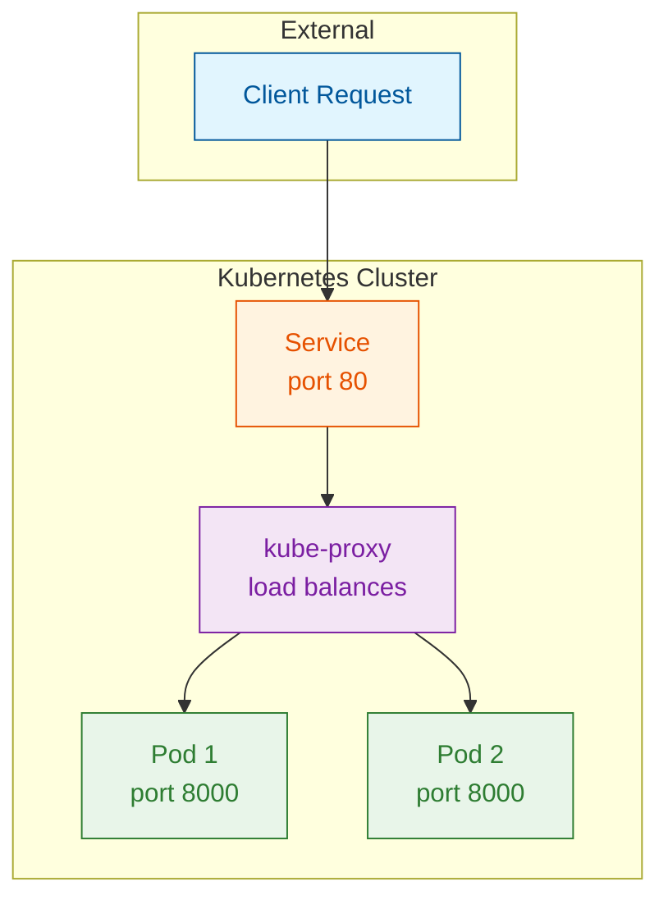
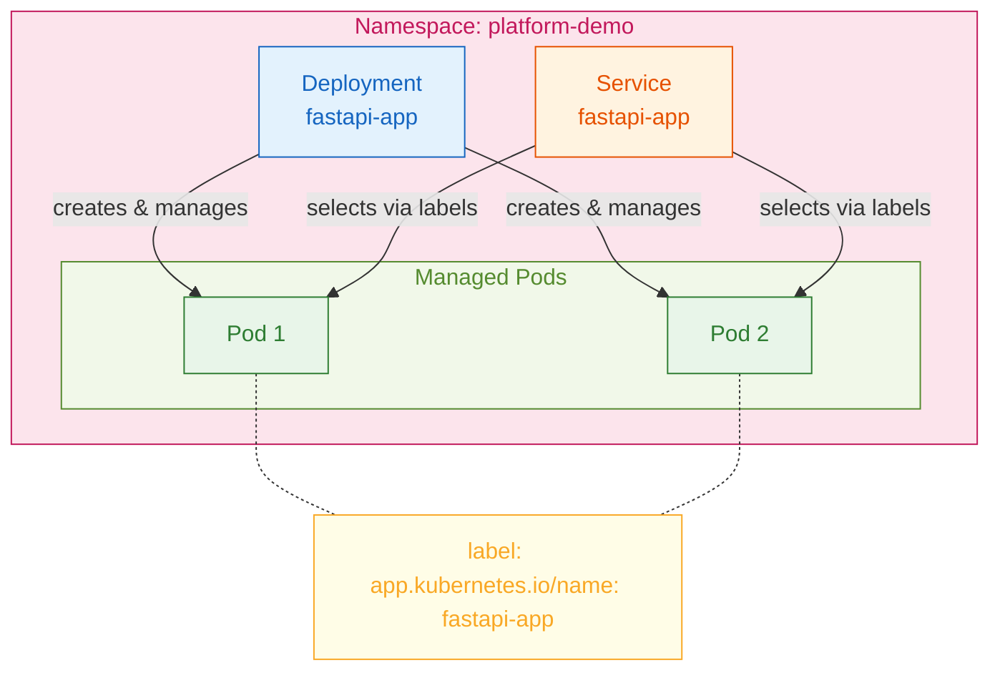

# Kubernetes Manifests Explained

This document provides a line-by-line explanation of each Kubernetes manifest file used to deploy the FastAPI application.

## Table of Contents

- [Namespace](#namespace)
- [Deployment](#deployment)
- [Service](#service)

---

## Namespace

File: `k8s/namespace.yaml`

```yaml
apiVersion: v1
kind: Namespace
metadata:
  name: platform-demo
  labels:
    app.kubernetes.io/name: platform-demo
```

### Namespace Line-by-Line Breakdown

| Line | Code                                    | Explanation                                                                                                                                                  |
| ---- | --------------------------------------- | ------------------------------------------------------------------------------------------------------------------------------------------------------------ |
| 1    | `apiVersion: v1`                        | Specifies the Kubernetes API version. `v1` is the core API group containing fundamental resources like Namespaces, Pods, Services, and ConfigMaps.           |
| 2    | `kind: Namespace`                       | Declares the type of Kubernetes resource. A Namespace provides a scope for names and is used to divide cluster resources between multiple users or projects. |
| 3    | `metadata:`                             | Section containing data that helps uniquely identify the object (name, labels, annotations).                                                                 |
| 4    | `name: platform-demo`                   | The unique name of this namespace within the cluster. All resources we create will live in this namespace.                                                   |
| 5-6  | `labels:`                               | Key-value pairs attached to the resource for organization and selection.                                                                                     |
| 6    | `app.kubernetes.io/name: platform-demo` | A recommended label following Kubernetes naming conventions. The `app.kubernetes.io/` prefix is a common label prefix for application identification.        |

### Why Use Namespaces?

- **Isolation**: Separates resources from other applications in the cluster
- **Resource Quotas**: Can apply CPU/memory limits per namespace
- **RBAC**: Can restrict access to specific namespaces
- **Organization**: Logical grouping of related resources

---

## Deployment

File: `k8s/deployment.yaml`

```yaml
apiVersion: apps/v1
kind: Deployment
metadata:
  name: fastapi-app
  namespace: platform-demo
  labels:
    app.kubernetes.io/name: fastapi-app
    app.kubernetes.io/component: api
spec:
  replicas: 2
  selector:
    matchLabels:
      app.kubernetes.io/name: fastapi-app
  template:
    metadata:
      labels:
        app.kubernetes.io/name: fastapi-app
        app.kubernetes.io/component: api
    spec:
      securityContext:
        runAsNonRoot: true
        runAsUser: 1000
        runAsGroup: 1000
        fsGroup: 1000
      containers:
        - name: fastapi-app
          image: fastapi-app:latest
          imagePullPolicy: Never
          ports:
            - name: http
              containerPort: 8000
              protocol: TCP
          env:
            - name: PYTHONUNBUFFERED
              value: '1'
          livenessProbe:
            httpGet:
              path: /api/v1/healthz
              port: http
            initialDelaySeconds: 10
            periodSeconds: 30
            timeoutSeconds: 10
            failureThreshold: 3
          readinessProbe:
            httpGet:
              path: /api/v1/healthz
              port: http
            initialDelaySeconds: 5
            periodSeconds: 10
            timeoutSeconds: 5
            failureThreshold: 3
          resources:
            requests:
              cpu: 100m
              memory: 128Mi
            limits:
              cpu: 500m
              memory: 256Mi
          securityContext:
            allowPrivilegeEscalation: false
            readOnlyRootFilesystem: true
            capabilities:
              drop:
                - ALL
```

### Deployment Line-by-Line Breakdown

#### API and Kind (Lines 1-2)

| Line | Code                  | Explanation                                                                                        |
| ---- | --------------------- | -------------------------------------------------------------------------------------------------- |
| 1    | `apiVersion: apps/v1` | Uses the `apps` API group version 1. Deployments, ReplicaSets, and StatefulSets are in this group. |
| 2    | `kind: Deployment`    | A Deployment manages a set of identical pods, handling rolling updates, rollbacks, and scaling.    |

#### Metadata (Lines 3-8)

| Line | Code                                  | Explanation                                                           |
| ---- | ------------------------------------- | --------------------------------------------------------------------- |
| 3    | `metadata:`                           | Begins the metadata section.                                          |
| 4    | `name: fastapi-app`                   | Name of the Deployment resource. Must be unique within the namespace. |
| 5    | `namespace: platform-demo`            | Places this Deployment in our custom namespace.                       |
| 6    | `labels:`                             | Labels for the Deployment itself (not the pods it creates).           |
| 7    | `app.kubernetes.io/name: fastapi-app` | Identifies the application name.                                      |
| 8    | `app.kubernetes.io/component: api`    | Identifies what component this is (api, frontend, database, etc.).    |

#### Spec - Replicas and Selector (Lines 9-13)

| Line | Code                                  | Explanation                                                                |
| ---- | ------------------------------------- | -------------------------------------------------------------------------- |
| 9    | `spec:`                               | Begins the specification of desired state.                                 |
| 10   | `replicas: 2`                         | Run 2 identical pod instances for high availability and load distribution. |
| 11   | `selector:`                           | Defines how the Deployment finds which Pods to manage.                     |
| 12   | `matchLabels:`                        | Pods must have ALL these labels to be managed by this Deployment.          |
| 13   | `app.kubernetes.io/name: fastapi-app` | The label that pods must have. This MUST match the pod template labels.    |

#### Pod Template Metadata (Lines 14-18)

| Line | Code                                  | Explanation                                                               |
| ---- | ------------------------------------- | ------------------------------------------------------------------------- |
| 14   | `template:`                           | Begins the pod template - a blueprint for creating pods.                  |
| 15   | `metadata:`                           | Metadata for the pods created from this template.                         |
| 16   | `labels:`                             | Labels applied to each pod.                                               |
| 17   | `app.kubernetes.io/name: fastapi-app` | Must match the selector above or the Deployment cannot manage these pods. |
| 18   | `app.kubernetes.io/component: api`    | Additional label for more specific selection if needed.                   |

#### Pod Security Context (Lines 19-24)

| Line | Code                 | Explanation                                                                                                          |
| ---- | -------------------- | -------------------------------------------------------------------------------------------------------------------- |
| 19   | `spec:`              | Begins the pod specification (what runs inside the pod).                                                             |
| 20   | `securityContext:`   | Pod-level security settings applied to all containers.                                                               |
| 21   | `runAsNonRoot: true` | Prevents containers from running as root user. Kubernetes will reject the pod if the container tries to run as root. |
| 22   | `runAsUser: 1000`    | Run all containers as user ID 1000 (matches our Dockerfile's `appuser`).                                             |
| 23   | `runAsGroup: 1000`   | Run all containers with group ID 1000 (matches our Dockerfile's `appgroup`).                                         |
| 24   | `fsGroup: 1000`      | All mounted volumes will be owned by group 1000, allowing the container to read/write to them.                       |

#### Container Definition (Lines 25-35)

| Line | Code                        | Explanation                                                                                         |
| ---- | --------------------------- | --------------------------------------------------------------------------------------------------- |
| 25   | `containers:`               | List of containers in this pod. Most pods have one container.                                       |
| 26   | `- name: fastapi-app`       | Container name. Used in logs and when exec-ing into pods.                                           |
| 27   | `image: fastapi-app:latest` | Docker image to run. Format: `registry/repository:tag`.                                             |
| 28   | `imagePullPolicy: Never`    | Never pull from remote registry - use local image only. Options: `Always`, `IfNotPresent`, `Never`. |
| 29   | `ports:`                    | Ports the container exposes (documentation + functionality).                                        |
| 30   | `- name: http`              | Named port - can be referenced by name in Services and probes.                                      |
| 31   | `containerPort: 8000`       | The port the application listens on inside the container.                                           |
| 32   | `protocol: TCP`             | Protocol (TCP or UDP). TCP is default but explicit is clearer.                                      |
| 33   | `env:`                      | Environment variables passed to the container.                                                      |
| 34   | `- name: PYTHONUNBUFFERED`  | Environment variable name.                                                                          |
| 35   | `value: "1"`                | Value of the variable. Disables Python output buffering for real-time logs.                         |

#### Liveness Probe (Lines 36-43)

| Line | Code                      | Explanation                                                                         |
| ---- | ------------------------- | ----------------------------------------------------------------------------------- |
| 36   | `livenessProbe:`          | Checks if the container is alive. If it fails, Kubernetes restarts the container.   |
| 37   | `httpGet:`                | Probe type - makes an HTTP GET request. Other types: `exec`, `tcpSocket`.           |
| 38   | `path: /api/v1/healthz`   | URL path to request.                                                                |
| 39   | `port: http`              | Port to connect to (references the named port from line 30).                        |
| 40   | `initialDelaySeconds: 10` | Wait 10 seconds after container starts before first probe. Gives app time to start. |
| 41   | `periodSeconds: 30`       | Run the probe every 30 seconds.                                                     |
| 42   | `timeoutSeconds: 10`      | Probe fails if no response within 10 seconds.                                       |
| 43   | `failureThreshold: 3`     | Container is restarted after 3 consecutive failures.                                |

#### Readiness Probe (Lines 44-51)

| Line | Code                     | Explanation                                                                                              |
| ---- | ------------------------ | -------------------------------------------------------------------------------------------------------- |
| 44   | `readinessProbe:`        | Checks if the container is ready to receive traffic. If it fails, pod is removed from Service endpoints. |
| 45   | `httpGet:`               | Same probe type as liveness.                                                                             |
| 46   | `path: /api/v1/healthz`  | Same health endpoint.                                                                                    |
| 47   | `port: http`             | Same named port reference.                                                                               |
| 48   | `initialDelaySeconds: 5` | Shorter delay - we want to start serving traffic quickly.                                                |
| 49   | `periodSeconds: 10`      | Check more frequently than liveness.                                                                     |
| 50   | `timeoutSeconds: 5`      | Shorter timeout.                                                                                         |
| 51   | `failureThreshold: 3`    | Removed from Service after 3 failures.                                                                   |

**Liveness vs Readiness:**

- **Liveness**: "Is this container alive?" -> Restart if no
- **Readiness**: "Can this container handle traffic?" -> Remove from load balancer if no

#### Resource Requests and Limits (Lines 52-58)

| Line | Code            | Explanation                                                                |
| ---- | --------------- | -------------------------------------------------------------------------- |
| 52   | `resources:`    | CPU and memory constraints for the container.                              |
| 53   | `requests:`     | Minimum guaranteed resources. Used for scheduling decisions.               |
| 54   | `cpu: 100m`     | Request 100 millicores (0.1 CPU core). `m` = millicores.                   |
| 55   | `memory: 128Mi` | Request 128 mebibytes of RAM. `Mi` = mebibytes (1024-based).               |
| 56   | `limits:`       | Maximum resources allowed. Container is throttled/killed if exceeded.      |
| 57   | `cpu: 500m`     | Maximum 500 millicores (0.5 CPU core). Container is throttled if exceeded. |
| 58   | `memory: 256Mi` | Maximum 256 mebibytes. Container is OOM-killed if exceeded.                |

**Resource Units:**

- CPU: `100m` = 0.1 cores, `1` = 1 core, `2000m` = 2 cores
- Memory: `128Mi` = 128 mebibytes, `1Gi` = 1 gibibyte

#### Container Security Context (Lines 59-64)

| Line | Code                              | Explanation                                                               |
| ---- | --------------------------------- | ------------------------------------------------------------------------- |
| 59   | `securityContext:`                | Container-specific security settings (overrides/extends pod-level).       |
| 60   | `allowPrivilegeEscalation: false` | Prevents processes from gaining more privileges than their parent.        |
| 61   | `readOnlyRootFilesystem: true`    | Container filesystem is read-only. Prevents malware from writing to disk. |
| 62   | `capabilities:`                   | Linux kernel capabilities control.                                        |
| 63   | `drop:`                           | List of capabilities to remove.                                           |
| 64   | `- ALL`                           | Remove all Linux capabilities. Principle of least privilege.              |

---

## Service

File: `k8s/service.yaml`

```yaml
apiVersion: v1
kind: Service
metadata:
  name: fastapi-app
  namespace: platform-demo
  labels:
    app.kubernetes.io/name: fastapi-app
spec:
  type: ClusterIP
  ports:
    - name: http
      port: 80
      targetPort: http
      protocol: TCP
  selector:
    app.kubernetes.io/name: fastapi-app
```

### Service Line-by-Line Breakdown

#### API, Kind, and Metadata (Lines 1-7)

| Line | Code                                  | Explanation                                                                                                      |
| ---- | ------------------------------------- | ---------------------------------------------------------------------------------------------------------------- |
| 1    | `apiVersion: v1`                      | Core API group - Services are fundamental resources.                                                             |
| 2    | `kind: Service`                       | A Service provides stable networking for a set of Pods. Pods are ephemeral; Services provide a permanent IP/DNS. |
| 3    | `metadata:`                           | Resource metadata.                                                                                               |
| 4    | `name: fastapi-app`                   | Service name. Creates DNS entry: `fastapi-app.platform-demo.svc.cluster.local`.                                  |
| 5    | `namespace: platform-demo`            | Must match the namespace of the pods it targets.                                                                 |
| 6    | `labels:`                             | Labels for the Service itself.                                                                                   |
| 7    | `app.kubernetes.io/name: fastapi-app` | Standard application label.                                                                                      |

#### Service Spec (Lines 8-16)

| Line | Code                                  | Explanation                                                                                           |
| ---- | ------------------------------------- | ----------------------------------------------------------------------------------------------------- |
| 8    | `spec:`                               | Service specification.                                                                                |
| 9    | `type: ClusterIP`                     | Service type. `ClusterIP` = internal only. Other options: `NodePort`, `LoadBalancer`, `ExternalName`. |
| 10   | `ports:`                              | Port mappings.                                                                                        |
| 11   | `- name: http`                        | Port name (useful when service exposes multiple ports).                                               |
| 12   | `port: 80`                            | Port the Service listens on. Clients connect to this port.                                            |
| 13   | `targetPort: http`                    | Port on the pod to forward to. References named port `http` (8000) from Deployment.                   |
| 14   | `protocol: TCP`                       | Protocol for this port.                                                                               |
| 15   | `selector:`                           | Label selector to find target pods.                                                                   |
| 16   | `app.kubernetes.io/name: fastapi-app` | All pods with this label receive traffic from this Service.                                           |

### Service Types Explained

| Type           | Description                                     | Use Case                                |
| -------------- | ----------------------------------------------- | --------------------------------------- |
| `ClusterIP`    | Internal cluster IP only                        | Internal services, accessed via Ingress |
| `NodePort`     | Exposes on each node's IP at a static port      | Development, direct node access         |
| `LoadBalancer` | Creates external load balancer (cloud provider) | Production external access              |
| `ExternalName` | Maps to external DNS name                       | Accessing external services             |

### How Traffic Flows



---

## How These Resources Connect



1. **Namespace** provides the scope (pink border)
2. **Deployment** creates and manages pods with specific labels (blue)
3. **Service** finds pods using label selectors and routes traffic to them (orange)
