# Kubernetes Practical Guide

A hands-on guide to understanding Kubernetes concepts through deploying a real application. This guide explains not just _what_ to do, but _why_ things work the way they do.

## Table of Contents

- [The Big Picture](#the-big-picture)
- [Deploying an Application](#deploying-an-application)
- [Understanding Pods and Containers](#understanding-pods-and-containers)
- [What Does "Listening on a Port" Mean?](#what-does-listening-on-a-port-mean)
- [Services: The Stable Endpoint](#services-the-stable-endpoint)
- [Ingress: External Access](#ingress-external-access)
- [Namespaces: Organizational Boundaries](#namespaces-organizational-boundaries)
- [Local Kubernetes Options](#local-kubernetes-options)
- [Common Commands Reference](#common-commands-reference)

---

## The Big Picture

When you deploy an application to Kubernetes, multiple components work together to make your app accessible. Here is the complete flow from your browser to your application:

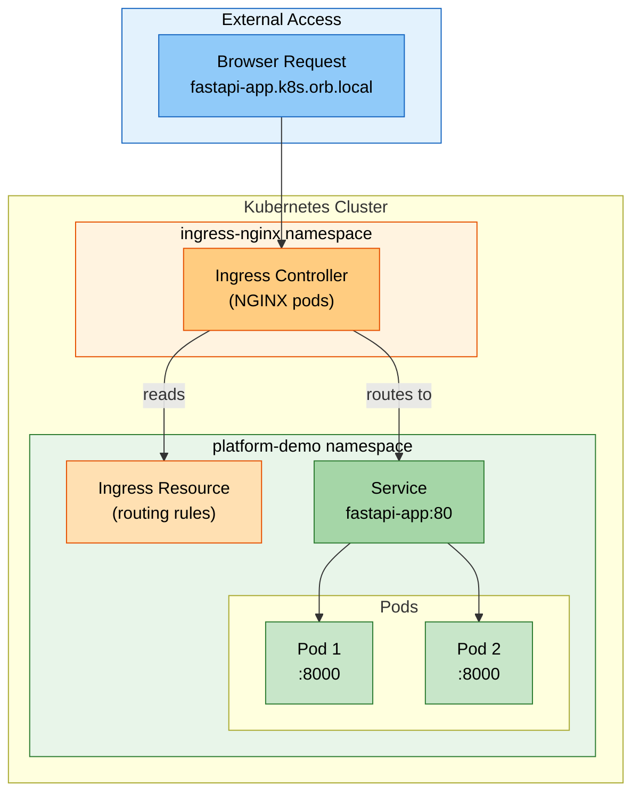

Each layer serves a specific purpose:

| Layer              | What It Does                                         | Analogy                 |
| ------------------ | ---------------------------------------------------- | ----------------------- |
| Ingress Controller | Receives all external traffic, routes based on rules | Building receptionist   |
| Ingress Resource   | Defines routing rules (hostname to service mapping)  | Directory listing       |
| Service            | Stable endpoint, load balances across pods           | Department phone number |
| Pods               | Run your actual application containers               | Individual employees    |

---

## Deploying an Application

### The Deployment Process

When you run `kubectl apply -f k8s/`, Kubernetes processes your manifest files and creates resources in the cluster:

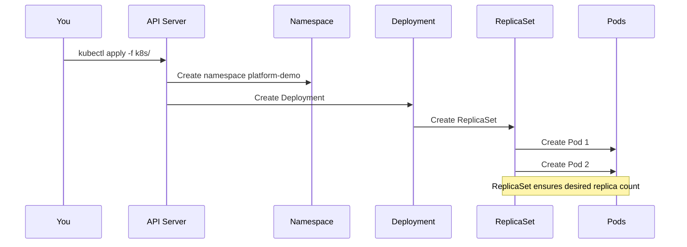

### What Each Manifest Does

Your `k8s/` directory contains four files that work together:

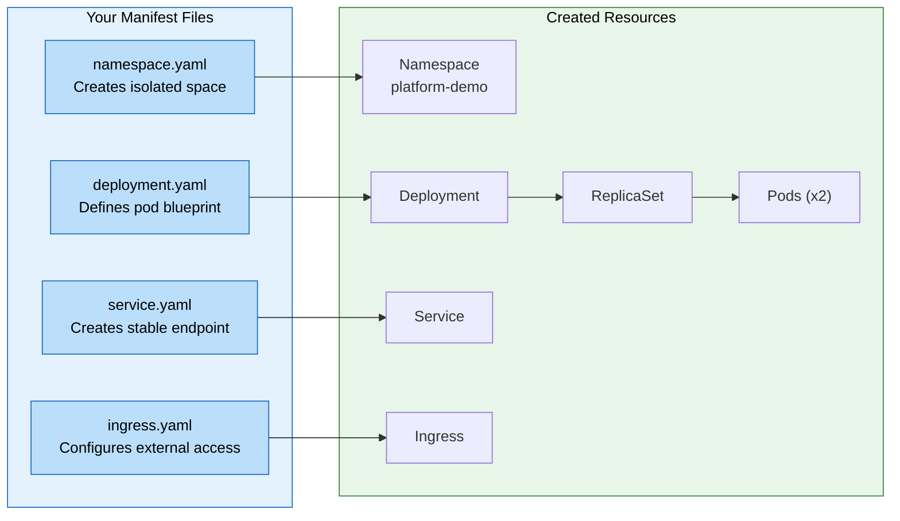

### Deployment Order Matters

When applying all manifests at once, the namespace must exist before other resources can be created in it. If you see errors like "namespace not found", simply run the command again:

```bash
# First run might show errors (race condition)
kubectl apply -f k8s/

# Second run succeeds (namespace now exists)
kubectl apply -f k8s/
```

---

## Understanding Pods and Containers

### The Deployment Hierarchy

A Deployment does not directly create Pods. Instead, it creates a ReplicaSet, which manages the Pods:

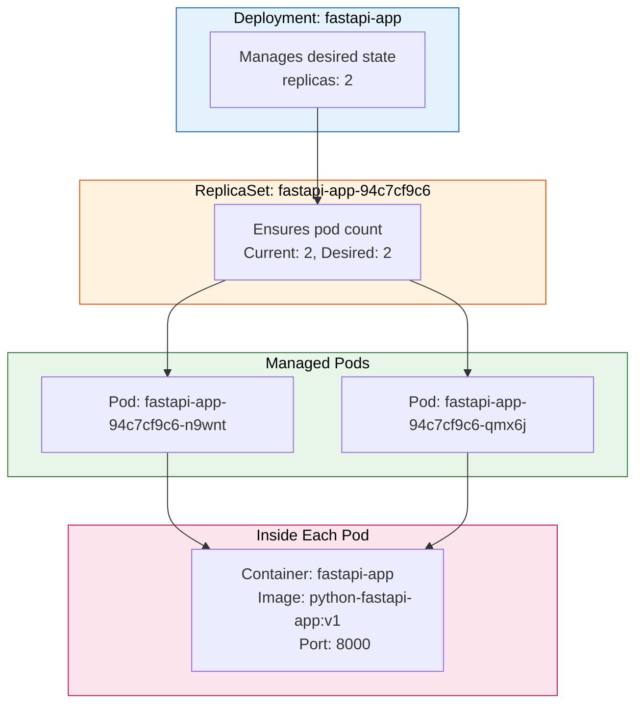

### Why ReplicaSets Matter

When a Pod dies (crashes, gets deleted, node fails), the ReplicaSet automatically creates a new one to maintain the desired count:

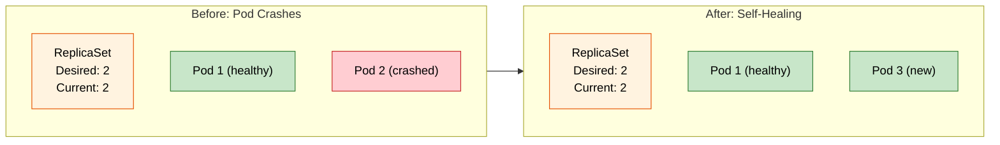

### What the Deployment Defines

The Deployment is the blueprint for your Pods. It specifies:

| Setting           | Purpose                                            |
| ----------------- | -------------------------------------------------- |
| `replicas`        | How many identical Pods to run                     |
| `image`           | Which container image to use                       |
| `ports`           | Which ports the container uses                     |
| `resources`       | CPU and memory requests/limits                     |
| `probes`          | Health checks (liveness and readiness)             |
| `securityContext` | Security settings (non-root, read-only filesystem) |
| `env`             | Environment variables                              |

---

## What Does "Listening on a Port" Mean?

When we say an application "listens on port 8000", it means the application has claimed that port and is waiting for incoming connections.

### The Socket Metaphor

Think of ports as numbered doors on a building. Your application stands at door 8000, waiting for someone to knock:

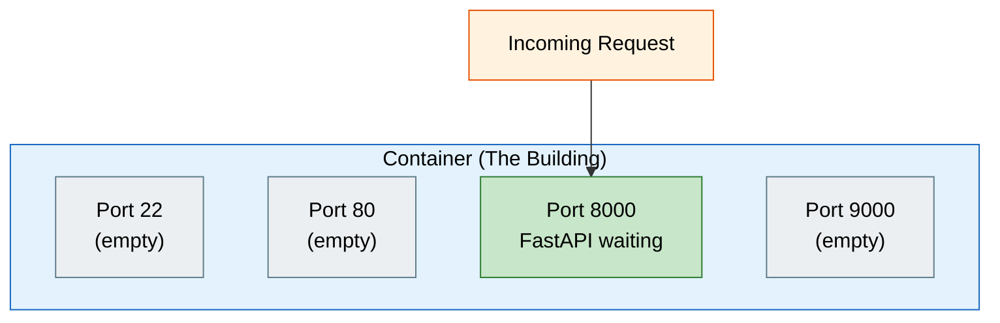

### What Happens Under the Hood

Your FastAPI application (via Uvicorn) does something like this:

```python
# Simplified - what happens when your app starts
socket = create_socket()
socket.bind('0.0.0.0', 8000)  # "I claim port 8000"
socket.listen()               # "I am waiting for connections"

while True:
    connection = socket.accept()  # Blocks here, ear to the ground
    handle_request(connection)    # Someone knocked, handle it
```

### The Meaning of 0.0.0.0

The address your app binds to determines who can connect:

| Address          | Meaning                | Who Can Connect           |
| ---------------- | ---------------------- | ------------------------- |
| `0.0.0.0:8000`   | All network interfaces | Anyone (external traffic) |
| `127.0.0.1:8000` | Localhost only         | Same machine only         |

Your FastAPI app binds to `0.0.0.0:8000` so it can receive traffic from outside the container (from the Service).

### Container Port Declaration

The `containerPort: 8000` in your Deployment is mostly documentation. The port is opened by your application, not by Kubernetes:

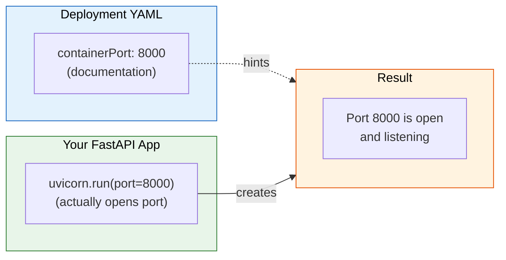

---

## Services: The Stable Endpoint

### The Problem Services Solve

Pods are ephemeral. Every time a Pod restarts, crashes, or scales, it gets a new IP address:

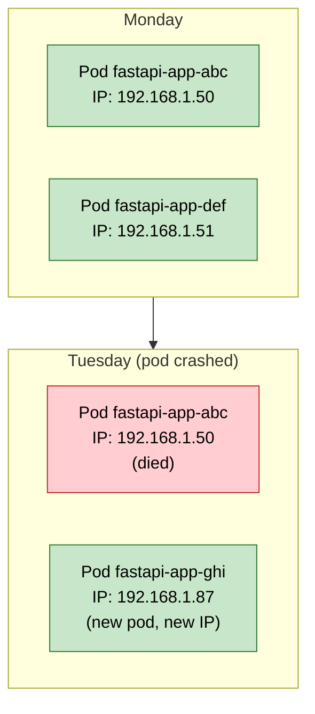

If another application hardcoded `192.168.1.50`, it would break when that Pod dies.

### How Services Provide Stability

A Service gets its own IP that never changes. It watches for Pods matching its selector and maintains a list of their current IPs:

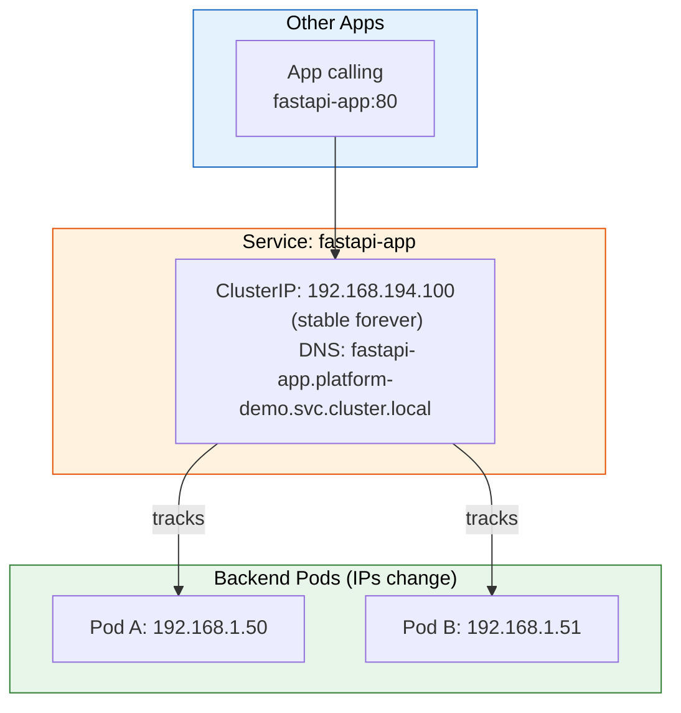

### What Services Provide

| Feature          | Description                                          |
| ---------------- | ---------------------------------------------------- |
| Stable IP        | Service IP never changes, even when Pods come and go |
| DNS Name         | `fastapi-app.platform-demo.svc.cluster.local`        |
| Load Balancing   | Distributes requests across healthy Pods             |
| Port Translation | Service listens on 80, forwards to Pod port 8000     |

### Load Balancing in Action

With 2 replicas, the Service distributes requests between them:

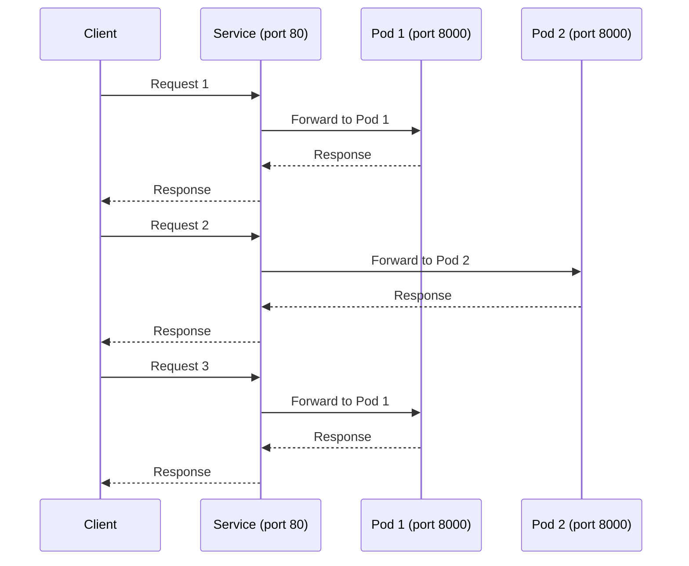

---

## Ingress: External Access

### Ingress Controller vs Ingress Resource

There are two distinct concepts, both called "Ingress":

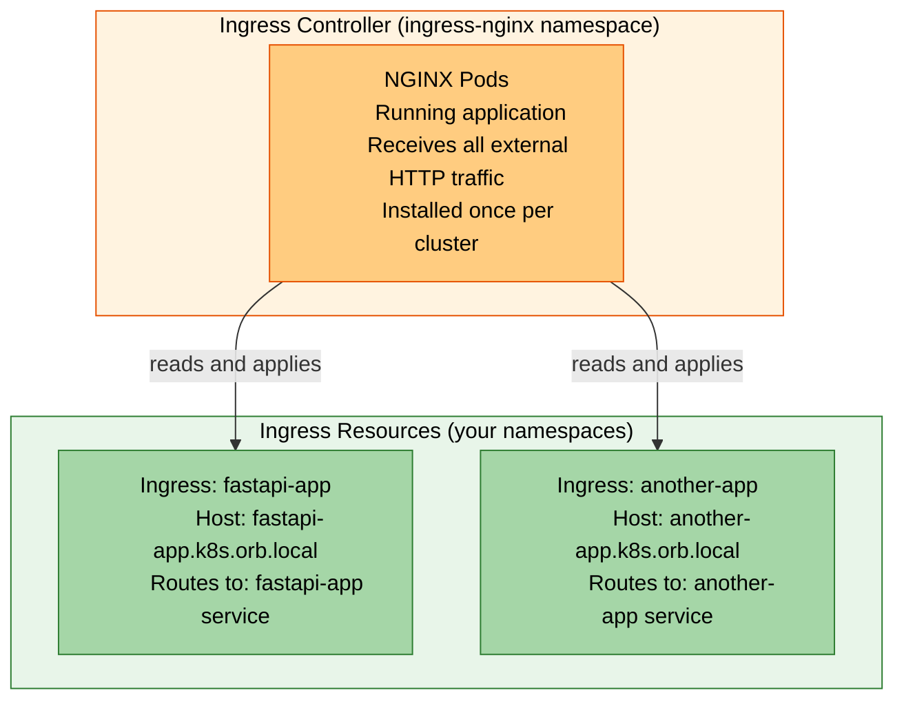

| Component          | What It Is                              | How Many            |
| ------------------ | --------------------------------------- | ------------------- |
| Ingress Controller | Running NGINX pods that receive traffic | One per cluster     |
| Ingress Resource   | YAML routing rules                      | One per app/service |

### The Receptionist Analogy

Think of the Ingress Controller as a building receptionist, and Ingress Resources as the directory:

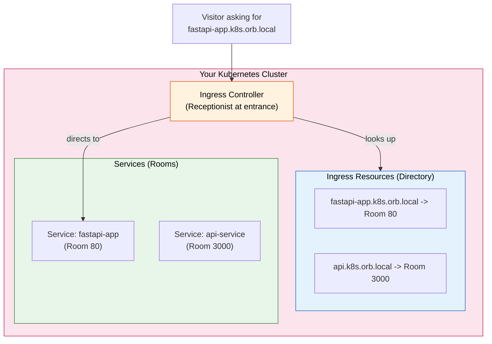

### Installing the Ingress Controller

The Ingress Controller is installed once per cluster:

```bash
kubectl apply -f https://raw.githubusercontent.com/kubernetes/ingress-nginx/controller-v1.8.1/deploy/static/provider/cloud/deploy.yaml
```

This creates the NGINX pods in the `ingress-nginx` namespace. Verify with:

```bash
kubectl get pods -n ingress-nginx
```

### Your Ingress Resource

Your `k8s/ingress.yaml` defines the routing rule:

```yaml
apiVersion: networking.k8s.io/v1
kind: Ingress
metadata:
  name: fastapi-app
  namespace: platform-demo
spec:
  ingressClassName: nginx
  rules:
    - host: fastapi-app.k8s.orb.local
      http:
        paths:
          - path: /
            pathType: Prefix
            backend:
              service:
                name: fastapi-app
                port:
                  number: 80
```

This tells the controller: "When someone requests `fastapi-app.k8s.orb.local`, send them to the `fastapi-app` service on port 80."

---

## Namespaces: Organizational Boundaries

### What Namespaces Provide

Namespaces are logical partitions within a cluster. Think of them as cubby holes or folders:

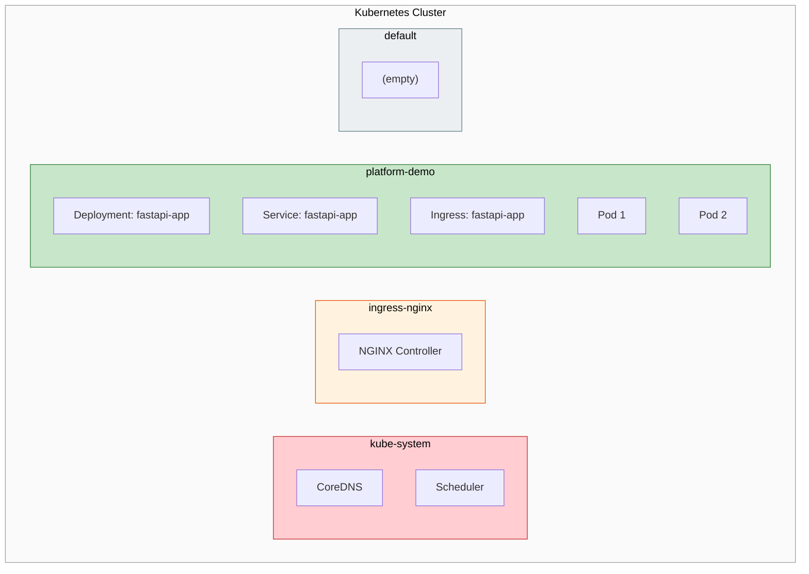

### Benefits of Namespaces

| Benefit          | Description                                          |
| ---------------- | ---------------------------------------------------- |
| Name isolation   | Same resource name can exist in different namespaces |
| Resource scoping | Commands can target a specific namespace             |
| Access control   | RBAC can restrict who accesses which namespaces      |
| Resource quotas  | Limit CPU/memory per namespace                       |
| Network policies | Control which namespaces can communicate             |

### Important Note on Isolation

Namespaces provide organizational separation, not hard security isolation. By default, Pods can still communicate across namespaces unless you add NetworkPolicies.

---

## Local Kubernetes Options

### Orbstack vs Minikube

Both provide local single-node Kubernetes clusters, but take different approaches:

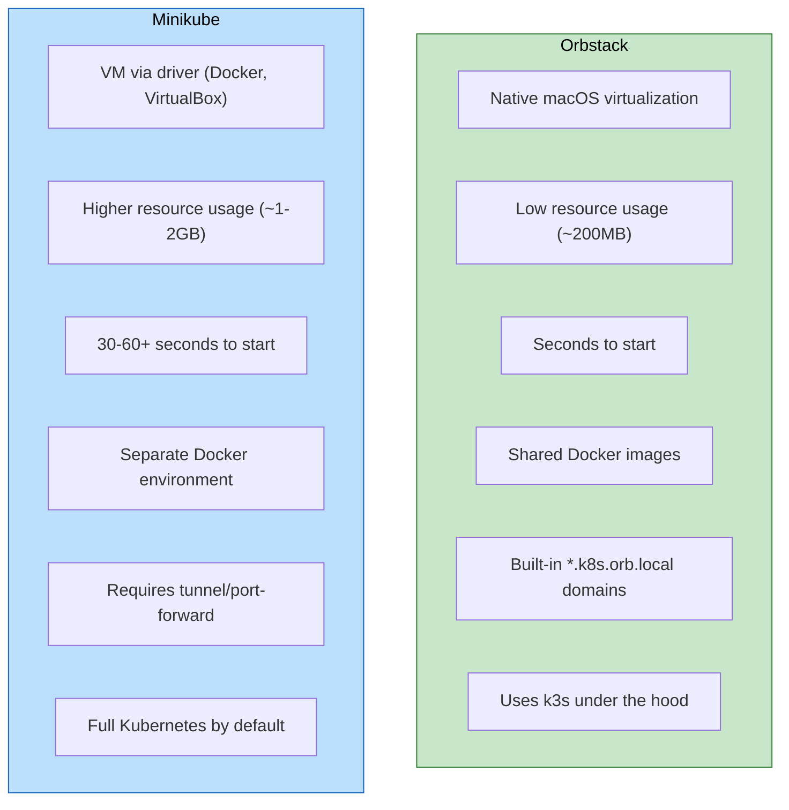

| Aspect             | Orbstack                              | Minikube                   |
| ------------------ | ------------------------------------- | -------------------------- |
| Platform           | macOS only                            | Cross-platform             |
| Resource usage     | Very low                              | Higher                     |
| Startup time       | Seconds                               | 30-60+ seconds             |
| Docker integration | Shared (images available instantly)   | Separate environment       |
| Networking         | Native (`*.k8s.orb.local` just works) | Requires `minikube tunnel` |
| Multi-cluster      | No                                    | Yes                        |
| K8s distribution   | k3s                                   | Full K8s (or k3s driver)   |

### k3s vs Full Kubernetes

Orbstack uses k3s, a lightweight Kubernetes distribution. Here is what that means:

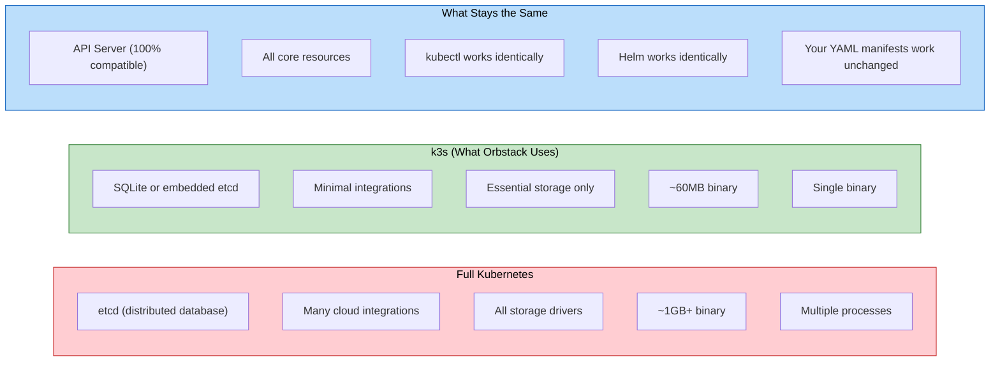

The key point: k3s is certified Kubernetes. Everything you learn locally transfers directly to production clusters (EKS, GKE, AKS, self-hosted).

---

## Common Commands Reference

### Deploying and Managing

```bash
# Apply all manifests in a directory
kubectl apply -f k8s/

# Delete all resources defined in manifests
kubectl delete -f k8s/

# Delete an entire namespace (and everything in it)
kubectl delete namespace platform-demo

# Restart a deployment (rolling restart)
kubectl rollout restart deployment fastapi-app -n platform-demo
```

### Viewing Resources

```bash
# List pods in a namespace
kubectl get pods -n platform-demo

# List common resources (pods, services, deployments, replicasets)
kubectl get all -n platform-demo

# List everything including ingress
kubectl get all,ingress -n platform-demo

# Watch pods in real-time
kubectl get pods -n platform-demo -w

# Get detailed information about a resource
kubectl describe pod <pod-name> -n platform-demo
```

### Troubleshooting

```bash
# Check pod logs
kubectl logs <pod-name> -n platform-demo

# Follow logs in real-time
kubectl logs -f <pod-name> -n platform-demo

# Get a shell inside a container
kubectl exec -it <pod-name> -n platform-demo -- /bin/sh

# Check events (useful for debugging)
kubectl get events -n platform-demo --sort-by='.lastTimestamp'
```

### Verifying Ingress

```bash
# Check ingress status
kubectl get ingress -n platform-demo

# Verify ingress controller is running
kubectl get pods -n ingress-nginx

# Test the endpoint
curl http://fastapi-app.k8s.orb.local/api/v1/healthz
```

---

## Quick Reference: The Complete Flow

Here is everything working together:

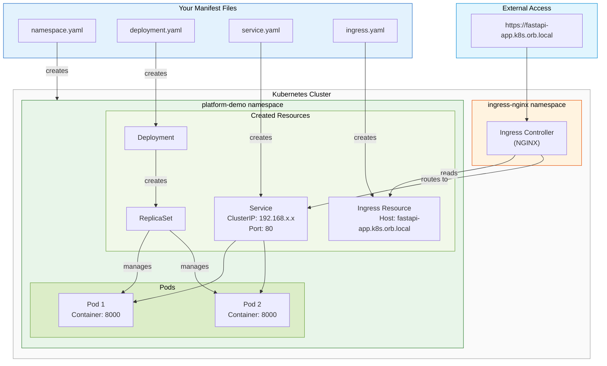

**Summary:**

1. **Namespace** creates an isolated space for your resources
2. **Deployment** defines what your Pods look like and how many to run
3. **ReplicaSet** (created by Deployment) ensures the desired Pod count
4. **Pods** run your containers with your application code
5. **Service** provides a stable endpoint and load balances across Pods
6. **Ingress Resource** defines routing rules for external access
7. **Ingress Controller** receives external traffic and applies routing rules
